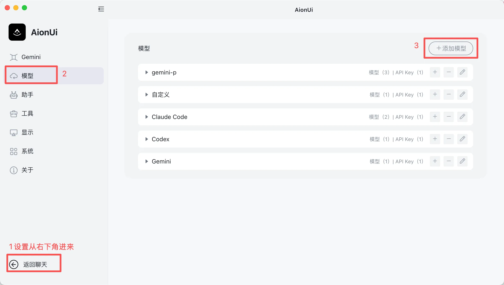
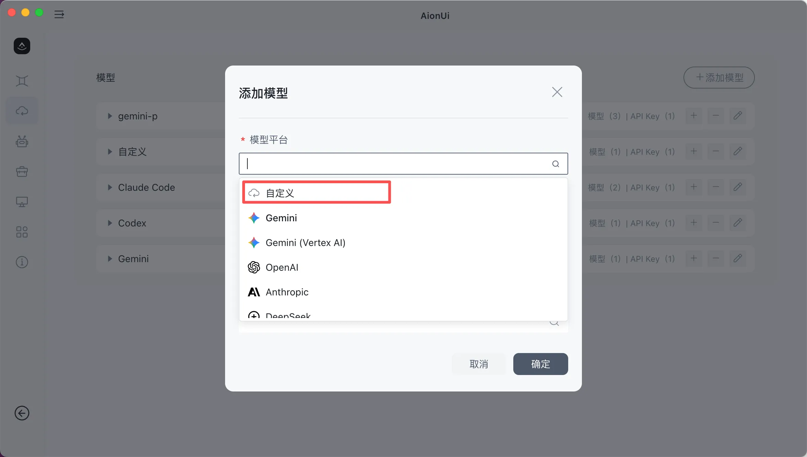
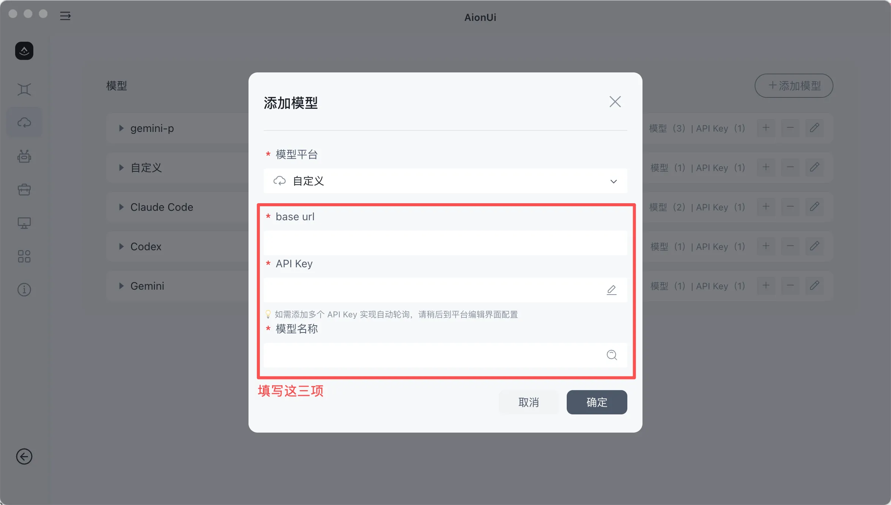
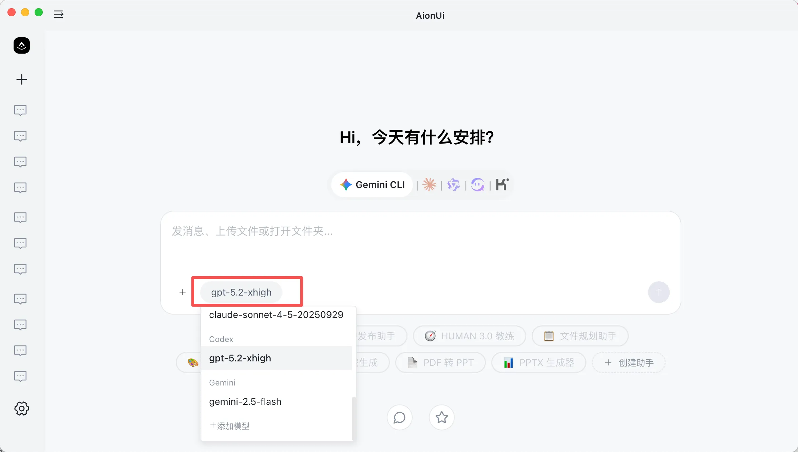

# AionUI

<!-- Source: https://docs.goswitcher.com/docs/advanced/AionUI.html -->

Author: goswitcher

Updated: 2026-06-13T10:02:01.000Z
## AionUI Introduction


### Cowork with Your CLI AI Agent

[](https://github.com/iOfficeAI/AionUi/releases)
[](https://github.com/iOfficeAI/AionUi/blob/main/LICENSE)
[](https://github.com/iOfficeAI/AionUi/releases)

[](https://trendshift.io/repositories/15423)

**🚀 Cowork with your AI, Gemini CLI, Claude Code, Codex, Qwen Code, Goose Cli, Auggie, and other AI Agents**

**User-friendly | Visual graphical interface | Multi-model support | Local data security**

[](https://github.com/iOfficeAI/AionUi/releases)

**With AionUI, you can have:**

-   ✅ **Unified Graphical Interface** - Automatically detects local CLI tools, provides a unified graphical interface, farewell to command line → [Multi-Agent Mode Setup](https://github.com/iOfficeAI/AionUi/wiki/ACP-Setup)
-   ✅ **Multi-session Parallel** - Open multiple conversations simultaneously, each session with independent context, no interference
-   ✅ **Local Data Security** - All conversations and files are saved in a local SQLite database, data never leaves your device
-   ✅ **9+ Format Preview** - PDF, Word, Excel, PPT, code, Markdown, images, HTML, Diff, and more instant preview
-   ✅ **Smart File Management** - AI-driven file organization, batch renaming, auto-categorization → [File Management Tutorial](https://github.com/iOfficeAI/AionUi/wiki/file-management)
-   ✅ **AI Image Generation** - Supports multiple image generation models, smart image editing and recognition → [Image Generation Model Configuration Guide](https://github.com/iOfficeAI/AionUi/wiki/AionUi-Image-Generation-Tool-Model-Configuration-Guide)
-   ✅ **WebUI Remote Access** - Access from any device via browser, mobile support → [WebUI Configuration Tutorial](https://github.com/iOfficeAI/AionUi/wiki/WebUI-Configuration-Guide)
-   ✅ **Multi-model Switching** - Flexibly switch between Gemini, Claude, OpenAI, Qwen, Ollama, and other mainstream models
-   ✅ **Fully Free and Open Source** - Apache-2.0 license, completely free to use

*AionUI WebUI example*

* * *

## Software Download

<DocTabs storage-key="docs-advanced-aionui-platform-1" :tabs="[{ label: 'Windows', value: 'windows' }, { label: 'MacOS', value: 'macos' }]">
<template #windows>

### Windows

1.  Visit the [GitHub Releases](https://github.com/iOfficeAI/AionUi/releases) page
2.  Download the Windows installer (`.exe` file)
3.  Run the installer and follow the prompts to complete installation


</template>

<template #macos>

### MacOS

``` bash
brew install aionui
```

1.  Visit the [GitHub Releases](https://github.com/iOfficeAI/AionUi/releases) page
2.  Download the macOS installer (`.dmg` or `.zip` file, supports Intel and Apple Silicon)
3.  Run the installer and follow the prompts to complete installation


</template>
</DocTabs>
Linux

``` bash
# Download the .deb package (visit GitHub Releases for the latest version number)
wget https://github.com/iOfficeAI/AionUi/releases/latest/download/AionUi-x.x.x-linux-amd64.deb

# Install
sudo dpkg -i AionUi-x.x.x-linux-amd64.deb
```

Visit the [GitHub Releases](https://github.com/iOfficeAI/AionUi/releases) page for the latest version number, replacing `x.x.x` in the command with the actual version number (e.g. `1.7.3`).

Visit the [GitHub Releases](https://github.com/iOfficeAI/AionUi/releases) page to download the appropriate installer for your system (`.AppImage` or `.deb` file).

* * *

## Configuration

### Get API Key

Review [Create API Token](https://goswitcher.com/), create a token for the corresponding group in GoSwitcher, click the copy button, and copy the API Key to your clipboard:

-   **Gemini** → Create a token in the **Gemini** group
-   **Claude** → Create a token in the **CC** group
-   **Codex** → Create a token in the **Codex** group

### Configure LLM Model

1.  Open AionUI, click Settings → LLM Configuration → Add Model



2.  Select the platform "Custom"



3.  Fill in the corresponding API Key and configuration information for each model below, then select the model



4.  After saving, return to the main interface, select the configured model to start using



* * *

## Model Configuration

Gemini

Use the **Gemini** group API Key and fill in the following configuration:

-   **API Key**: Paste the API Key copied from GoSwitcher
-   **API Request URL**: `https://goswitcher.com`
-   **Model**: Select a Gemini model supported by GoSwitcher

Claude

Use the **CC** group API Key and fill in the following configuration:

-   **API Key**: Paste the API Key copied from GoSwitcher
-   **API Request URL**: `https://goswitcher.com`
-   **Model**: Select a Claude model supported by GoSwitcher

Codex

Use the **Codex** group API Key and fill in the following configuration:

-   **API Key**: Paste the API Key copied from GoSwitcher
-   **API Request URL**: `https://goswitcher.com/v1`
-   **Model**: Select a Codex model supported by GoSwitcher

* * *

## FAQ

-   [❓ FAQ](https://github.com/iOfficeAI/AionUi/wiki/FAQ) - Question answers and troubleshooting
-   [🔧 Configuration & Usage Tutorial](https://github.com/iOfficeAI/AionUi/wiki/Configuration-Guides) - Complete configuration documentation
