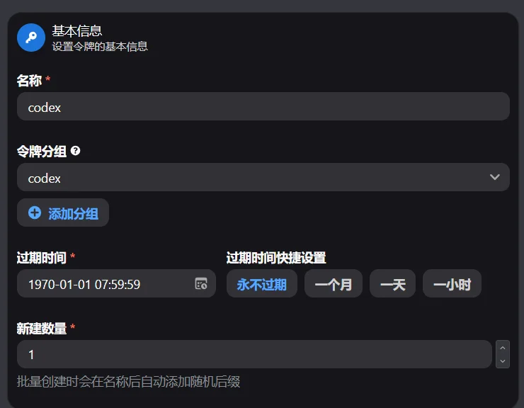
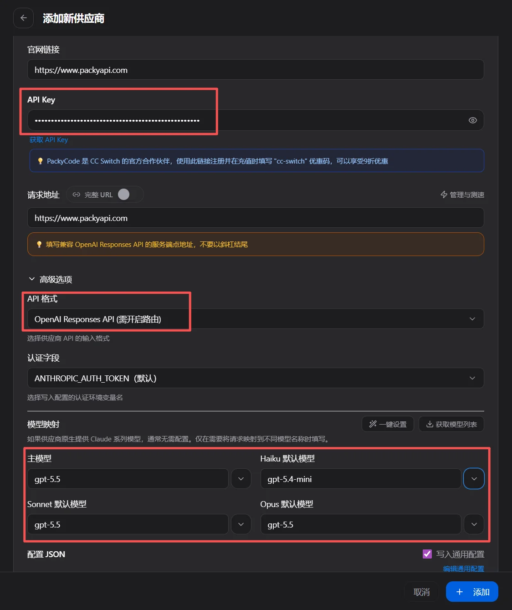
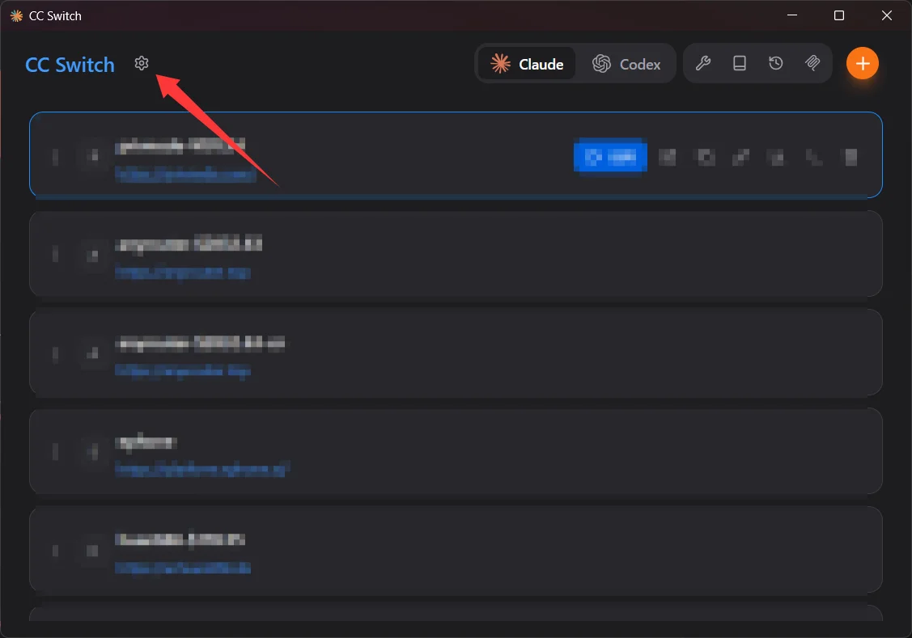
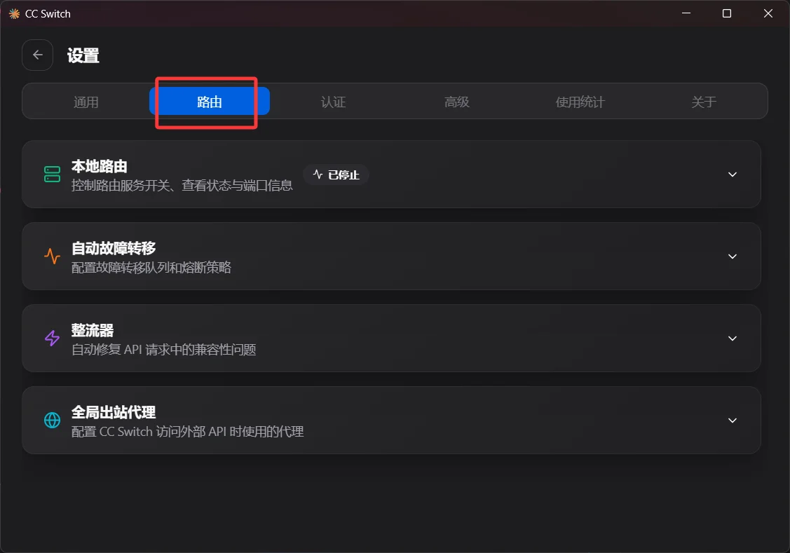
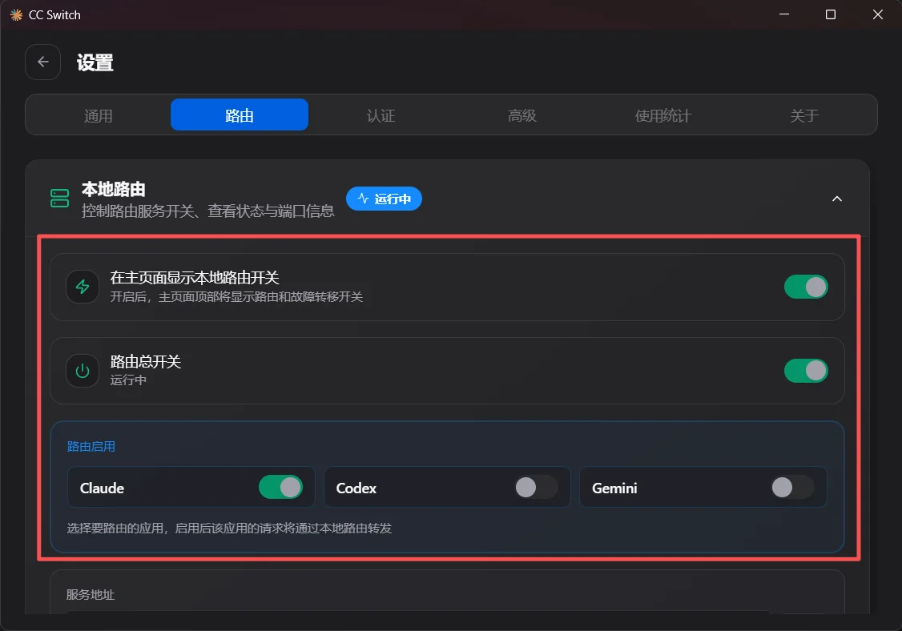
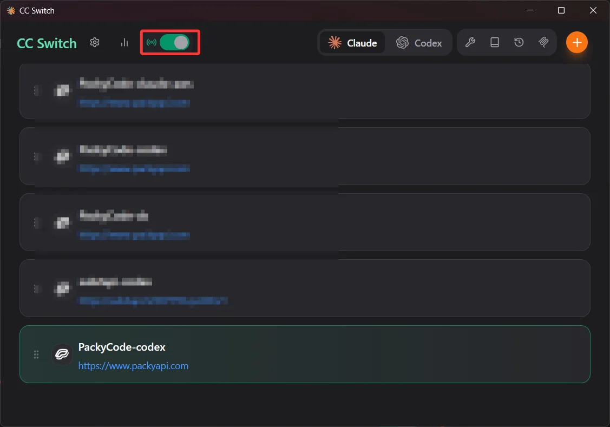
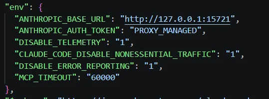
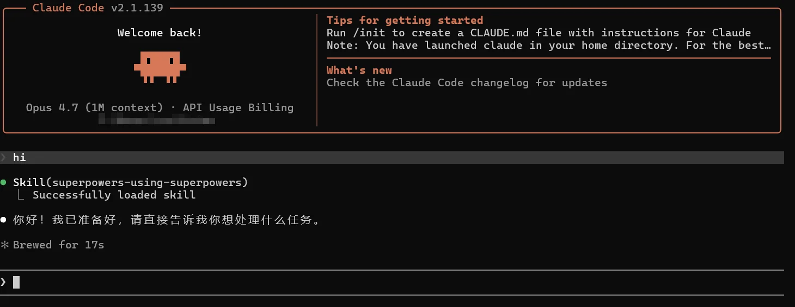
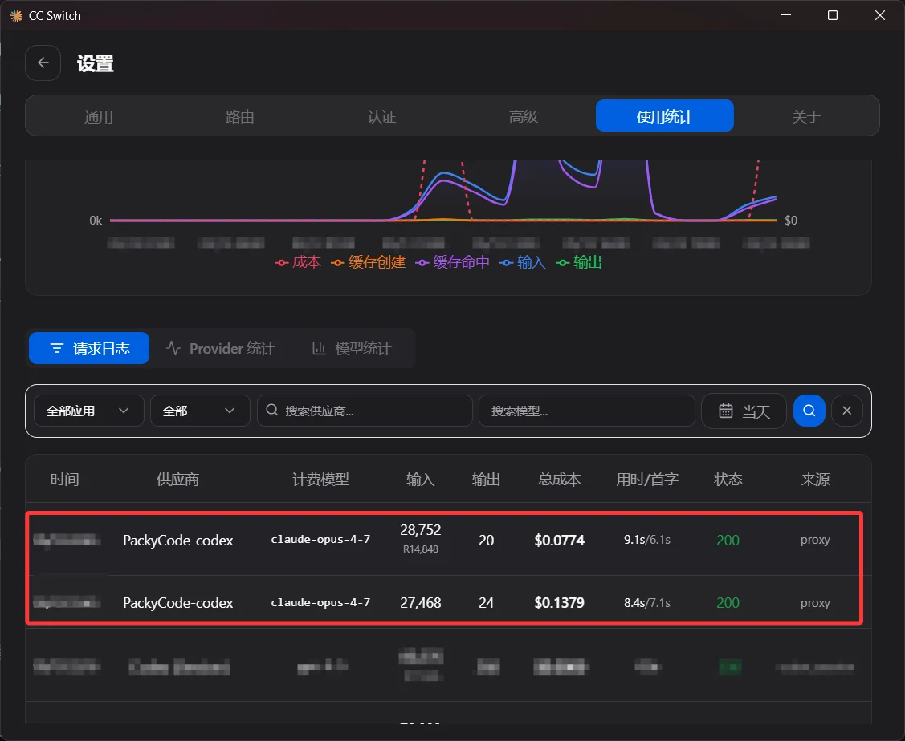
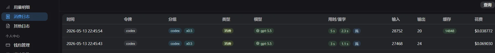

# GPT with Claude Code

<!-- Source: https://docs.goswitch.online/docs/advanced/ChatGPTClaudeCode.html -->

Author: goswitch

Updated: 2026-06-13T10:02:01.000Z
::: danger Important Warning

We do not recommend connecting GPT models to Claude Code. The more reliable approach is: use GPT models in Codex, and use Claude models in Claude Code.

This tutorial is provided only to address some users' testing needs. This solution relies on the `codex` group and CC Switch local routing, and may encounter cache errors, model mapping errors, MCP or Skills compatibility issues. GoSwitch does not recommend, guarantee availability, or assume responsibility for any usage issues, quota consumption, configuration errors, or other consequences arising from this approach.

Only try this if you understand the risks and have the ability to troubleshoot issues yourself; beginners are advised not to proceed.
:::
## Prerequisites

This tutorial is for connecting GPT models from the **codex** group to **Claude Code**. Before starting, please confirm that Claude Code is already installed locally; if not, you can refer to the [Claude Code Configuration](../cli/2-claude.md) for installation and basic setup steps.

Also, please confirm that CC Switch is installed and running locally. This solution must rely on CC Switch's local routing capability — it cannot be accomplished through regular provider configuration alone.

## Create codex Token

1.  Review [Create API Token](../register/4-token.md), and create a new API token in GoSwitch.

2.  You can name it `codex`, and select `codex` as the token group. After creation, copy the generated API Key for later configuration.

## Configure with CC Switch

::: warning Before Proceeding

This is not the recommended configuration for Claude Code. After configuration, please verify whether it works by checking Claude Code's actual conversation results, CC Switch request logs, and GoSwitch consumption logs together.
:::
### Add Provider

1.  Open CC Switch, and click `Add Provider` in the Claude Code configuration.

2.  Select `GoSwitch` as the preset provider, and fill in the following:

    -   **Website URL**: `https://goswitch.online`
    -   **API Key**: Enter the `codex` group API Key you just created
    -   **Request URL**: `https://goswitch.online`
    -   **API Format**: `OpenAI Responses API (requires routing)`
    -   **Main Model**: Enter the GPT model you want to map to Claude Code's main model, e.g. `gpt-5.5`
    -   **Haiku Default Model**: Enter a lighter GPT model, e.g. `gpt-5.4-mini`
    -   **Sonnet Default Model**: Enter the GPT model you want to map to Sonnet, e.g. `gpt-5.5`
    -   **Opus Default Model**: Enter the GPT model you want to map to Opus, e.g. `gpt-5.5`

::: warning Model Name Note

The model names above are only examples. Please use the actual available model names in your `codex` group when creating the token. If the model names are incorrect, Claude Code may show model not found, request failure, or log mapping errors.
:::
### Enable Local Routing

1.  Return to the CC Switch main interface, and click the settings button in the top left corner.

2.  On the settings page, switch to `Routing`, and expand `Local Routing`.

3.  Turn on the `Routing Master Switch`, and enable only `Claude` in `Routing Enabled`. You do not need to enable routing for Codex or Gemini.

4.  Return to the CC Switch main interface; the local routing toggle should appear at the top. Confirm the toggle is on, and select the `GoSwitch-codex` provider you just added.

If you need to stop this solution later, you can turn off the local routing toggle on the main interface, or go back to the settings page and turn off the `Routing Master Switch`.

## Verify Configuration

1.  Check Claude Code's `settings.json`. After enabling local routing, `ANTHROPIC_BASE_URL` should change to the local proxy address, and `ANTHROPIC_AUTH_TOKEN` is typically managed by CC Switch.

2.  Open a new terminal, run `claude` to start Claude Code, and send a test message. If it responds normally, Claude Code is successfully making requests through local routing.

3.  Go back to CC Switch's `Usage Statistics` and check the `Request Logs`. The logs may still show the mapped models from the Claude Code side, such as `claude-opus-4-7`, which is the expected behavior after local routing mapping.

4.  Finally, check GoSwitch's consumption logs to confirm the actual calls. If configured correctly, the consumption logs should show the `codex` group, with the actual billed GPT model, such as `gpt-5.5`.

## Usage Risks

::: danger Final Reminder

This is a non-recommended approach that may fail due to changes in Claude Code, CC Switch, model interfaces, cache policies, MCP, or Skills behavior.

GoSwitch does not recommend connecting GPT models to Claude Code, and does not assume responsibility for the stability, compatibility, output quality, quota consumption, or any derivative issues of this solution. You can use it for testing, research, and understanding routing logic, but it is not recommended as a daily stable workflow.
:::
