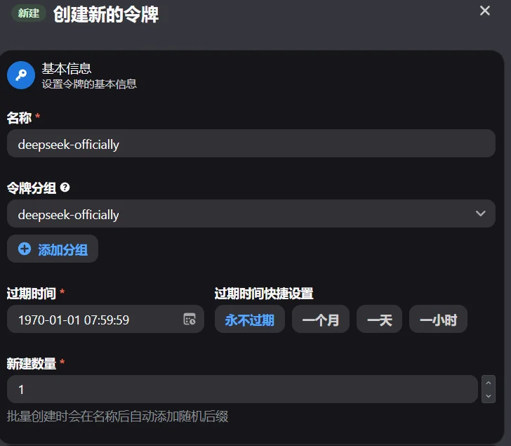
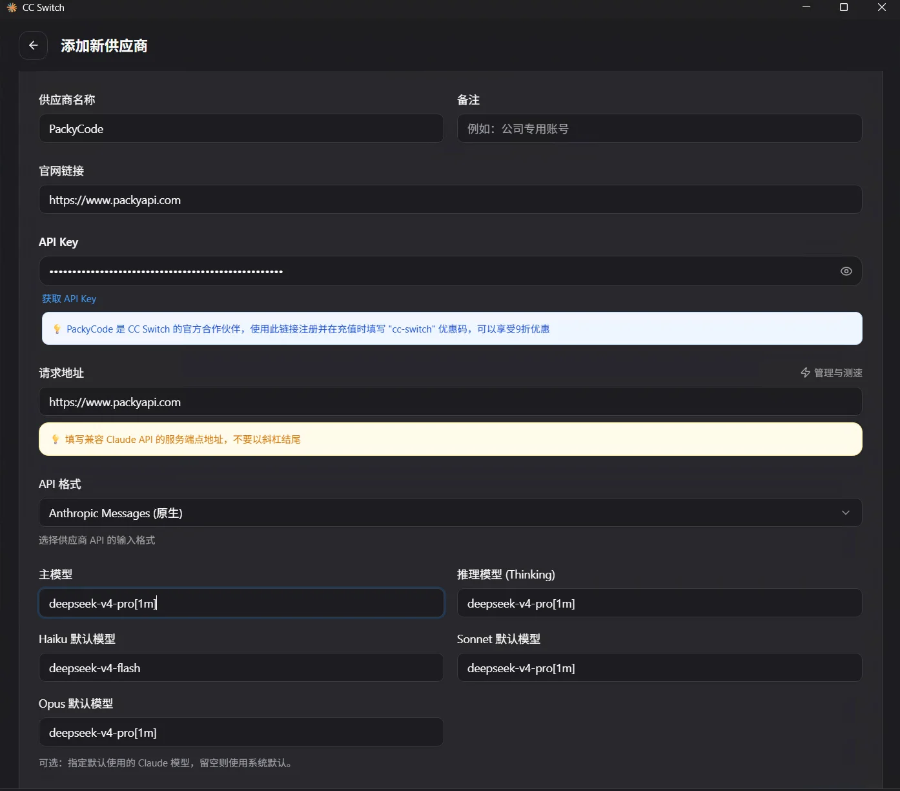
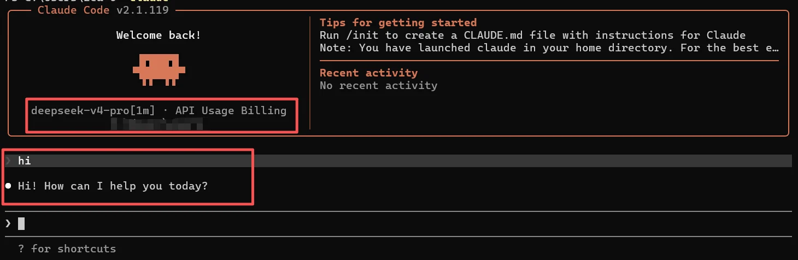

# DeepSeek with Claude Code

<!-- Source: https://docs.goswitch.online/docs/advanced/DeepSeekClaudeCode.html -->

Author: goswitch

Updated: 2026-06-13T10:02:01.000Z
## Prerequisites

This tutorial is for connecting the **DeepSeek** group to **Claude Code**. Before starting, please confirm that Claude Code is already installed locally; if not, you can refer to the [Claude Code Configuration](../cli/2-claude.md) for installation and basic setup steps.

## Create DeepSeek Token

1.  Review [Create API Token](../register/4-token.md), and create a new API token in GoSwitch.

2.  You can name it `deepseek-officially`, and select `deepseek-officially` as the token group. After creation, copy the generated API Key for later configuration.



## Configure with CC Switch

::: tip Recommended Method

If you're not familiar with Claude Code's `settings.json`, we recommend using CC Switch for configuration.

1.  Open CC Switch, and click `Add Provider` in the Claude Code configuration.

2.  Fill in the provider information as follows:

    -   **Provider Name**: `GoSwitch`
    -   **Website URL**: `https://goswitch.online`
    -   **API Key**: Enter the `deepseek-officially` group API Key you just created
    -   **Request URL**: `https://goswitch.online`
    -   **API Format**: `Anthropic Messages (Native)`
    -   **Main Model**: Default `deepseek-v4-pro`; use `deepseek-v4-pro[1m]` only when 1M context is needed
    -   **Thinking Model**: Default `deepseek-v4-pro`; use `deepseek-v4-pro[1m]` only when 1M context is needed
    -   **Haiku Default Model**: Default `deepseek-v4-flash`; use `deepseek-v4-flash[1m]` only when 1M context is needed
    -   **Sonnet Default Model**: Default `deepseek-v4-pro`; use `deepseek-v4-pro[1m]` only when 1M context is needed
    -   **Opus Default Model**: Default `deepseek-v4-pro`; use `deepseek-v4-pro[1m]` only when 1M context is needed


:::
::: warning Model Name Note

You don't need to set the `[1m]` suffix by default — just fill in `deepseek-v4-pro` or `deepseek-v4-flash`. Only set `deepseek-v4-pro[1m]` or `deepseek-v4-flash[1m]` when you need 1M context.

Please use the actual available model names in your token group when creating the token.
:::
## Manual Configuration via settings.json

If you prefer to configure Claude Code manually, you can directly edit Claude Code's `settings.json` file.

<DocTabs storage-key="docs-advanced-deepseekclaudecode-platform-1" :tabs="[{ label: 'Windows', value: 'windows' }, { label: 'MacOS', value: 'macos' }]">
<template #windows>

### Windows

The configuration file is usually located at:

``` bash
%userprofile%\.claude\settings.json
```


</template>

<template #macos>

### MacOS

The configuration file is usually located at:

``` bash
~/.claude/settings.json
```

Write the following content into `settings.json`, replacing `{{YourNewToken}}` with the `deepseek-officially` group API Key you just copied:

```json
{
  "env": {
    "ANTHROPIC_BASE_URL": "https://goswitch.online",
    "ANTHROPIC_AUTH_TOKEN": "{{YourNewToken}}",
    "ANTHROPIC_DEFAULT_HAIKU_MODEL": "deepseek-v4-flash",
    "ANTHROPIC_MODEL": "deepseek-v4-pro",
    "ANTHROPIC_REASONING_MODEL": "deepseek-v4-pro",
    "ANTHROPIC_DEFAULT_SONNET_MODEL": "deepseek-v4-pro",
    "ANTHROPIC_DEFAULT_OPUS_MODEL": "deepseek-v4-pro"
  }
}
```

::: warning Note

When configuring manually, please keep the model names consistent with what your token group actually supports. By default, do not set `[1m]`; only change `deepseek-v4-pro` to `deepseek-v4-pro[1m]` and `deepseek-v4-flash` to `deepseek-v4-flash[1m]` when you need 1M context.
:::

</template>
</DocTabs>
## Verify Configuration

1.  Open a new terminal, run `claude` to start Claude Code.

2.  In the Claude Code interface, confirm whether the model name displayed on the left matches your configured DeepSeek model. It should show `deepseek-v4-pro` by default; only when 1M context is enabled will it show `deepseek-v4-pro[1m]`.

3.  Send a test message directly in Claude Code. If it responds normally, the configuration is complete.



::: warning Usage Reminder

Whether DeepSeek's configuration in Claude Code is effective should be judged directly by the actual conversation results in Claude Code. Do not use the provider's test function in CC Switch as the final verdict.
:::
