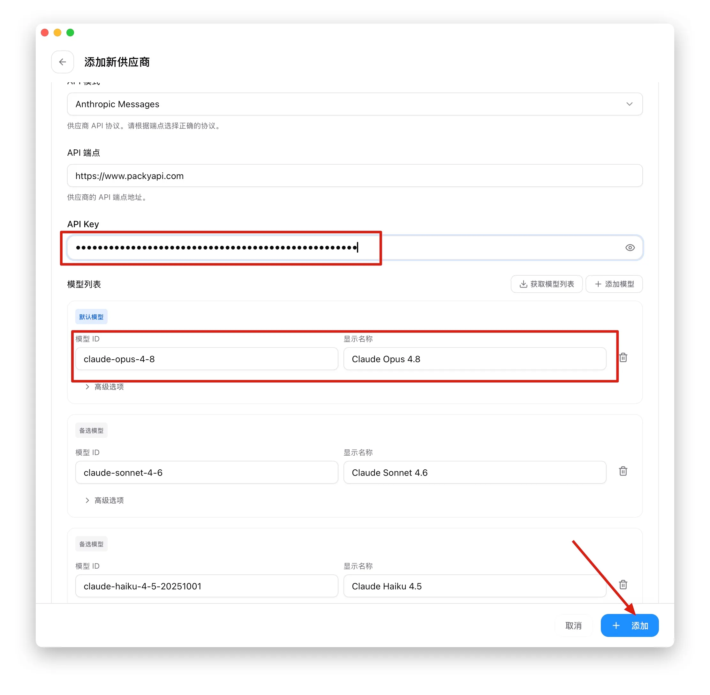
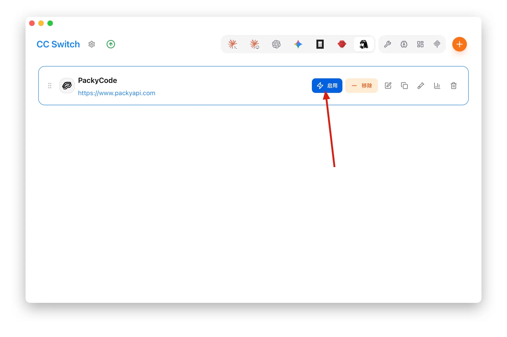
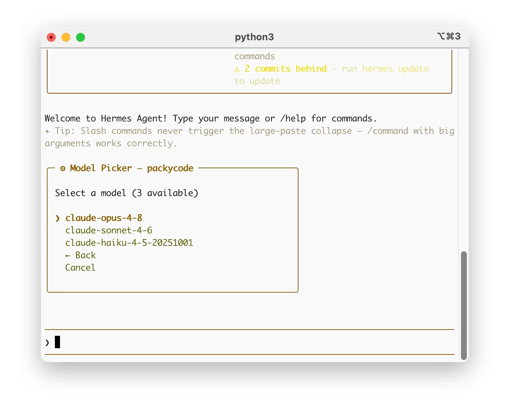
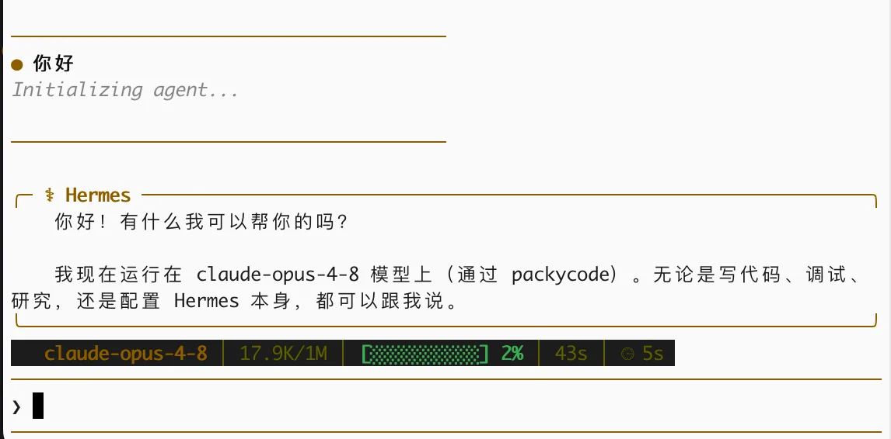

# Hermes

<!-- Source: https://docs.goswitcher.com/docs/advanced/Hermes.html -->

Author: goswitcher

Updated: 2026-06-13T10:02:01.000Z
## Project Introduction

-   **Project Overview**: [Hermes Agent](https://github.com/NousResearch/hermes-agent) is a fully-featured open-source AI Agent by Nous Research. It can converse and code in a terminal, or run as a persistent service connected to Telegram, Discord, Slack, WhatsApp, and other social platforms.
-   **Key Features**:
    -   Full CLI conversation experience with built-in tool calling, Memory, and Skills systems.
    -   Supports Nous Portal, OpenRouter, OpenAI, and other providers, as well as **any OpenAI / Anthropic compatible endpoint**, so it can connect directly to GoSwitcher.
    -   A single `hermes gateway` command attaches the Agent to social platforms as a bot.
    -   All data is saved locally in the `~/.hermes/` directory, with no telemetry reporting.
    -   Supports local terminal, Docker, SSH remote, and other execution backends.
-   **Platform Support**: Linux, MacOS, WSL2 (native Windows is experimental; WSL2 is recommended).

## Installation and Initialization

1.  Open a terminal and run the following command for one-click installation (the script will automatically install uv, Python 3.11, and other dependencies; no sudo needed)

Linux / MacOS / WSL2

``` bash
curl -fsSL https://hermes-agent.nousresearch.com/install.sh | bash
```

Windows (PowerShell, experimental)

```powershell
iex (irm https://hermes-agent.nousresearch.com/install.ps1)
```

2.  After installation, reload your shell configuration, then type `hermes` — if you see the interactive interface, the installation is successful

``` bash
source ~/.bashrc   # zsh users: source ~/.zshrc
hermes
```

3.  On first launch, you'll enter the setup wizard. You can skip the provider selection for now — we'll configure the GoSwitcher channel through CC-Switch below.

## Configure GoSwitcher Channel

1.  Refer to the [CC Switch Download](../ccswitch/1-common.md) section, download and install CC-Switch locally, then open the software

2.  Select `Hermes` in the top configuration section, then click the `Add Provider` button


3.  Configure the following items:

    -   In `Preset Provider`, select `GoSwitcher`
    -   In `Provider Identifier`, enter a name (only lowercase letters, numbers, and hyphens), e.g. goswitcher
    -   Keep `API Mode` as `Anthropic Messages`, and `API Endpoint` as `https://goswitcher.com`
    -   In `API Key`, enter the Key you created in the [Create API Token](../register/4-token.md) section

    ::: warning Important

    **Currently recommended groups for Hermes:**

    -   **Claude**: [aws-q group](../token/2-group.md#aws-q%E5%88%86%E7%BB%84), [cc-sale group](../token/2-group.md#cc-sale%E5%88%86%E7%BB%84), [claude-officially group](../token/2-group.md#claude-officially%E5%88%86%E7%BB%84), cc-expensive group

    **Please create an API Key for the correct group before entering**

    -   In `Model List`, configure the correct model names for your API Key's group. Each model needs a `Model ID` and `Display Name` (`Advanced Options` can stay default). The models for each group can be found in the [Token Group Introduction](../token/2-group.md) section.
        **For example, if your API Key corresponds to the cc-sale group, you can configure:**
        -   Default model → Model ID: claude-opus-4-8 Display Name: Claude Opus 4.8
        -   Alternative model → Model ID: claude-sonnet-4-6 Display Name: Claude Sonnet 4.6
    -   After completing all configuration, click the `Add` button in the bottom right corner




4.  Select the newly configured GoSwitcher channel in the interface, and click the `Enable` button to activate the channel


:::
::: tip Tip

CC-Switch actually writes to the `.env` (ApiKey and other sensitive info) and `config.yaml` (provider and model configuration) files under the `~/.hermes/` directory. Users familiar with Hermes can also directly edit these two files manually.
:::
## Verify Configuration

1.  Open a new terminal, type `hermes` to enter the conversation interface

2.  Type the `/model` command to see the GoSwitcher channel and model list you just configured in the model selector. Select your desired model and press Enter to confirm; you can switch channels later in CC-Switch with one click



3.  Send any message — if you receive a normal reply, the configuration is successful. Enjoy your conversation!



::: tip Common Commands Quick Reference
:::
| Command | Description |
| --- | --- |
| `hermes` | Enter interactive CLI |
| `hermes model` | Interactively select provider / model |
| `hermes dashboard` | Start Web interface |
| `hermes config set KEY VALUE` | Write configuration (keys are saved to `.env`) |
| `hermes gateway setup` | Configure Telegram / Discord etc. social platform bot |
| `hermes doctor` | Diagnose environment issues |
| `hermes update` | Update Hermes to the latest version |
