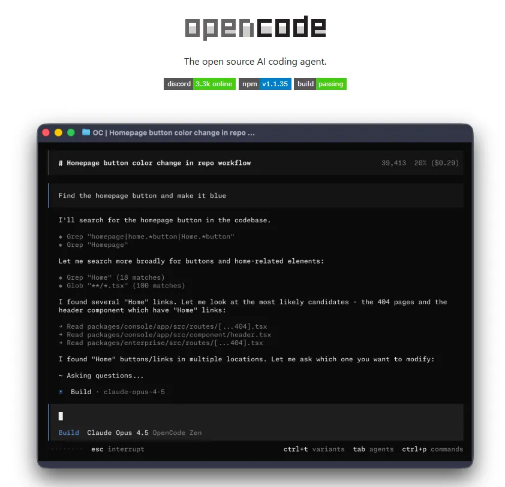
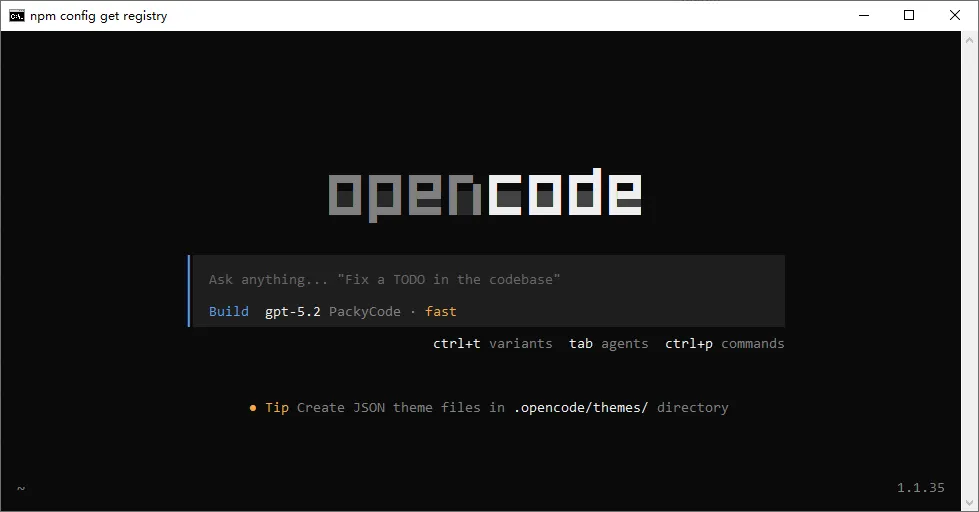
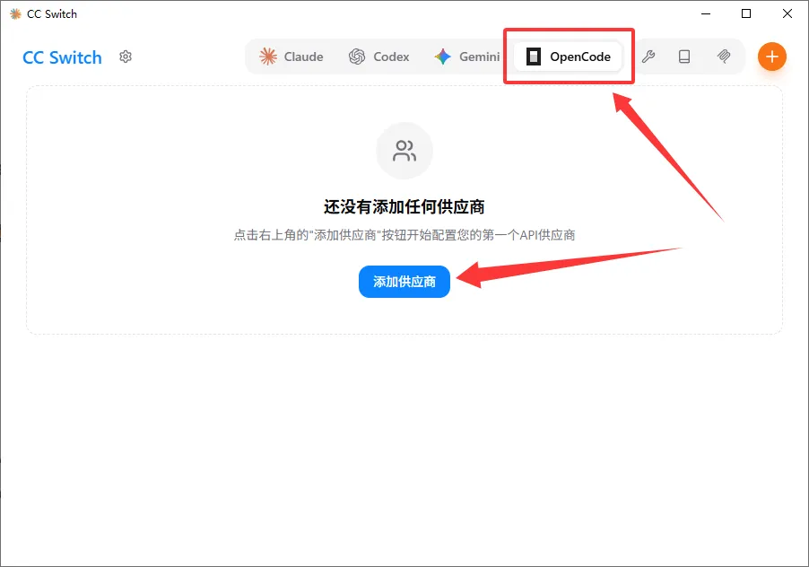
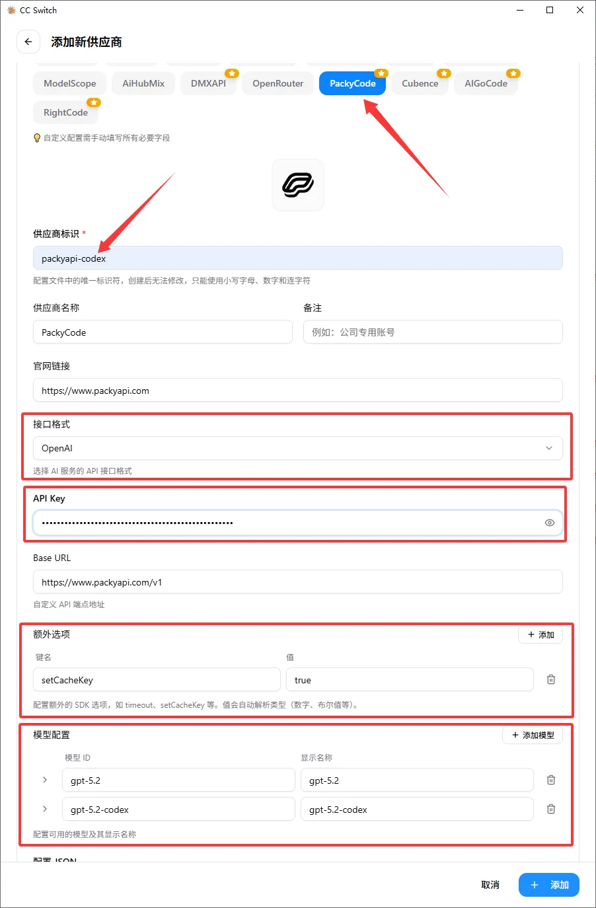
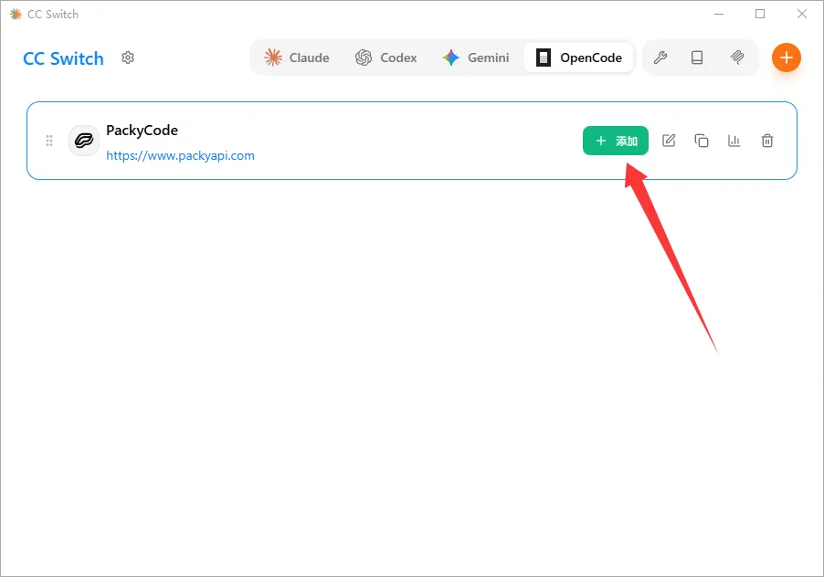
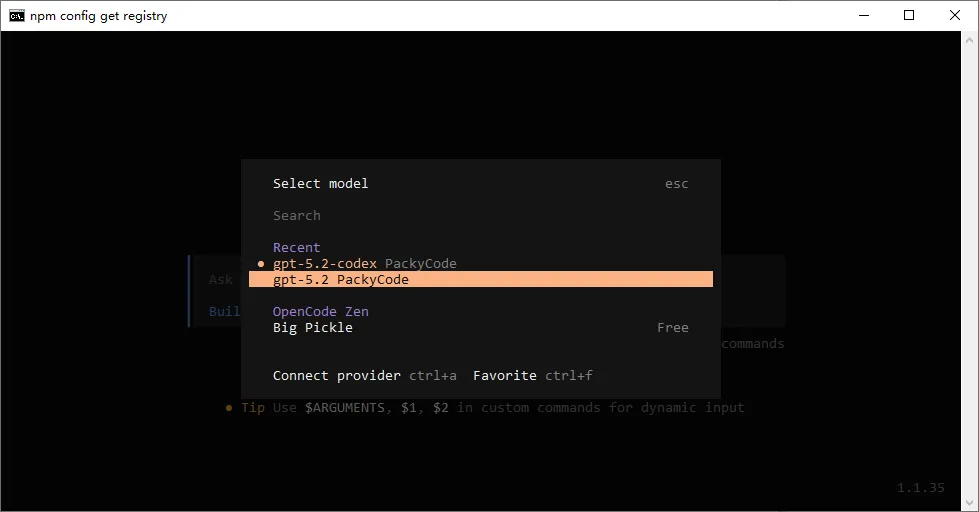
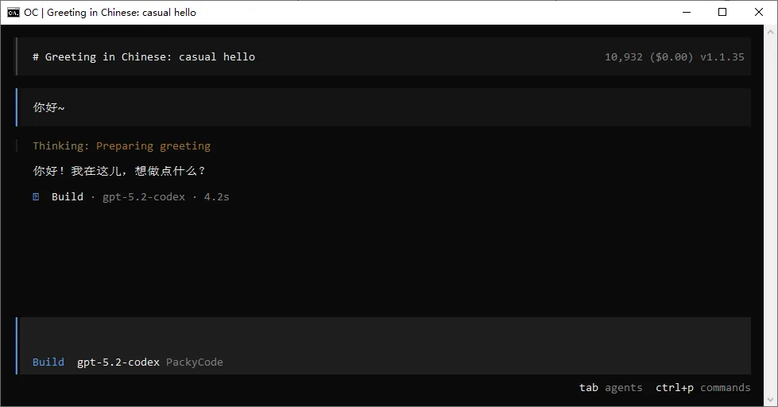

# OpenCode

<!-- Source: https://docs.goswitcher.com/docs/advanced/OpenCode.html -->

Author: goswitcher

Updated: 2026-06-13T10:02:01.000Z
## Project Introduction



-   **Project Overview**: An open-source AI programming assistant that helps write, debug, and improve code in terminal, IDE, or desktop environments.
-   **Key Features**:
    -   Native terminal or TUI support, suitable for command-line developers.
    -   Automatically loads the correct language server (LSP) to improve context understanding.
    -   Supports multiple parallel sessions and session link sharing.
    -   Supports 75+ model providers, including local models.
    -   Integrates with GitHub Copilot, ChatGPT Plus/Pro, etc.
-   **Platform Support**: Terminal CLI, desktop application (Beta), IDE extensions, etc.

## Environment Configuration

1.  Open your terminal and run the following command to globally install OpenCode

``` bash
npm install -g opencode-ai
```

2.  After installation, type `opencode` in the terminal — if the interface appears, installation is successful



3.  Refer to the [CC Switch Download](../ccswitch/1-common.md) section, download and install CC-Switch locally, then open the software

4.  Select `OpenCode` in the top configuration section, then click the `Add Provider` button



5.  Configure the following items:

    -   In `Preset Provider`, select `GoSwitcher`
    -   In `Provider Identifier`, enter a group name, e.g. GoSwitcher-Codex
    -   In `Interface Format`, select the appropriate group
        -   Claude series models: `Anthropic`
        -   Codex series models: `OpenAI`
        -   Gemini series models: `Google (Gemini)`
    -   In `API Key`, enter the Key you created in the [Create API Token](../register/4-token.md) section

    ::: warning Important

    **Currently supported groups for OpenCode:**

    -   **GPT**: [codex group](../token/2-group.md#codex%E5%88%86%E7%BB%84), [gpt-officially group](../token/2-group.md#gpt-officially%E5%88%86%E7%BB%84)

    -   **Claude**: [aws-q group](../token/2-group.md#aws-q%E5%88%96%E7%BB%84), [aws group](../token/2-group.md#aws%E5%88%96%E7%BB%84), [claude-officially group](../token/2-group.md#claude-officially%E5%88%96%E7%BB%84)

    -   **Gemini**: [gemini-slb group](../token/2-group.md#gemini-slb%E5%88%96%E7%BB%84)

    **Please create an API Key for the correct group before entering**

    -   In `Extra Options`, configure the key-value pair `{"setCacheKey":true}`
    -   In `Model Configuration`, configure the correct model names for your API Key's group. The models for each group can be found in the [Token Group Introduction](../token/2-group.md) section.
        **For example, if your API Key corresponds to the Codex group, you can configure:**
        -   Model ID: gpt-5.2 Display Name: gpt-5.2
        -   Model ID: gpt-5.2-codex Display Name: gpt-5.2-codex
    -   After completing all configuration, click the `Add` button in the bottom right corner



6.  Select the newly configured GoSwitcher channel in the interface, and click the add button


:::
## Verify Configuration

1.  Open a new terminal, type `opencode` to run

2.  Type the `/models` command and check whether the GoSwitcher channel you just configured appears. If it exists, the configuration is successful



3.  Enjoy your conversation!


