# Nano Banana2 Pro Drawing Tutorial

<!-- Source: https://docs.goswitcher.com/docs/paint/Banana.html -->

Author: goswitcher

Updated: 2026-06-13T10:02:01.000Z
## Drawing with Cherry Studio

1.  Following the [Create Token Group](../register/4-token.md#create-api-token) tutorial, you need to create a token with the **token group** set to `gemini`. After creating the token, click the copy button to copy the token to your clipboard

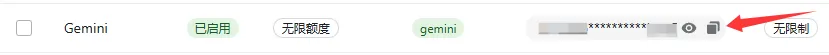

2.  Visit the [Cherry Studio](https://www.cherry-ai.com/) website to download

3.  Open Cherry Studio and click the settings button in the upper right corner

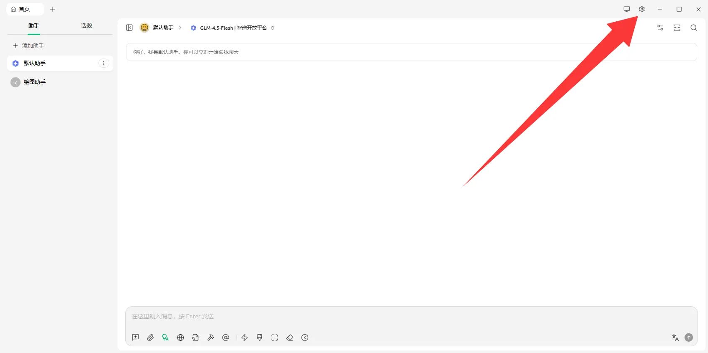

4.  Select `Model Service` on the left, then click the `Add` button at the bottom

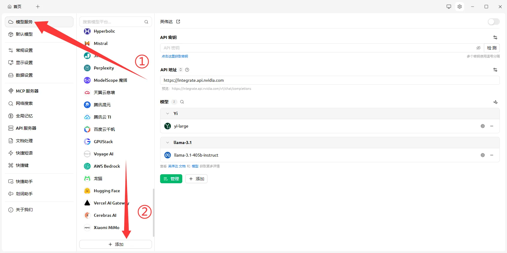

5.  In the Add Provider window, enter the provider name and type as shown in the image

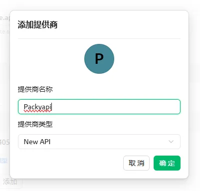

6.  Find the newly added `GoSwitcher` group in the left list. Fill in the API key with the `gemini` group API key you copied in step 1, and enter `https://goswitcher.com` for the API address

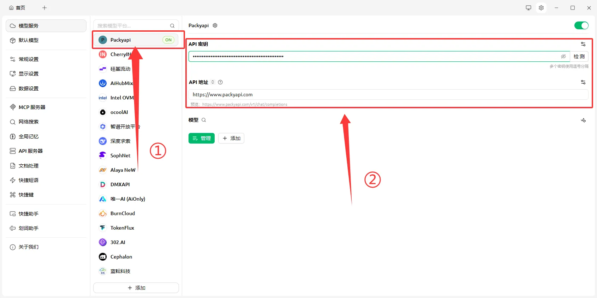

7.  Click the `Manage` button below, and in the model list popup, select our drawing model. GoSwitcher has optimized some commonly used aspect ratio and resolution models, which you can select directly as shown below

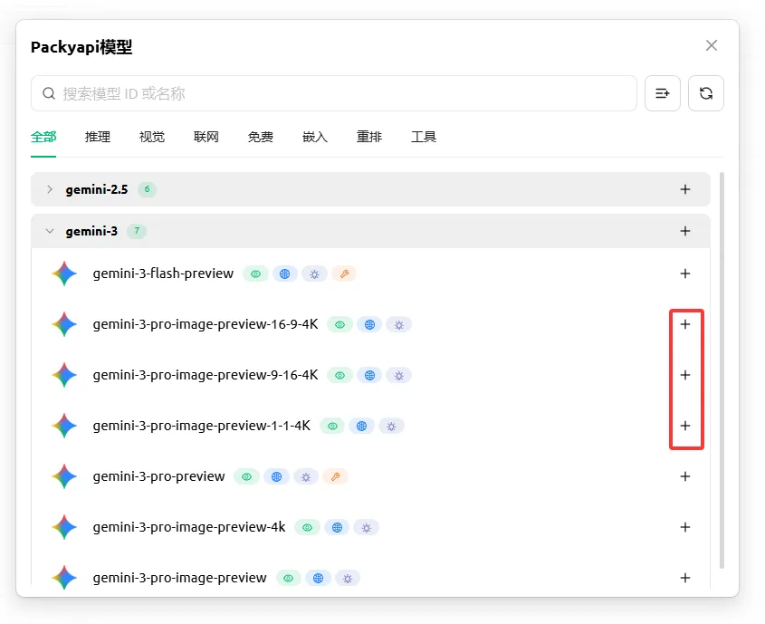

8.  After adding, it should look like the image below

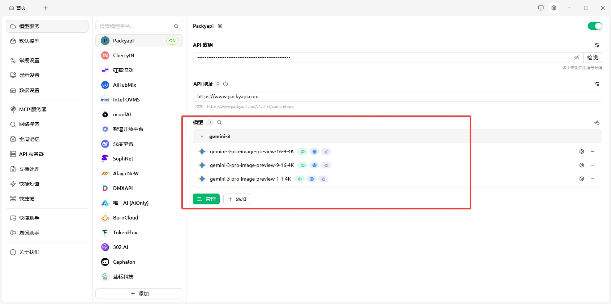

9.  Click the `Home` button in the upper left to return to the main page. Click the settings button on the right side of the assistant you're currently using. In the `Model Settings` section, find `Streaming Output` and make sure to disable it, then close the window

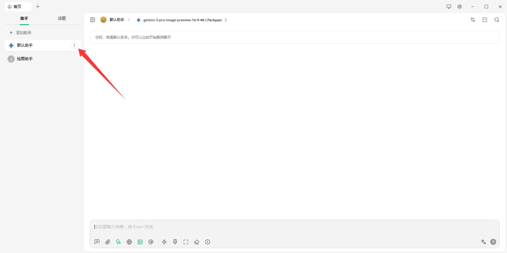

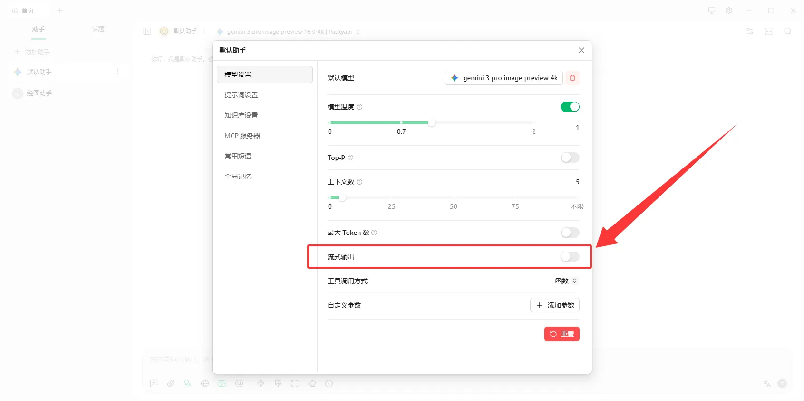

10.  Click on the model settings above and select the drawing model from the group we just created

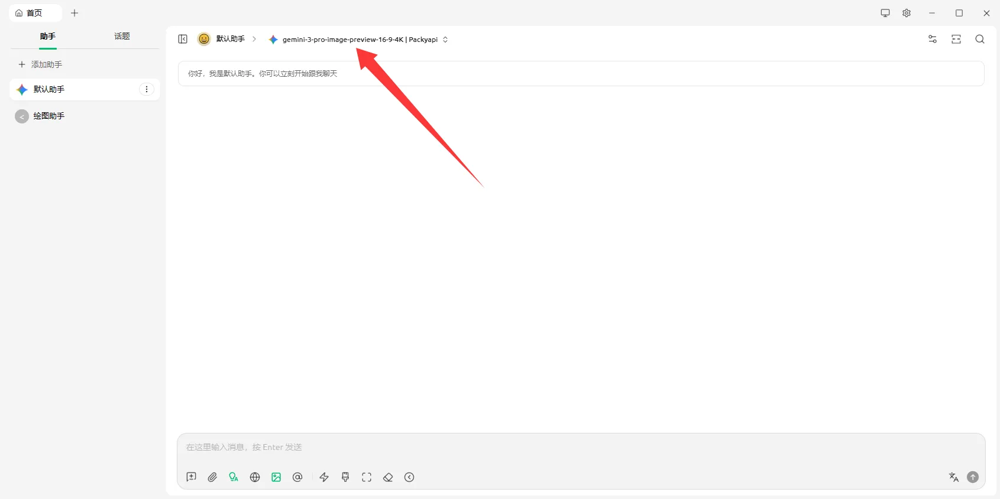

11.  Let your imagination run wild~

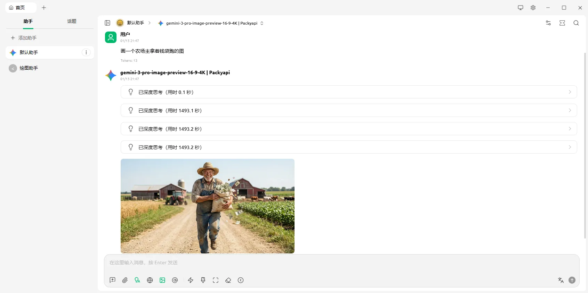
