# GPT-Image-2 Drawing Tutorial

<!-- Source: https://docs.goswitch.online/docs/paint/GPTImage.html -->

Author: goswitch

Updated: 2026-06-13T10:02:01.000Z
## Prerequisites

The `gpt-image-2` model belongs to the **Sora group**. Before using it, you need to create a token with the token group set to `sora`.

Follow the [Create Token Group](../register/4-token.md#%E8%BF%9B%E5%85%A5%E4%BB%A4%E7%89%8C%E7%AE%A1%E7%90%86) tutorial to create a token, **selecting `sora` as the group**.

## API Methods

OpenAI's official documentation divides image-related capabilities into three categories: Responses API, Images API, and Chat Completions API. For GoSwitch's `gpt-image-2`, please prioritize using the Images API for image generation.

| API | OpenAI Official Purpose | GoSwitch `gpt-image-2` Usage Recommendation | Recommendation |
| --- | --- | --- | --- |
| Responses API | Analyze images and use images as input; can also generate image output via tools | Not supported as an image generation endpoint for `gpt-image-2`. Use Images API for image generation. | Not supported |
| Images API | Generate images, or upload images as input for editing | Supports text-to-image and image editing. This is the recommended method for `gpt-image-2`. | Recommended |
| Chat Completions API | Analyze image input and generate text or audio | Not supported as an image generation endpoint for `gpt-image-2`; Images parameters like `size`, `quality`, `output_format` will not take effect via this API. | Not supported |

### Method 1: Images API (Recommended)

The Images API is the recommended method for `gpt-image-2` image generation, with two endpoints:

-   Text-to-image: `POST https://goswitch.online/v1/images/generations`
-   Image editing / image-to-image: `POST https://goswitch.online/v1/images/edits`

Each endpoint is explained in the format "API example → Parameter description" below. For beginners, just pass `model`, `prompt`, and set `n` to `1`; use the `image` field only when uploading images.

::: tip Recommended Usage

Use `/v1/images/generations` for text-to-image, and `/v1/images/edits` for uploading reference images for editing.
:::
#### Text-to-Image: `/v1/images/generations`

##### API Example

``` bash
curl --location 'https://goswitch.online/v1/images/generations' \
--header 'Content-Type: application/json' \
--header 'Authorization: Bearer YourSoraGroupToken' \
--header 'Accept: */*' \
--header 'Host: www.goswitch.online' \
--header 'Connection: keep-alive' \
--data '{
    "model": "gpt-image-2",
    "prompt": "An orange cat wearing an orange scarf holding an otter, warm illustration style",
    "size": "3840x2160",
    "quality": "high",
    "output_format": "png",
    "response_format": "url",
    "n": 1
}'
```

##### Text-to-Image Parameters

| Parameter | Type | Support Status | Description |
| --- | --- | --- | --- |
| `model` | string | Supported | Must be `gpt-image-2`. |
| `prompt` | string | Supported | Image description prompt. It's recommended to clearly specify the subject, scene, style, proportions, and any text content. |
| `n` | integer | Only `1` supported | Only 1 image per request. ~`n: 2`, `n: 4`~ multi-image output is not supported. |
| `size` | string | Supported | Supports `auto` and valid sizes such as `1024x1024`, `1536x1024`, `1024x1536`, `1536x864`, `3840x2160`. |
| `quality` | string | Supported | Options: `low`, `medium`, `high`, `auto`. Use `low` for drafts, `high` for final images. |
| `response_format` | string | Supported | Options: `url`, `b64_json`. Default recommendation: `url`; `b64_json` is suitable for programmatic image saving. |
| `output_format` | string | Partially supported | Recommended: `png` or `jpeg`. ~`webp`~ is not recommended. |
| `output_compression` | integer | Supported | Recommended only when `output_format` is `jpeg`, values from `0` to `100`. |
| `background` | string | Partially supported | Recommended: default value or `opaque`. ~`transparent`~ is not supported. |
| `moderation` | string | Supported | Options: `auto`, `low`. This is a safety review parameter; it won't directly change the visual style. Keep default if unsure. |
| `user` | string | Supported | Optional. Used to identify your end users or business source. Can be omitted for regular calls. |
| ~`stream`~ | boolean | Not supported | Do not enable this. |
| ~`partial_images`~ | integer | Not supported | Depends on `stream` for intermediate image output. Not supported. |
| ~`style`~ | string | Not recommended | This is a common parameter for older models. `gpt-image-2` does not need this. |

#### Image Editing / Image-to-Image: `/v1/images/edits`

`/v1/images/edits` uses `multipart/form-data` for image upload. `image` is a binary image file, and `prompt` specifies how you want the image modified.

##### API Example

``` bash
curl --location 'https://goswitch.online/v1/images/edits' \
--header 'Authorization: Bearer YourSoraGroupToken' \
--header 'Accept: */*' \
--form 'model="gpt-image-2"' \
--form 'prompt="Keep the main subject in the image, add a small red stamp in the upper right corner with the text DEMO"' \
--form 'image=@"/path/to/your-image.jpg"' \
--form 'size="1024x1024"' \
--form 'quality="high"' \
--form 'output_format="png"' \
--form 'response_format="url"'
```

##### Image Editing Parameters

| Parameter | Type | Support Status | Description |
| --- | --- | --- | --- |
| `model` | string | Supported | Must be `gpt-image-2`. |
| `prompt` | string | Supported | Clearly describe what to keep, what to change, and what you want the result to look like. |
| `image` | file | Supported | Required. Upload the binary image file to edit. Recommended: upload only 1 image at a time. |
| `mask` | file | Supported | Optional. Pass a PNG mask for local editing; without a mask, the entire image is edited based on the prompt. |
| `n` | integer | Only `1` supported | Only 1 image per request. ~Multiple results~ are not supported. |
| `size` | string | Supported | Same as text-to-image. Supports `auto` and valid sizes. |
| `quality` | string | Supported | Options: `low`, `medium`, `high`, `auto`. |
| `response_format` | string | Supported | Options: `url`, `b64_json`. Default recommendation: `url`. |
| `output_format` | string | Partially supported | Recommended: `png` or `jpeg`. ~`webp`~ is not recommended. |
| `output_compression` | integer | Supported | Recommended only when `output_format` is `jpeg`, values from `0` to `100`. |
| `background` | string | Partially supported | Recommended: default value or `opaque`. ~`transparent`~ is not supported. |
| `moderation` | string | Supported | Options: `auto`, `low`. This is a safety review parameter; it won't directly change the visual style. |
| `input_fidelity` | string | Supported | Pass `high` during image editing to preserve the original image's subject and details as much as possible. |
| `user` | string | Supported | Optional. Can be omitted for regular calls. |
| ~`stream`~ | boolean | Not supported | Do not enable this. |
| ~`partial_images`~ | integer | Not supported | Depends on `stream` for intermediate image output. Not supported. |

If you need local editing, you can additionally pass a `mask`. The `mask` should be a PNG image where transparent areas indicate where the model should focus on modifying; without a `mask`, the model will edit the entire image based on the prompt.

#### General Notes

##### Size and Quality

-   Popular sizes

    -   **1024 × 1024**: Square
    -   **1536 × 1024**: Landscape
    -   **1024 × 1536**: Portrait
    -   **2048 × 2048**: 2K Square
    -   **2048 × 1152**: 2K Landscape
    -   **3840 × 2160**: 4K Landscape
    -   **2160 × 3840**: 4K Portrait
    -   **auto**: Automatic (default)
-   Size constraints

    -   Maximum side length must be **less than or equal to 3840 pixels**
    -   Both width and height must be **multiples of 16**
    -   The ratio between the long side and short side **must not exceed 3:1**
    -   Total pixel count must be **at least 655,360** and **no more than 8,294,400**
-   Quality options

    -   **low**: Low quality
    -   **medium**: Medium quality
    -   **high**: High quality
    -   **auto**: Automatic (default)

::: tip How to Choose Parameters

-   Simplest text-to-image: Just pass `model`, `prompt`, and set `n` to `1`.
-   For higher resolution: Add `quality: "high"`.
-   To control size: Add `size`, e.g. `1024x1024` or `1536x1024`.
-   To get an image URL: Use the default `response_format: "url"`.
-   For programmatic image saving: Use `response_format: "b64_json"`.
-   Do not set `n` greater than `1`; for multiple images, make separate requests.
:::
##### Response Format

The default response returns an image download URL:

``` json
{
  "created": 1776923999,
  "data": [
    {
      "url": "https://external-resources.goswitch.online/file_download/xxxxxxxx-xxxx-xxxx-xxxx-xxxxxxxxxxxx",
      "revised_prompt": "..."
    }
  ]
}
```

The returned `url` is the generated image address; you can download it directly by visiting the URL. `revised_prompt` is the prompt that the model rewrote before actually using it — seeing this is normal and not an error.

If you passed `"response_format": "b64_json"` in the request, the response will contain Base64 image data:

``` json
{
  "created": 1776923999,
  "data": [
    {
      "b64_json": "iVBORw0KGgoAAAANSUhEUgAA...",
      "revised_prompt": "..."
    }
  ]
}
```

In this case, there is usually no `url` in the response; the client must decode the `b64_json` into an image file itself. Both `url` and `b64_json` response formats include `revised_prompt`. For regular users, the default `url` format is recommended — it's the easiest way to save and share images.

### Method 2: Responses API (Not Supported)

::: warning Not Supported

GoSwitch's `gpt-image-2` does not support image generation via `/v1/responses`. Do not use `image_generation` tool, `input`, or `input_image` to call `gpt-image-2` for image generation.

For text-to-image, use `/v1/images/generations`; for uploading images for editing, use `/v1/images/edits`.
:::
### Method 3: Chat Completions API (Not Supported)

::: warning Not Supported

GoSwitch's `gpt-image-2` does not support image generation via `/v1/chat/completions`. Do not put `messages`, `image_url`, `size`, `quality`, `output_format` or other parameters into Chat Completions to call image generation.

If using Cherry Studio, please switch to the "Painting" application and ensure the endpoint type is set to `Image Generation (OpenAI)`.
:::
::: tip For Developers

If your client only supports Chat Completions and must integrate image capabilities, we recommend prioritizing support for the OpenAI Images API. Do not use `/v1/chat/completions` as a substitute for `/v1/images/generations`.
:::
## Using in Cherry Studio

1.  Follow the [Create Token Group](../register/4-token.md#%E8%BF%9B%E5%85%A5%E4%BB%A4%E7%89%8C%E7%AE%A1%E7%90%86) tutorial to create a token with the **token group** set to `sora`. After creating the token, click the copy button to copy the API Key to your clipboard.

2.  Visit the [Cherry Studio](https://www.cherry-ai.com/) official website to download and install the software.

3.  Open Cherry Studio, click the settings button in the bottom left corner, go to the `Model Services` page, and click the `Add` button at the bottom to add a new provider.

4.  In the Add Provider window, fill in the provider name, e.g. `goswitch-gpt-image-2`, select `New API` as the `Provider Type`, then click `Confirm`.

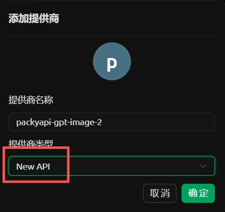

5.  Find the newly added provider in the left sidebar, fill in the `sora` group API Key copied in step 1 into `API Key`, and set `API Address` to `https://goswitch.online`.

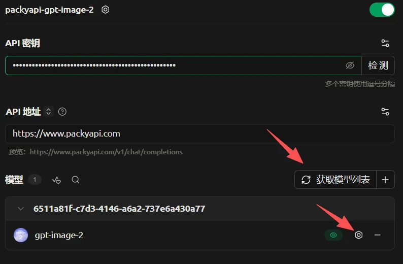

6.  Click `Get Model List` on the right side of the model area, refresh, and add the `gpt-image-2` model. After adding, you should see `gpt-image-2` in the model list on the provider configuration page.

7.  Click the edit button on the right side of `gpt-image-2`, enter the edit model window, set the `Endpoint Type` to `Image Generation (OpenAI)`, then click `Save`.

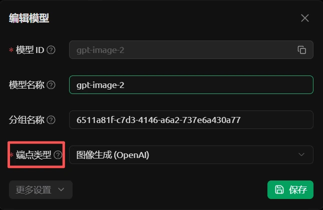

8.  Return to the home page, click the `+` button at the top, and select `Painting` from the application list.

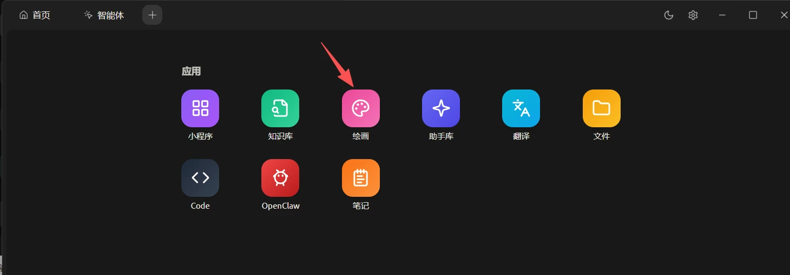

9.  On the painting page, select the provider you just added on the left side under `Provider`, and select `gpt-image-2` under `Model`. For first-time use, we recommend keeping `Image Size`, `Quality`, `Sensitivity`, and other options as `Auto`, and `Generation Count` as `1`.

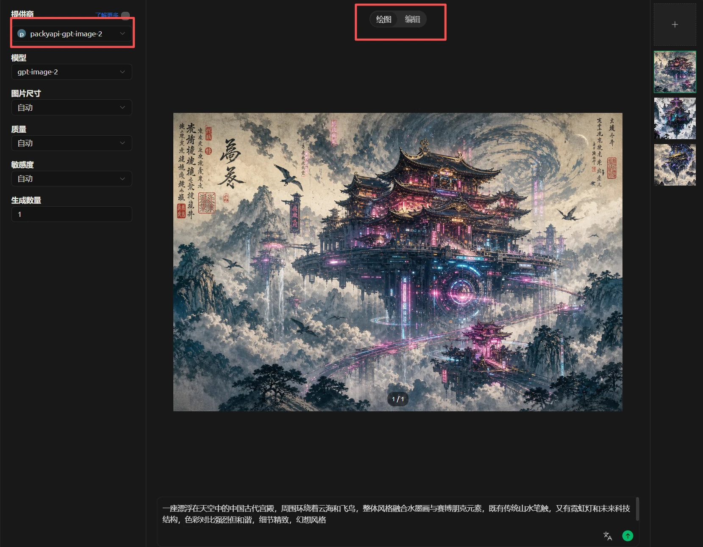

10.  If you only want to generate images from text prompts, select `Draw` mode at the top, enter your prompt, and click the send button to start generating.

11.  If you need to upload a reference image for image-to-image or local editing, switch to `Edit` mode at the top, upload your reference image in `Input Image` on the left, enter your modification instructions, and click the send button.

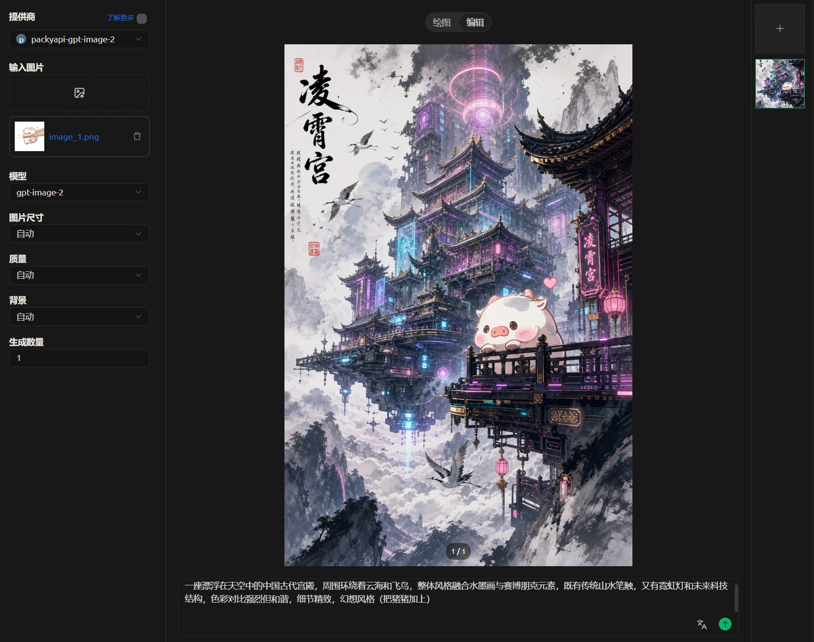

::: tip Usage Tips

-   `API Address` should simply be `https://goswitch.online`; Cherry Studio will automatically append the compatible endpoint, no need to manually add `/v1`.
-   If `gpt-image-2` is not in the model list, first refresh models in `Manage`; if image generation still doesn't work, check whether the `Endpoint Type` is set to `Image Generation (OpenAI)`.
-   Use `Draw` mode for text-to-image; use `Edit` mode to upload reference images for image-to-image or local editing.
-   If you call `gpt-image-2` directly in a regular chat page, we recommend disabling `Stream Output` to avoid content parsing issues. No additional handling is needed when using the `Painting` application.
:::
### Possible Issues

If Cherry Studio shows `Failed to fetch`, it usually means the request connection was interrupted, which may be related to your local proxy or network environment. Check your proxy settings first, confirm that Cherry Studio can properly access `https://goswitch.online`, and then retry.

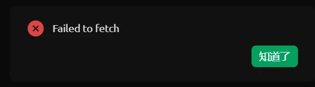

If Cherry Studio shows `Unexpected token '<', "<html><h"... is not valid JSON`, it usually means you received a Cloudflare or similar page during the request, and the client is displaying an error when trying to parse it as JSON. You can directly retry, or try again later.

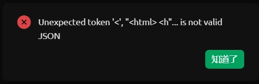

## Important Note: Long Connections and Proxy Settings

Whether calling the API directly or using `gpt-image-2` in client programs like Cherry Studio, image generation requests typically take longer than regular chat requests, especially when using editing mode, high quality, or high resolution. If your local proxy, network tools, or intermediate gateways have long connection limits, they may actively disconnect around 60 seconds,表现为 API request timeout, no response content, or the client showing `Failed to fetch`.

Below is an example using Cherry Studio's editing mode — when a long connection is interrupted, the client usually pops up `Failed to fetch`; in developer tools, you can also see the `edits` request stopping around 1 minute. When calling the API directly, the interface prompt may differ, but the root cause is the same: the connection was interrupted before image generation completed.

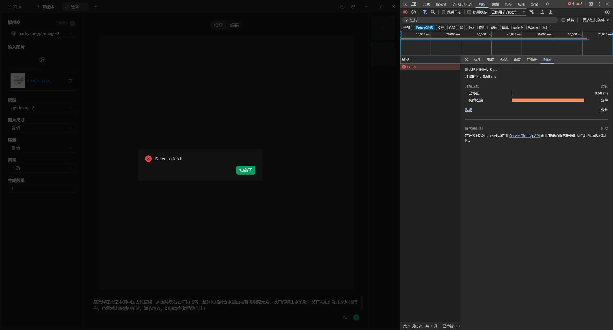

If you confirm that the proxy is causing the disconnection, we recommend adding the domain `goswitch.online` to your proxy tool's direct connection or whitelist rules, so that access to the GoSwitch API no longer goes through the proxy. Different proxy software may have different settings, but the core is adding a domain rule like `domain:goswitch.online`.

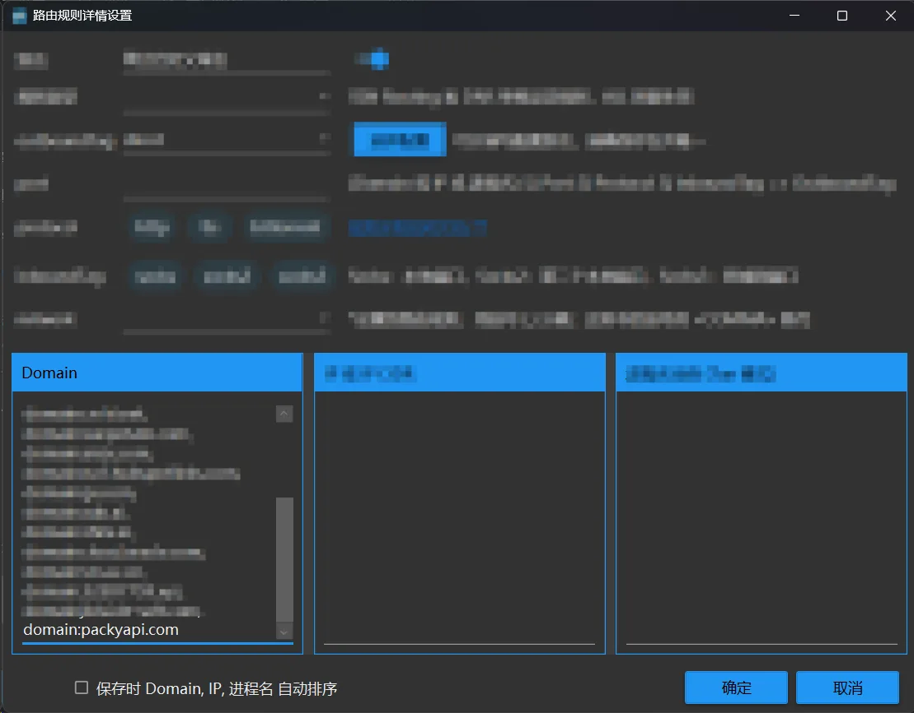

After bypassing the proxy, similar requests can wait longer and return normally. In the image below, the request returned an image after about 1.6 minutes; if using higher resolution or quality settings, generation time may increase further. To reduce uncontrollable network interruptions, we recommend connecting directly to `goswitch.online` for image generation requests, rather than going through proxies or transit networks that limit long connections.

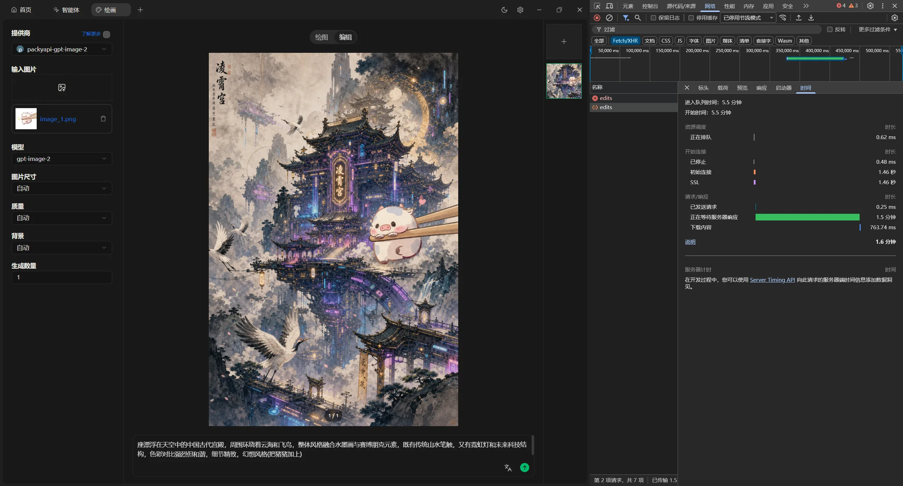
