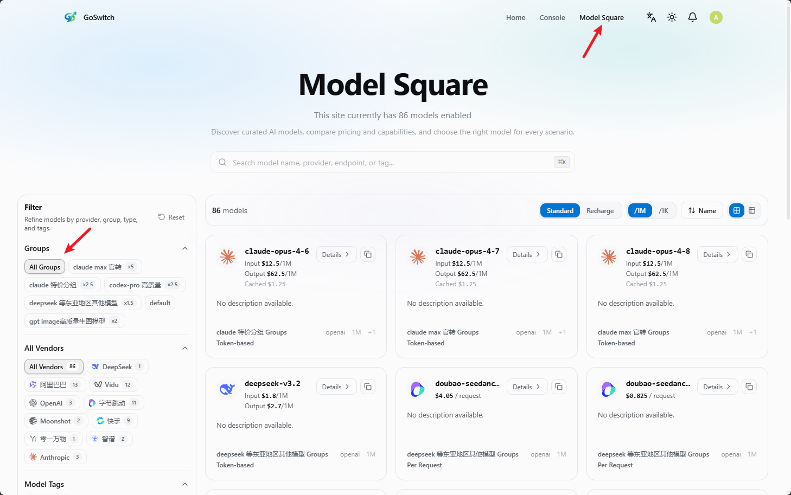

# Group Introduction

<!-- Source: https://docs.goswitch.online/docs/token/ -->

Author: goswitch

Updated: 2026-06-13T10:02:01.000Z
## How to View Latest Groups

1.  In the console panel, click "Model Plaza" in the upper right corner to view groups and models

2.  In Model Plaza, the left side (highlighted in red) shows the token groups mentioned in the [Create API Token](../register/4-token.md) step, and the right side shows the models available under that group

::: warning Why should you learn this?

Teaching someone to fish is better than giving them a fish. Many people only look at group names without understanding what models are actually in each group. After configuring hastily, they encounter "model not found" errors.

**To prevent this, we'll teach you how to check detailed information for each group directly.**

:::
## Token Group Introduction

### Default Group

::: info Details

-   **Group Description:**
    -   A default group with no specific model categorization. Contains test models, uncategorized models, and miscellaneous models. Generally not useful — just be aware of it
:::
::: warning Important

**If you want to use CC, Codex, or Gemini CLI, this group is irrelevant. Do NOT select this group when creating a token!!!**

-   **Supported CLI:**

    -   None
-   **Third-party Integration:**

    -   ✕ Not supported
-   **Model List (Real-time query):**
:::
### Aws Group

::: info Details

-   **Group Description:**

    -   Reverse-engineered Claude models from Amazon AWS platform. Slightly cheaper than official AWS channels, but with somewhat lower stability. Can be used for Claude Code and other third-party platforms
-   **Supported CLI:**

    -   Claude Code
-   **Third-party Integration:**

    -   ✓ Supported
-   **Model List (Real-time query):**
:::
### Aws-officially Group

::: info Details

-   **Group Description:**

    -   Official Claude API purchased from Amazon AWS platform. Deployed separately from Claude's official models. More expensive but stable, suitable as a fallback option — just be aware of it
-   **Supported CLI:**

    -   Claude Code
-   **Third-party Integration:**

    -   ✓ Supported
-   **Model List (Real-time query):**
:::
### Aws-Q Group

::: info Details

-   **Group Description:**
    -   Reverse-engineered Claude models from Kiro's AWSQ, converted to API format. Uses a special channel with a series of techniques, resulting in extremely low pricing. Compared to Claude's official models, this group has a 200K context window and supports thinking, suitable for daily use, task planning, translation, etc.
:::
::: warning Important

**Note: This group may experience 422 errors and other issues when used with Claude Code. Stability is inferior to CC and Aws groups**

-   **Supported CLI:**

    -   Claude Code
-   **Third-party Integration:**

    -   ✓ Supported
-   **Model List (Real-time query):**
:::
### Azure-officially Group

::: info Details

-   **Group Description:**

    -   Official Azure channel providing GPT-related models. Can be used in OpenCode and other third-party tools, or for general chat
-   **Supported CLI:**

    -   None
-   **Third-party Integration:**

    -   ✓ Supported
-   **Model List (Real-time query):**
:::
### Bailian Group

::: info Details

-   **Group Description:**

    -   Alibaba Cloud Bailian official version channel. Models in this group use tiered pricing
-   **Supported CLI:**

    -   Claude Code
-   **Third-party Integration:**

    -   ✓ Supported
-   **Model List (Real-time query):**
:::
### CC Group

::: info Details

-   **Group Description:**

    -   You must select this group when using Claude Code! One of the main groups, specifically designed for Claude Code. Cannot be connected to any third-party platform. If GoSwitch's environment audit is triggered, your account will be suspended and enter the refund process. This is because some people ask Claude NSFW questions, triggering ethical audits that result in account bans with no refunds. To maintain pool stability, please do not connect to any third-party
-   **Supported CLI:**

    -   Claude Code
-   **Third-party Integration:**

    -   ✕ Not supported
-   **Model List (Real-time query):**
:::
### CC-azu-sale Group

::: info Details

-   **Group Description:**

    -   Available for third-party and Claude Code use — a great value option
-   **Supported CLI:**

    -   Claude Code
-   **Third-party Integration:**

    -   ✓ Supported
-   **Model List (Real-time query):**
:::
### CC-expensive Group

::: info Details

-   **Group Description:**

    -   Premium Claude Code group, available for third-party use
-   **Supported CLI:**

    -   Claude Code
-   **Third-party Integration:**

    -   ✓ Supported
-   **Model List (Real-time query):**
:::
### CC-sale Group

::: info Details

-   **Group Description:**
    -   Budget-friendly Claude Code group providing cheaper Claude models with similar performance to official channels. Can be used with OpenClaw and other third-party tools (raising lobsters)
:::
::: warning Important

**This group may have cache anomalies**

-   **Supported CLI:**

    -   Claude Code
-   **Third-party Integration:**

    -   ✓ Supported
-   **Model List (Real-time query):**
:::
### claude-officially Group

::: info Details

-   **Group Description:**

    -   Official Claude API key channel. Prices basically match official rates, suitable for emergency use
-   **Supported CLI:**

    -   Claude Code
-   **Third-party Integration:**

    -   ✓ Supported
-   **Model List (Real-time query):**
:::
### claude-sale Group

::: info Details

-   **Group Description:**

    -   Reverse-engineered Claude models. Slightly more expensive, similar to official channels, suitable for emergency use
-   **Supported CLI:**

    -   Claude Code
-   **Third-party Integration:**

    -   ✓ Supported
-   **Model List (Real-time query):**
:::
### Codex Group

::: info Details

-   **Group Description:**

    -   You must select this group when using Codex! One of the main groups, specifically designed for Codex use. Can also be connected to third-party platforms. However, it's best to use in Codex because the models in this group are specialized for programming — using them for other purposes may not yield ideal results
-   **Supported CLI:**

    -   Codex
-   **Third-party Integration:**

    -   ✓ Supported
-   **Model List (Real-time query):**
:::
### Codex-sale Group

::: info Details

-   **Group Description:**

    -   Discount version of the Codex group with more affordable pricing
-   **Supported CLI:**

    -   Codex
-   **Third-party Integration:**

    -   ✓ Supported
-   **Model List (Real-time query):**
:::
### Cxtocc Group

::: info Details

-   **Group Description:**
    -   An early compatibility group that adapted Codex group models for Claude Code. Since its stability and cache performance no longer meet recommended standards, it's only kept for reference by existing users.
:::
::: warning Important

**This group is no longer recommended for use. New users should prioritize selecting the recommended groups for their corresponding tools: GPT models are recommended for use in Codex, Claude models are recommended for use in Claude Code.**

-   **Supported CLI:**

    -   Claude Code
-   **Third-party Integration:**

    -   ✕ Not supported
-   **Model List (Real-time query):**
:::
### DeepSeek-officially Group

::: info Details

-   **Group Description:**

    -   Official DeepSeek channel providing DeepSeek-related models
-   **Supported CLI:**

    -   None
-   **Third-party Integration:**

    -   ✓ Supported
-   **Model List (Real-time query):**
:::
### Doubao Group

::: info Details

-   **Group Description:**

    -   Volcano Ark official channel, slightly cheaper than official rates, providing Doubao-related models
-   **Supported CLI:**

    -   Claude Code
-   **Third-party Integration:**

    -   ✓ Supported
-   **Model List (Real-time query):**
:::
### Gemini Group

::: info Details

-   **Group Description:**

    -   Gemini standard pool, suitable for general scenarios. Slightly less stable but more economical
-   **Supported CLI:**

    -   Gemini
-   **Third-party Integration:**

    -   ✓ Supported
-   **Model List (Real-time query):**
:::
### Gemini-officially Group

::: info Details

-   **Group Description:**

    -   Fully connected official Gemini API channel. Prices match official rates, suitable for enterprise users
-   **Supported CLI:**

    -   Gemini CLI
-   **Third-party Integration:**

    -   ✓ Supported
-   **Model List (Real-time query):**
:::
### Gemini-slb Group

::: info Details

-   **Group Description:**

    -   Gemini enterprise pool, more stable but slightly more expensive. Using Gemini-3 with this group's pool provides a great experience
-   **Supported CLI:**

    -   Gemini
-   **Third-party Integration:**

    -   ✓ Supported
-   **Model List (Real-time query):**
:::
### GPT-officially Group

::: info Details

-   **Group Description:**

    -   Choose this group cautiously! Official GPT API key distribution models, suitable for users with specific needs. General users should not select this group as it will quickly consume quota
-   **Supported CLI:**

    -   None
-   **Third-party Integration:**

    -   ✓ Supported
-   **Model List (Real-time query):**
:::
### Image Group

::: info Details

-   **Group Description:**

    -   Official stable Image generation model aggregation group. For specific usage, refer to the "Image Model Tutorial" section
-   **Supported CLI:**

    -   None
-   **Third-party Integration:**

    -   ✓ Supported
-   **Model List (Real-time query):**
:::
### Mimo-officially Group

::: info Details

-   **Group Description:**

    -   Xiaomi MiMo official version channel
-   **Supported CLI:**

    -   None
-   **Third-party Integration:**

    -   ✓ Supported
-   **Model List (Real-time query):**
:::
### Minimax-officially Group

::: info Details

-   **Group Description:**

    -   Official Minimax channel providing relatively affordable Minimax models
-   **Supported CLI:**

    -   Claude Code
-   **Third-party Integration:**

    -   ✓ Supported
-   **Model List (Real-time query):**
:::
### Pplx Group

::: info Details

-   **Group Description:**

    -   Reverse-engineered Perplexity-related models. No detailed explanation needed — just be aware of it
-   **Supported CLI:**

    -   None
-   **Third-party Integration:**

    -   ✓ Supported
-   **Model List (Real-time query):**
:::
### Sora Group

::: info Details

-   **Group Description:**

    -   Dedicated group for Sora video generation models
-   **Supported CLI:**

    -   None
-   **Third-party Integration:**

    -   ✓ Supported
-   **Model List (Real-time query):**
:::
### zai-officially Group

::: info Details

-   **Group Description:**

    -   Official Zhipu GLM (ChatGLM) channel, suitable for Claude Code integration or daily conversation
-   **Supported CLI:**

    -   Claude Code
-   **Third-party Integration:**

    -   ✓ Supported
-   **Model List (Real-time query):**

:::
