# Claude Desktop

<!-- Source: https://docs.goswitch.online/docs/advanced/ClaudeDesktop.html -->

Author: goswitch

Updated: 2026-06-13T10:02:01.000Z
## Software Download

1.  Click the [Claude Desktop download link](https://claude.com/download) to go to the download page

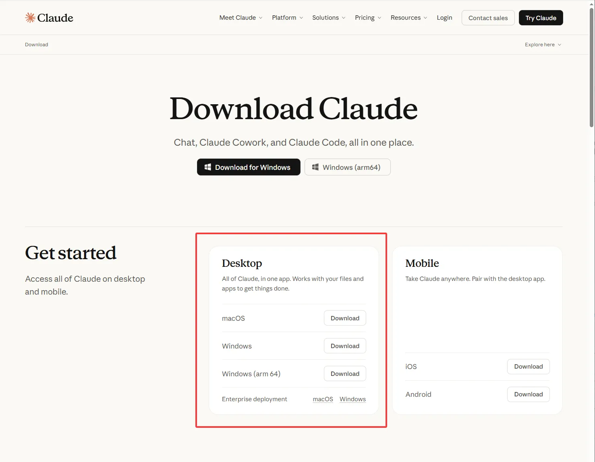

2.  In the `Desktop` section shown above, download the installer for your system

## Software Installation

Windows

1.  On Windows, the software installation requires contacting Anthropic's official servers. You need to use a VPN with **global service (TUN mode)**, or run the installer from the command line to force it through the proxy. Otherwise, you will see the following error:

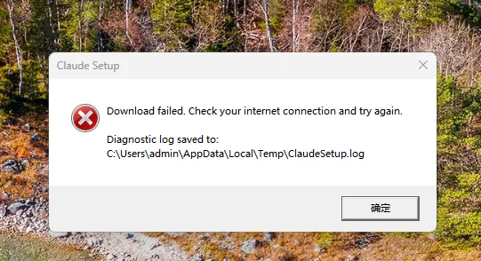

2.  If you encounter the above error and cannot install, open `cmd` in the directory where the Claude Desktop installer is located

3.  Check your VPN's port number. For example, if you're using `Clash Verge`, the port is `7897`

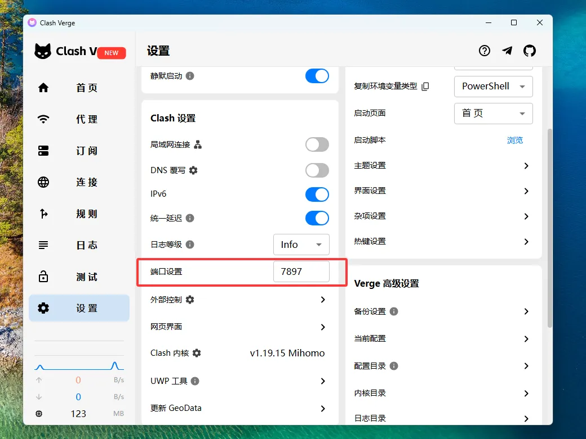

4.  Enter the following commands in the command line to run the installer with proxy settings:

``` bash
set HTTP_PROXY=http://127.0.0.1:7897
set HTTPS_PROXY=http://127.0.0.1:7897
"Claude Setup.exe"
```

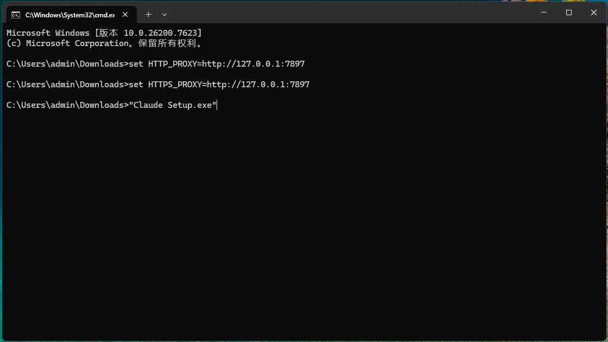

5.  The installation should proceed normally

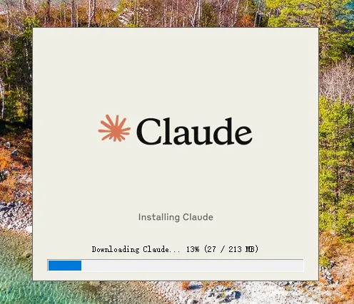

MacOS

1.  On MacOS, you can install directly without additional steps

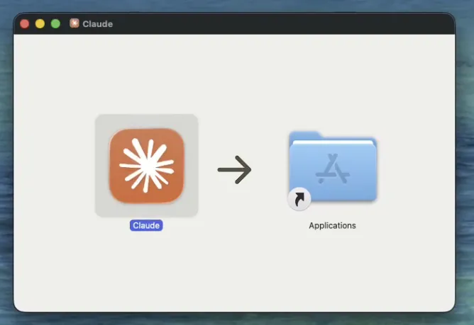

## Bypass Login and Configure Third-Party API

1.  Open the software and enter the login screen

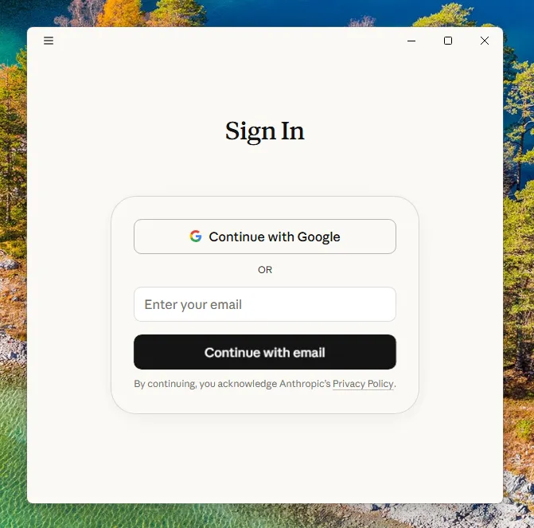

2.  Enable Developer Mode

Windows

1.  Click on the message input field to gain focus, then use Tab to navigate to the top-left menu, press Enter, and navigate through → help → troubleshooting → enable developer mode

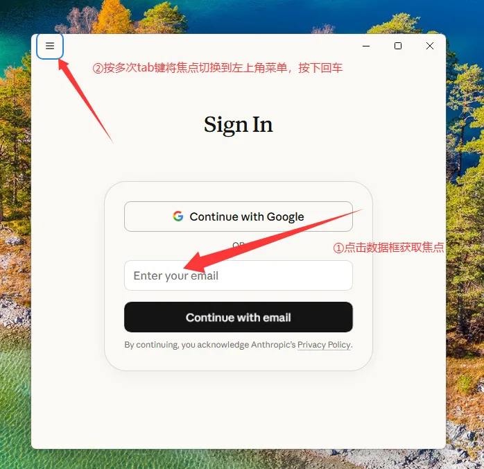

2.  Enable `enable developer mode`

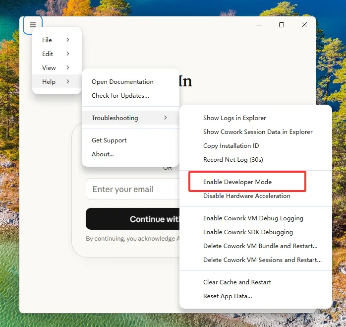

MacOS

1.  From the top-left menu, navigate through → help → troubleshooting → enable developer mode

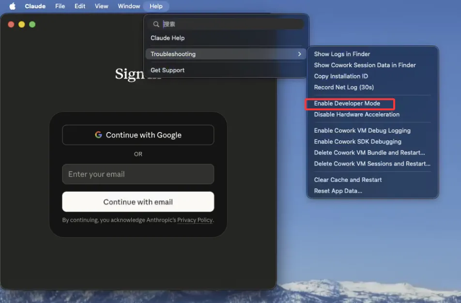

2.  Enable `enable developer mode`


3.  Wait for the software to restart

## Configure Third-Party API

1.  Open the menu again the same way, navigate through Developer → Configure third-party inference

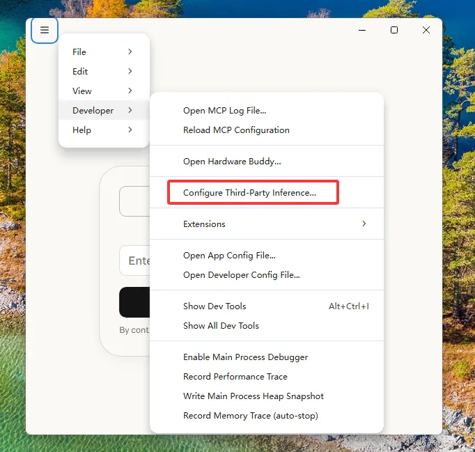

2.  In Gateway base URL, enter `https://goswitch.online`

3.  Change Gateway auth scheme to `x-api-key`

4.  For Gateway API key, enter your CC group API Key

5.  Enable the `Skip login-mode chooser` option at the bottom

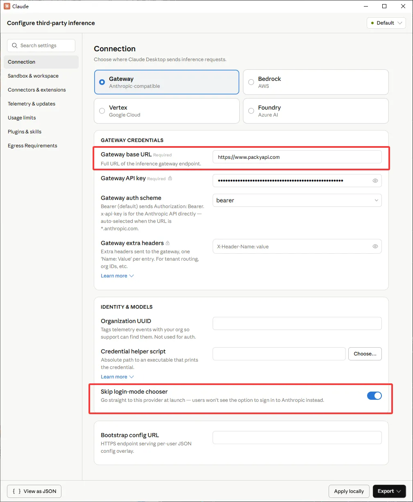

6.  Click the `Apply locally` button in the bottom right corner to apply the configuration

7.  Enjoy your conversation!

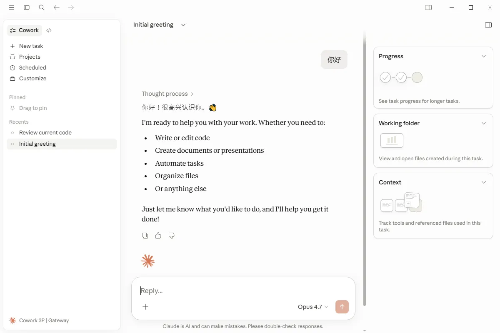
