# OpenClaw

<!-- Source: https://docs.goswitch.online/docs/advanced/OpenClaw.html -->

Author: goswitch

Updated: 2026-06-13T10:02:01.000Z
::: tip Note

**This tutorial is intended for Linux cloud server and MacOS users**
:::
## Installation and Initialization

1.  Log into your server via SSH, or open your terminal program on MacOS, and enter the following command to start the installation. Wait patiently for the installation process to complete. When the following interface appears, select `yes` and press Enter to confirm

```bash
curl -fsSL https://openclaw.ai/install.sh | bash
```

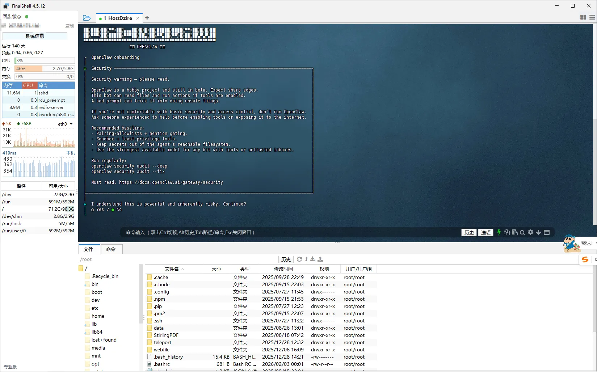

2.  Next, select `QuickStart` and press Enter to confirm

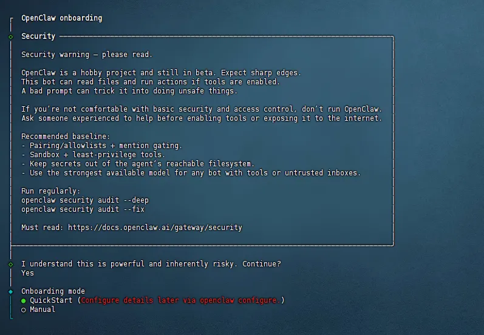

3.  In the provider selection section, select `Skip for now` and press Enter to skip the setup

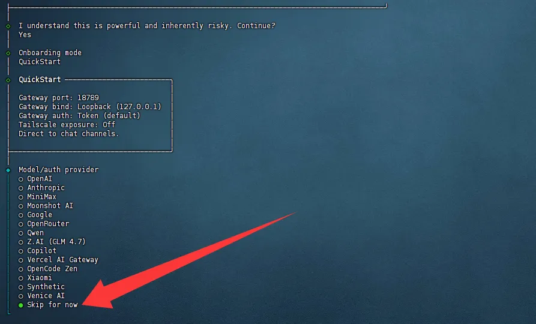

4.  In the adapter selection section, select `anthropic`

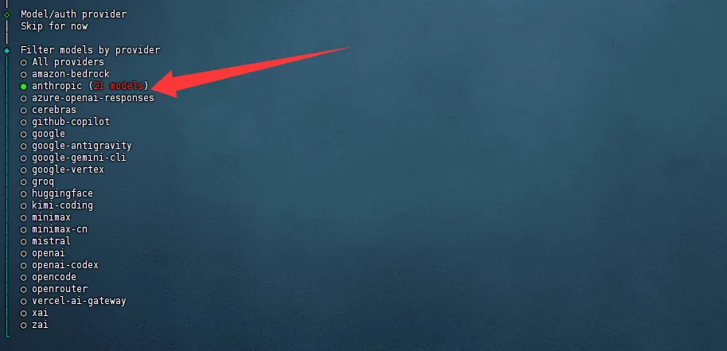

5.  In the model selection section, select `opus-4.5`

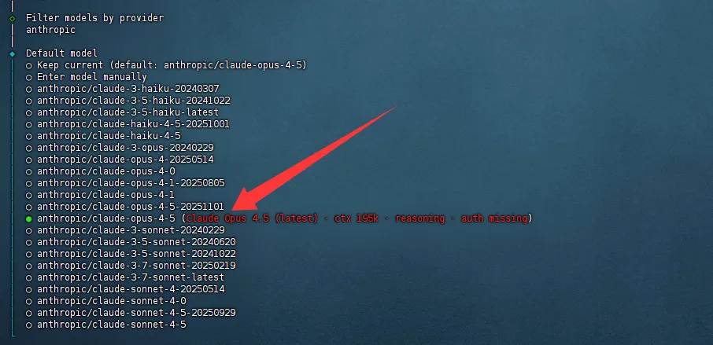

6.  Here, select a social software adapter based on your needs. For testing, we select `Telegram`

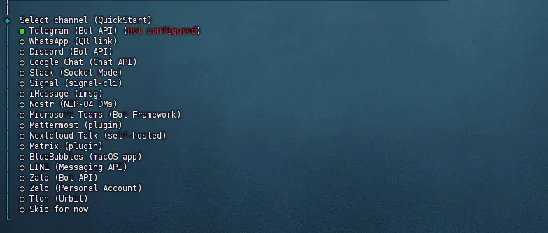

7.  Enter the Bot Token, then press Enter

8.  Here, select Skills installation — skip this for now, you can install them later via the web interface

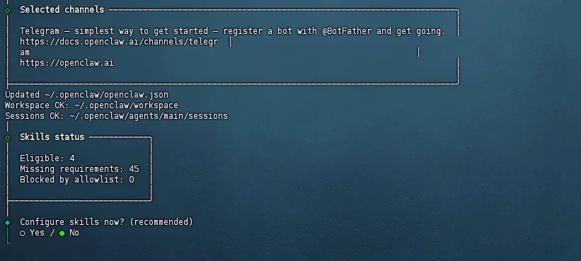

9.  Select Hooks using the spacebar to select all, then press Enter to confirm. The Gateway installation process will follow — please wait patiently

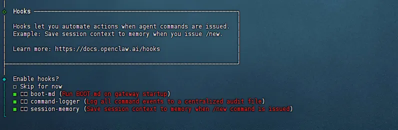

10.  For the open method, select skip for now

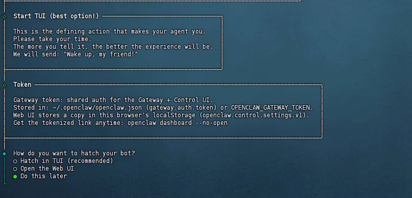

11.  For installing the Shell completion script, select `yes` and press Enter to confirm. This completes the installation

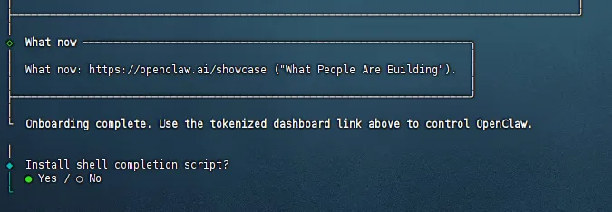

## Channel and Model Configuration

::: tip Note

GoSwitch has written a dedicated configuration script for OpenClaw. The GitHub repository is: [openclaw-configurator](https://github.com/packyme/openclaw-configurator). This script can quickly help us configure GoSwitch's API.

The script currently does not support Gemini channel configuration — still under construction!

1.  In your SSH console or MacOS terminal, enter the following command to install the configurator

```bash
curl -fsSL https://github.com/packyme/openclaw-configurator/releases/latest/download/index.js -o /tmp/openclaw-config.js && node /tmp/openclaw-config.js
```

2.  Select `Add Provider`, then select `GoSwitch`

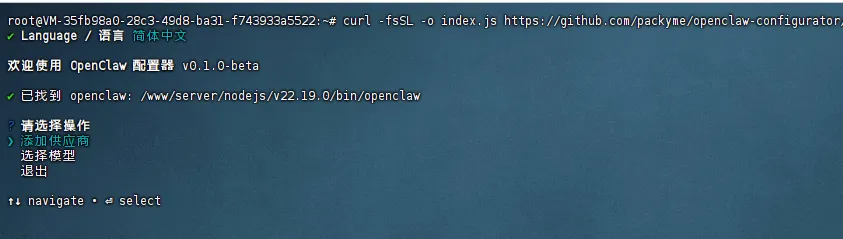

3.  Using Opus as an example, select `Claude Opus 4.5` from the available models

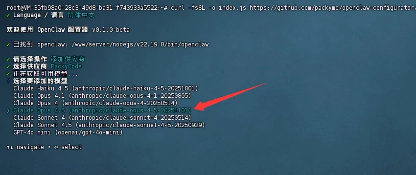

4.  Enter the token you created in the [Create API Token](../register/4-token.md) section for the relevant group, copy and paste it
:::
::: tip Note

**Currently recommended groups for OpenClaw:**

-   **GPT**: [codex group](../token/2-group.md#codex%E5%88%86%E7%BB%84), [gpt-officially group](../token/2-group.md#gpt-officially%E5%88%86%E7%BB%84)

-   **Claude**: [aws-q group](../token/2-group.md#aws-q%E5%88%86%E7%BB%84), [aws group](../token/2-group.md#aws%E5%88%86%E7%BB%84), [claude-officially group](../token/2-group.md#claude-officially%E5%88%86%E7%BB%84)

-   **Gemini**: [gemini-slb group](../token/2-group.md#gemini-slb%E5%88%86%E7%BB%84)

**Please create an API Key for the correct group before entering**

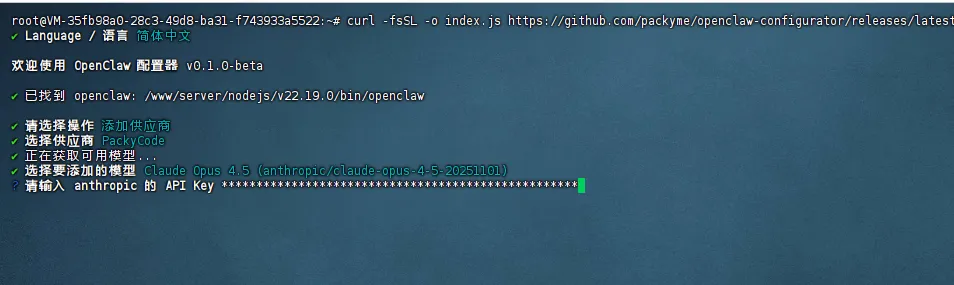

5.  Select `Select Model`, then select the model we just configured, and press Enter to confirm

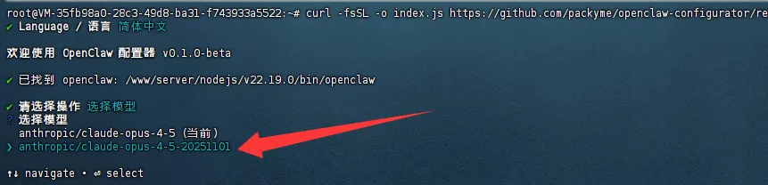

6.  Select `Exit` to return to our console

7.  In the console, enter the following command to restart the Gateway

```bash
openclaw gateway restart
```

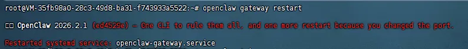

8.  After successful restart, enter the following command in the console to enter the TUI interface and test whether the model can output normally. If testing is normal, type `/quit` to exit the TUI interface

```bash
openclaw tui
```

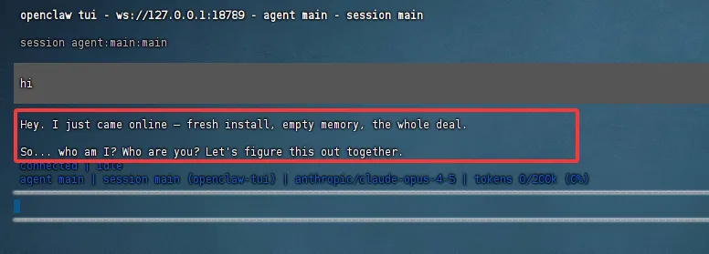
:::
## Browser Access

1.  Enter the following command in the console to get the `Dashboard URL`, then access it in your browser

::: tip Note

**If you are running on a server, please use nginx or another reverse proxy tool to proxy the service, and set up SSL certificates**

You also need to modify the `openclaw.json` file under `~/.openclaw`, adding the following content under the `gateway` field:

```json
"controlUi":{
    "allowInsecureAuth":true
}
```

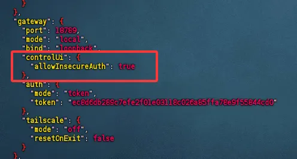

After modifying, return to the console and enter the following command to restart the gateway

```bash
openclaw gateway restart
```

2.  Visit the `Dashboard URL` with the Token to enter the dashboard interface

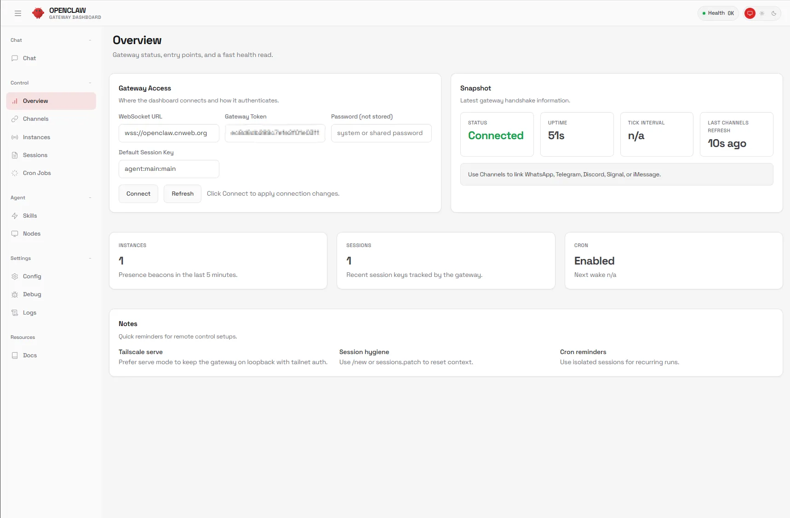
:::
## Configure Telegram Bot Access

1.  Return to the conversation with @BotFather where you previously created the bot, click our bot link, and start a conversation

2.  On first conversation, obtain the required `Pairing code`

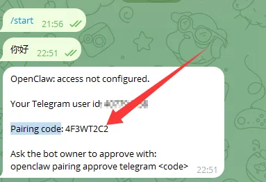

3.  Enter the following command in the console to allow interaction with the Bot

```bash
openclaw pairing approve telegram YourPairingCode
```

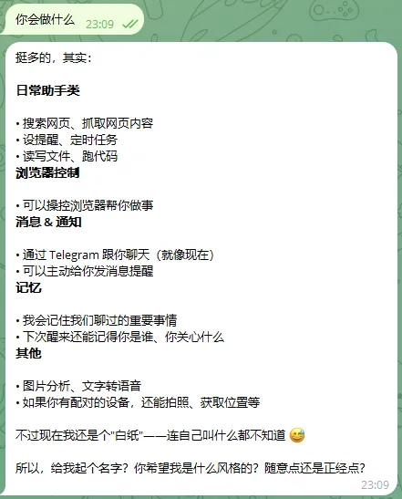
