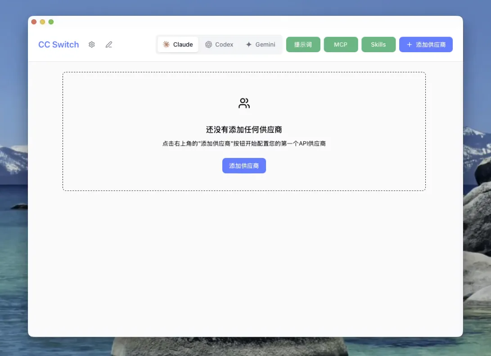
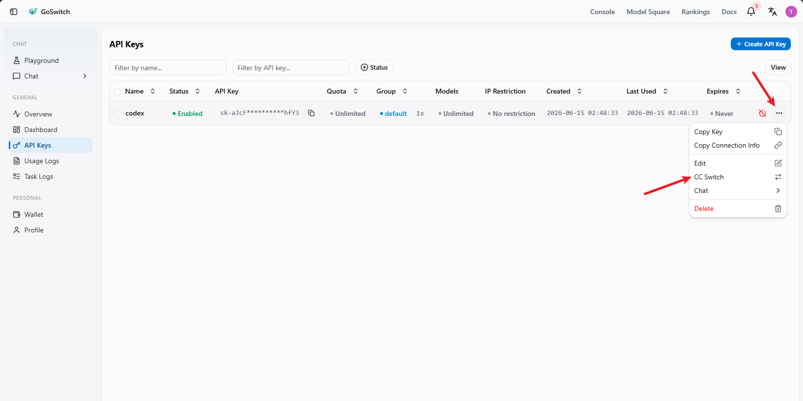
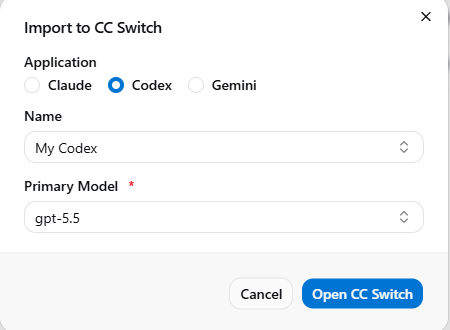
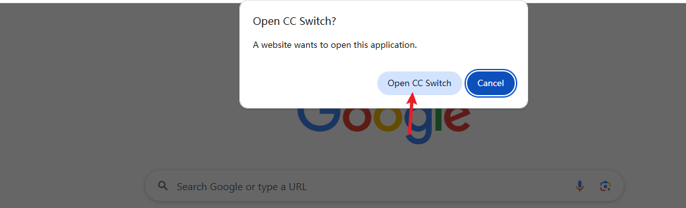
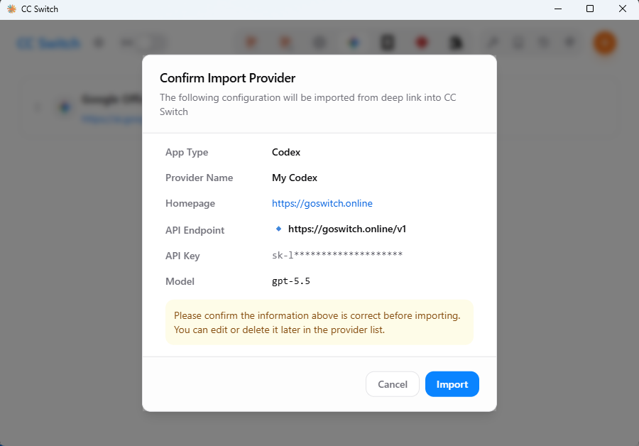
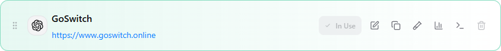

# Codex Configuration

<!-- Source: https://docs.goswitch.online/docs/ccswitch/3-codex.html -->

Author: goswitch

Updated: 2026-06-13T10:02:01.000Z
1.  Open the CC-Switch software you downloaded, and you will see the initial interface as shown below

2.  In the group bar, select the "Codex" group

3.  Switch to the console's API key section, click "More", and select "CC Switch"

4.  Set your configuration name and the corresponding model, then click "Open CCSwitch"

5.  CC-Switch will automatically pop up a confirmation window. After verifying the information, click "Import". The window will automatically close once the import is complete

6.  After successfully adding the configuration, you will see the configured group on the main interface. Click the "Enable" button on the right — when it shows "In Use", the configuration is complete

7.  Run `codex` in the terminal. If you see the conversation interface and can get normal responses, the configuration is complete

