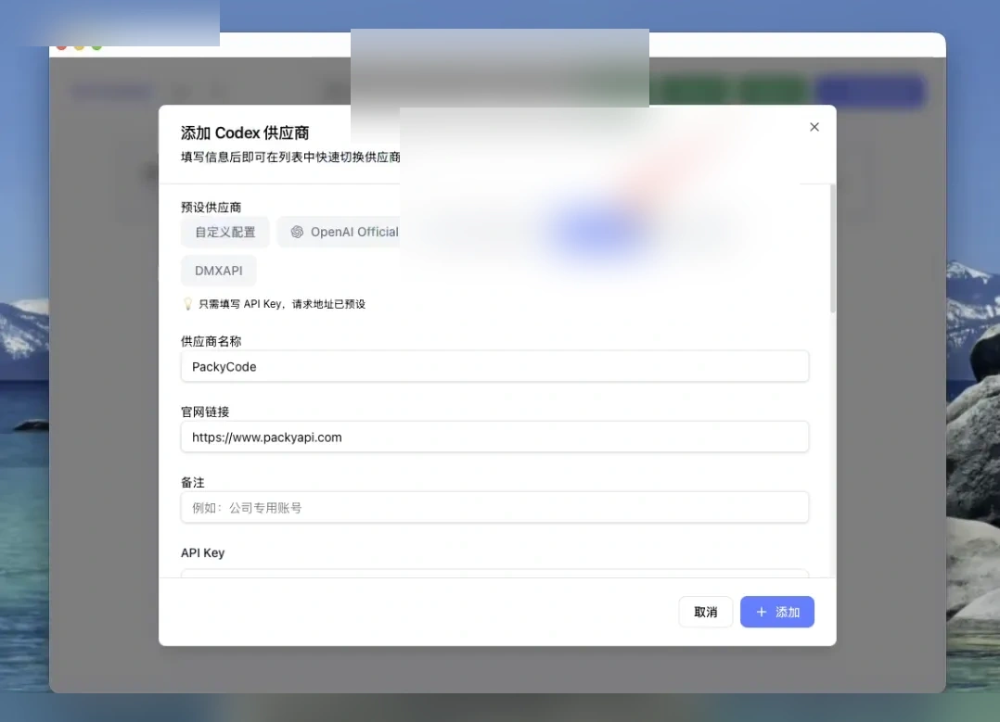
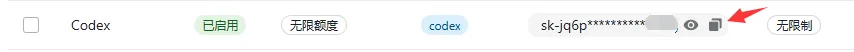
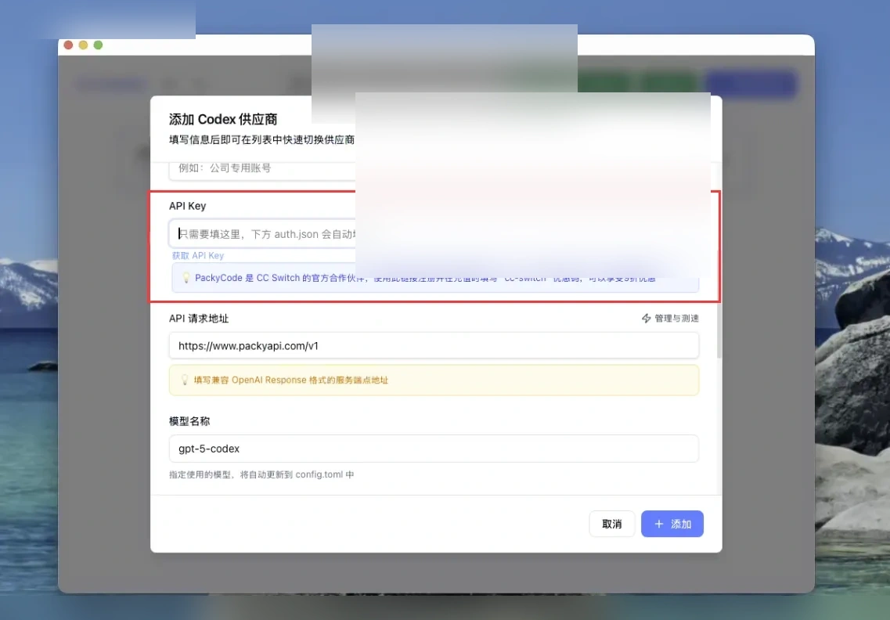
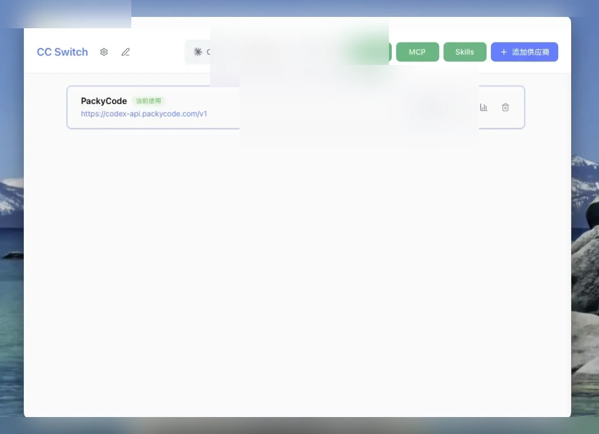

# Codex配置

Source: https://docs.packyapi.com/docs/ccswitch/3-codex.html

Updated: 2026-06-10T10:02:01.000Z
1.  打开你下载的CC Switch软件，你会看到如下图的初始界面

2.  在分组条中，将分组选择至“Codex”

3.  在供应商分组中，选择如图的“PakcyCode”

4.  回顾 [创建API令牌](../register/4-token.md)，在 PackyApi 中创建 **Codex** 分组的令牌，点击复制按钮，复制ApiKey到剪切板

5.  下拉模态框，找到“API Key”配置项，填入你刚才复制的ApiKey，再点击右下角“添加”按钮

6.  添加成功后，在主界面会看到我们配置的分组，在右侧点击“启用”按钮，显示“使用中”，则配置完成

7.  在终端运行 `codex`，看到对话界面并能正常回复即表示配置完成

