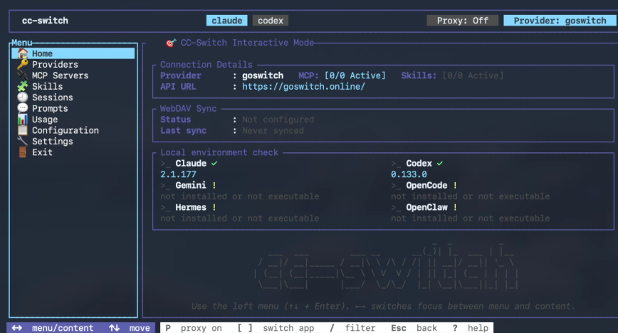
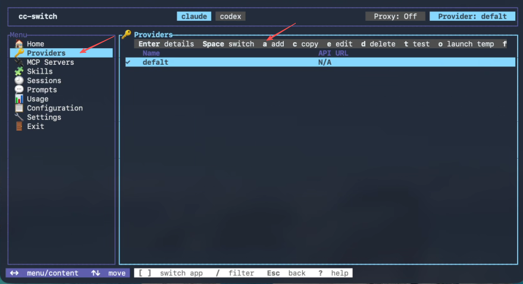
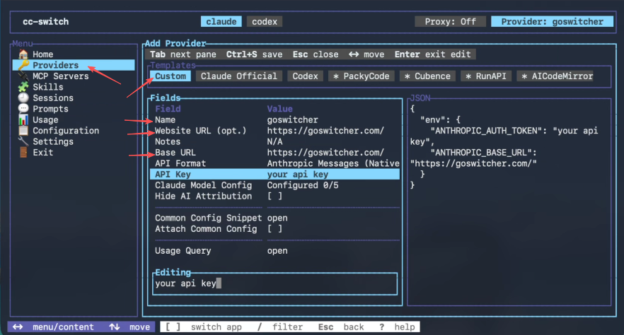
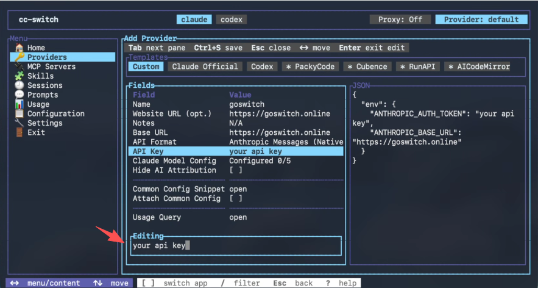
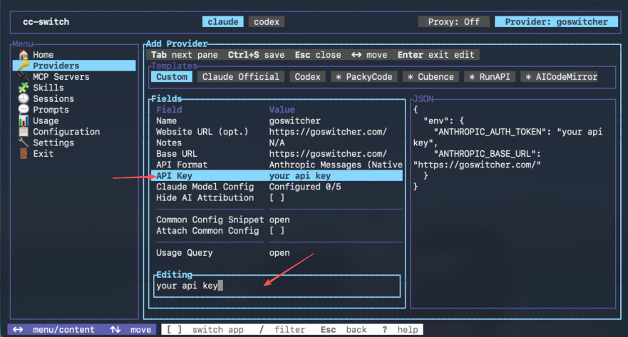
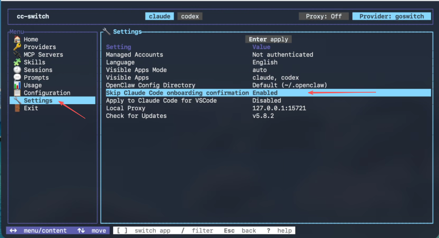

# CC-Switch CLI Usage

<!-- Source: https://docs.goswitch.online/docs/ccswitch/5-ccs_cli.html -->

Author: goswitch

Updated: 2026-06-13T10:02:01.000Z
::: tip Tip

CC-Switch CLI is suitable for servers, SSH, macOS terminals, and automation scenarios. If you prefer a graphical interface, you can continue using the previous CC-Switch tutorial.
:::
# CC-Switch CLI

[](https://github.com/saladday/cc-switch-cli/releases/latest)
[](https://github.com/saladday/cc-switch-cli/releases)
[](https://www.rust-lang.org/)
[](https://github.com/saladday/cc-switch-cli/blob/main/LICENSE)

**Command-line management tool for Claude Code, Codex, Gemini, OpenCode, and OpenClaw**

Unified management of multiple AI coding CLI provider configurations, with support for MCP, Skills, prompts, local proxies, and environment checks.



## What is CC-Switch CLI

CC-Switch CLI is the command-line version of CC-Switch, suitable for servers, SSH, macOS terminals, and automation scenarios.

It consists of two parts:

-   **Full CLI Commands**: You can use commands to view provider lists, switch, check environments, sync MCP, manage Skills, manage prompts, set local proxies, etc.
-   **Full TUI Interface**: Run `cc-switch` to enter the terminal graphical interface, where you can add Providers, select GoSwitch templates, fill in API Keys, save and switch configurations just like the desktop version.

If you're only configuring GoSwitch for the first time, we recommend using the TUI first. After configuration is complete, daily switching, checking, and troubleshooting can be done directly with CLI commands.

## Installing CC-Switch CLI

For macOS and Linux, we recommend using the one-click install script:

``` bash
curl -fsSL https://github.com/SaladDay/cc-switch-cli/releases/latest/download/install.sh | bash
```

By default, it installs to `~/.local/bin`. If the terminal says `cc-switch` not found, make sure `~/.local/bin` is in your `PATH`.

::: details Manual Installation

<DocTabs storage-key="zh-docs-ccswitch-1-common-platform-1" :tabs="[{ label: 'Windows', value: 'windows' }, { label: 'MacOS', value: 'macos' }, { label: 'Linux x64', value: 'Linuxx64' }, { label: 'Linux ARM64', value: 'LinuxARM64' }]">
<template #macos>

### MacOS

``` bash
curl -LO https://github.com/saladday/cc-switch-cli/releases/latest/download/cc-switch-cli-darwin-universal.tar.gz
tar -xzf cc-switch-cli-darwin-universal.tar.gz
chmod +x cc-switch
sudo mv cc-switch /usr/local/bin/

# If you encounter "cannot verify developer" prompt
xattr -cr /usr/local/bin/cc-switch
```
</template>
<template #Linuxx64>

### Linux x64

``` bash
curl -LO https://github.com/saladday/cc-switch-cli/releases/latest/download/cc-switch-cli-linux-x64-musl.tar.gz
tar -xzf cc-switch-cli-linux-x64-musl.tar.gz
chmod +x cc-switch
sudo mv cc-switch /usr/local/bin/
```
</template>
<template #LinuxARM64>

### Linux ARM64

``` bash
curl -LO https://github.com/saladday/cc-switch-cli/releases/latest/download/cc-switch-cli-linux-arm64-musl.tar.gz
tar -xzf cc-switch-cli-linux-arm64-musl.tar.gz
chmod +x cc-switch
sudo mv cc-switch /usr/local/bin/
```
</template>
<template #windows>

### Windows

Go to [GitHub Releases](https://github.com/saladday/cc-switch-cli/releases/latest) to download `cc-switch-cli-windows-x64.zip`, extract it, and place `cc-switch.exe` in a PATH directory, or run it directly from the current directory:

``` powershell
.\cc-switch.exe
```
</template>
</DocTabs>

:::

## Two Usage Methods

### Enter TUI Interface

``` bash
cc-switch
```

To directly configure a specific app, add `--app`:

``` bash
cc-switch --app claude
cc-switch --app codex
cc-switch --app gemini
```

TUI is suitable for first-time configuration. You can select the GoSwitch template, fill in the API Key, then save and switch to that Provider.

### Using CLI Commands

``` bash
cc-switch provider list
cc-switch provider current
cc-switch provider switch <id>
cc-switch env tools
cc-switch env check
```

`claude` is the default app. Use `--app` to manage other apps:

``` bash
cc-switch --app codex provider list
cc-switch --app gemini provider current
```

CLI commands are suitable for servers, scripts, and daily troubleshooting, and can also be given to Claude Code / Codex for direct execution.

## Pre-Configuration Preparation

First confirm that the target CLI is installed:

``` bash
cc-switch env tools
```

We recommend running the target CLI or its help command once to let it create its configuration directory:

``` bash
claude --help
codex --help
gemini --help
```

Then create a token for the corresponding group in GoSwitch:

-   Claude Code: Create a **CC Group** token
-   Codex: Create a **Codex Group** token
-   Gemini: Create a **Gemini Group** token

## Configuring GoSwitch

For first-time configuration, we recommend using TUI because it displays GoSwitch templates and the fields you need to fill in.

::: tip Tip

Below we use Claude Code as an example. Codex and Gemini follow the same configuration method, just use `--app codex` or `--app gemini` to switch the target app.

1.  Run the following command to enter the interactive interface:

``` bash
cc-switch
```

To directly configure Codex or Gemini:

``` bash
cc-switch --app codex
cc-switch --app gemini
```

2.  Select `Providers` on the left to enter the provider management page, then add a new provider.



3.  Select `* GoSwitch` from the templates.



4.  Fill in the `API Key` with the token you copied from GoSwitch, then save.



5.  Return to the provider list and confirm that the newly added GoSwitch Provider is selected.



6.  If you're configuring Claude Code, go to `Settings`, find `Skip Claude Code initial installation confirmation`, and confirm it's enabled.



This option writes `hasCompletedOnboarding=true` to `~/.claude.json`, preventing Claude Code from stopping at the installation confirmation process on first launch.

7.  Open the corresponding CLI to test if it can have a normal dialogue:

``` bash
claude
```

For Codex and Gemini respectively:

``` bash
codex
gemini
```
:::

## Common Commands

``` bash
cc-switch                         # Enter interactive interface
cc-switch env tools               # Check if local CLI is installed
cc-switch env check               # Check for environment variable conflicts

cc-switch provider list           # View Claude providers
cc-switch provider current        # View current Claude provider
cc-switch provider switch <id>    # Switch Claude provider

cc-switch --app codex provider list
cc-switch --app gemini provider list

cc-switch provider stream-check <id> # Check provider streaming response
cc-switch provider fetch-models <id> # Fetch remote model list
cc-switch update                     # Update CC-Switch CLI
```

When managing Codex, Gemini, OpenCode, or OpenClaw, use the global `--app` parameter to specify the target app.

## Advanced Usage: Let AI Assistants Operate CC-Switch CLI

If you're already working in Claude Code or Codex, you can directly have them call the `cc-switch` command to check and switch configurations.

For example, you can say:

``` text
Help me run cc-switch provider list to see what Claude Providers are currently available.
```

``` text
Help me run cc-switch --app codex provider current to confirm if Codex is currently using GoSwitch.
```

``` text
Help me run cc-switch env check --app claude to check if there are environment variables overriding the configuration.
```

``` text
Help me switch to the GoSwitch provider, then run claude to test if it can respond normally.
```

This approach is suitable for people already familiar with terminals. The AI assistant handles executing commands and explaining results, while you only need to confirm key operations like switching Providers, overriding configuration files, or deleting configurations.

## FAQ

### Provider switch didn't take effect

First confirm that the target CLI has initialized its configuration directory. Run once:

``` bash
claude --help
codex --help
gemini --help
```

Then switch the Provider again.

### Environment variables overriding configuration

If the system has `ANTHROPIC_API_KEY`, `OPENAI_API_KEY`, `GEMINI_API_KEY` and other environment variables set, the target CLI may read environment variables first, causing the configuration written by CC-Switch CLI to not take effect.

You can run:

``` bash
cc-switch env check --app claude
cc-switch env check --app codex
cc-switch env check --app gemini
```
