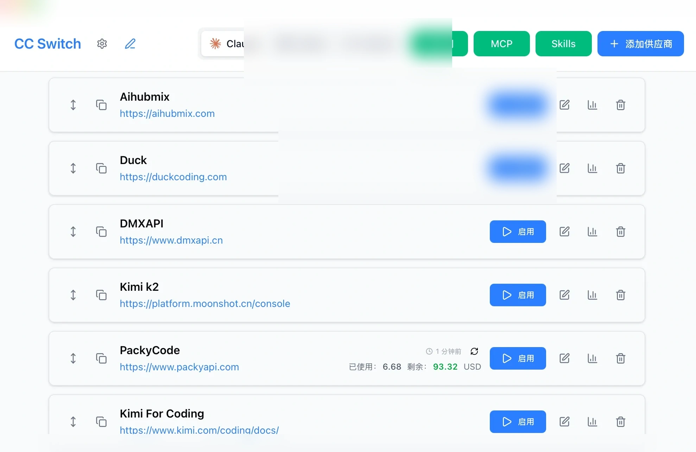
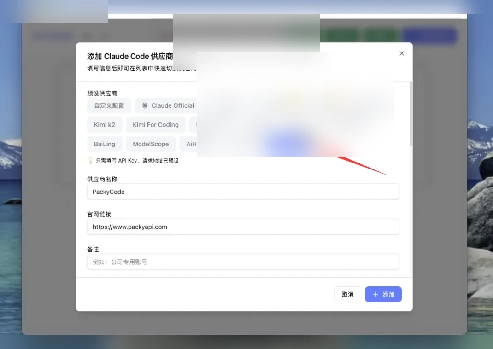
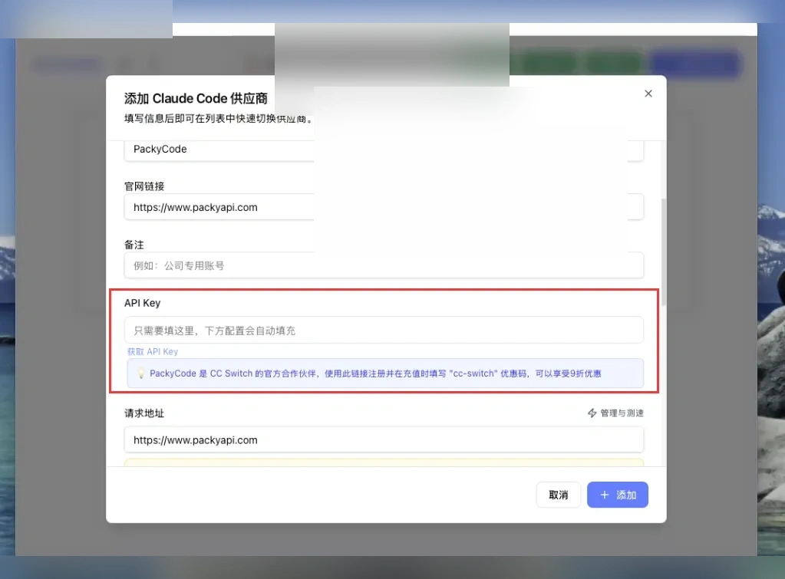
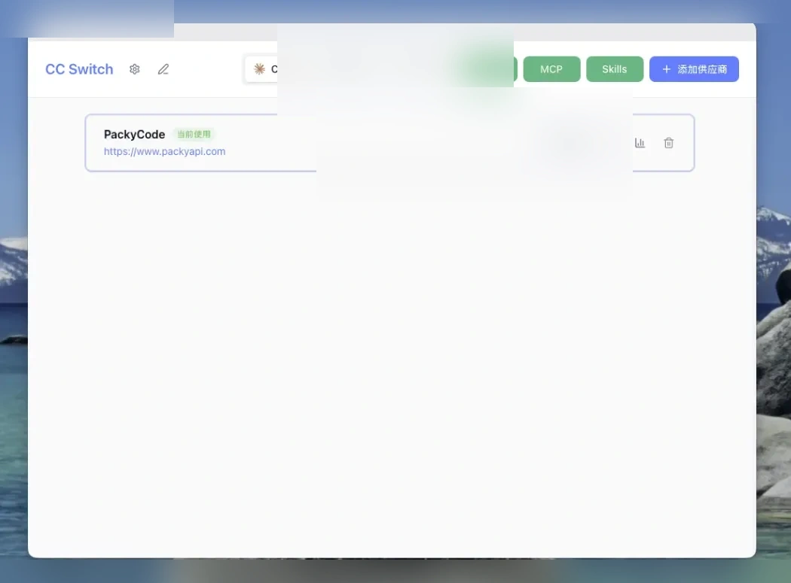
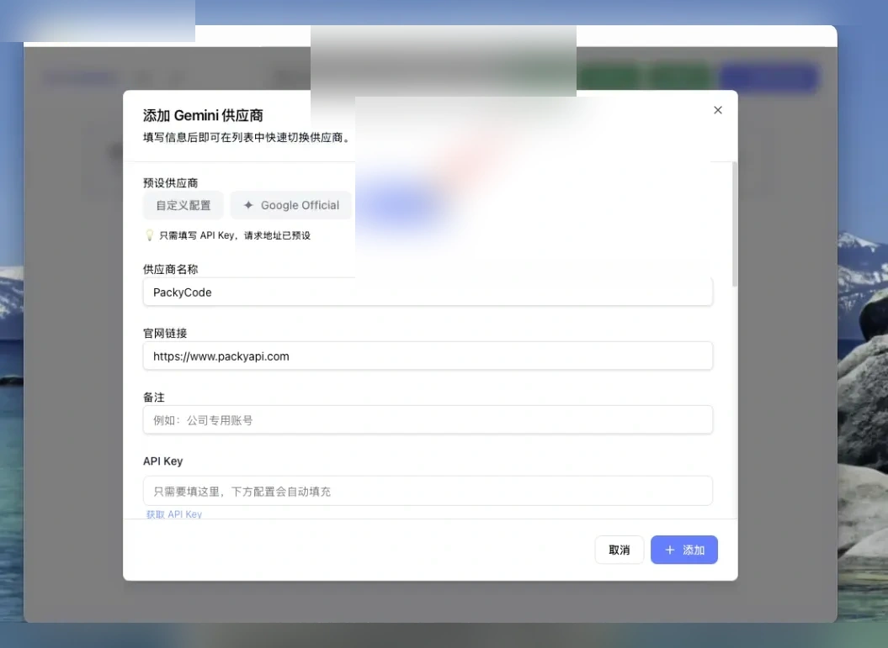
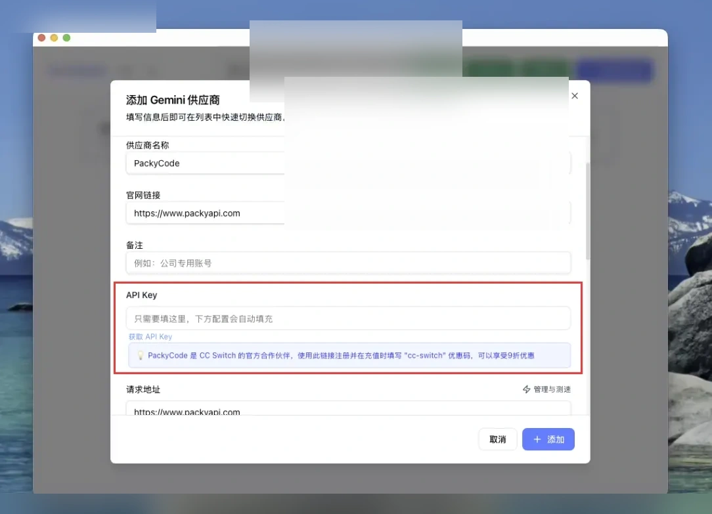
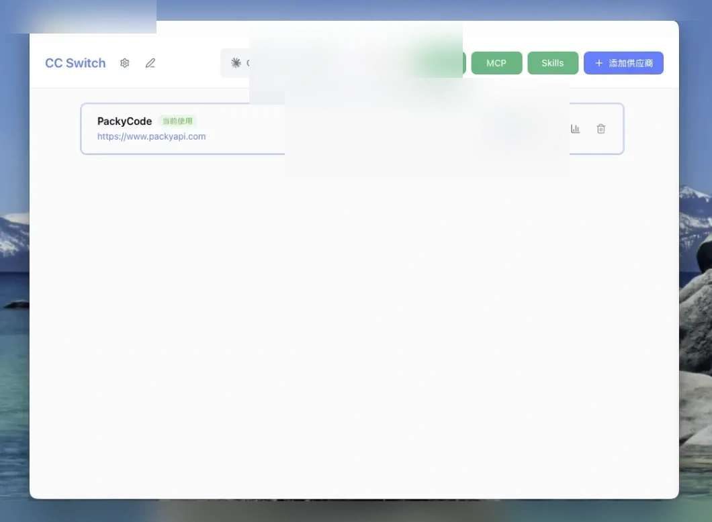
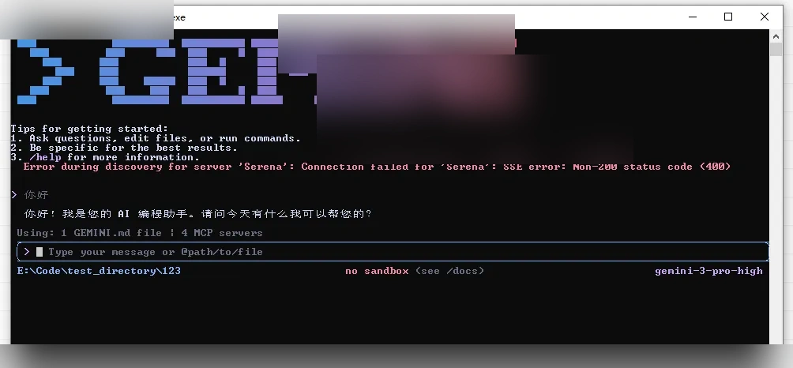

# CC-Switch使用教程

Source: https://docs.packyapi.com/docs/ccswitch/

Updated: 2026-06-10T10:02:01.000Z
## 通用步骤

### CC-Switch介绍

### Claude Code / Codex / Gemini CLI 全方位辅助工具

[](https://github.com/farion1231/cc-switch/releases)
[](https://github.com/trending/typescript)
[](https://github.com/farion1231/cc-switch/releases)
[](https://tauri.app/)
[](https://github.com/farion1231/cc-switch/releases/latest)

[](https://trendshift.io/repositories/15372)

[更新日志](https://github.com/farion1231/cc-switch/blob/main/CHANGELOG.md) | [下载地址](https://github.com/farion1231/cc-switch/releases/latest)

**从供应商切换器到 AI CLI 一体化管理平台**

**统一管理 Claude Code、Codex 与 Gemini CLI 的供应商配置、MCP 服务器、Skills 扩展和系统提示词。**

使用 CC-Switch，您可以：

-   ✅ 一键切换 API 配置 - 在多个 API 提供商之间快速切换
-   ✅ 可视化配置管理 - 通过图形界面轻松管理所有配置
-   ✅ 内置 PackyAPI 模板 - 预设了 PackyAPI 的配置模板
-   ✅ MCP 服务器管理 - 管理 Model Context Protocol 服务器
-   ✅ 系统托盘快捷操作 - 通过托盘菜单快速切换

::: tip 温馨提示

CC-Switch 已经内置了 PackyAPI 的快捷配置模板，无需手动编辑配置文件！
:::
### 软件下载

Windows

1.  点击下载链接→[传送门](https://github.com/farion1231/cc-switch/releases/latest)←，进入CC-Switch的Github Release页面

2.  鼠标滚动到最下方选择适合自己版本的安装包，windows系统推荐下载普通msi后缀的安装包进行安装


3.  安装后运行CC-Switch主程序，界面如下。



MacOS

-   MacOS安装推荐使用HomeBrew

-   开启终端后，分别运行以下命令：

```bash
# 添加 tap 源
brew tap farion1231/ccswitch

# 安装 CC-Switch
brew install --cask cc-switch
```

-   安装完成后，在“启动台”或“应用程序”文件夹中找到 CC-Switch 并启动。


Linux

::: warning 重要

以下命令中的文件名包含占位符版本号 x.x.x，请访问[GitHub Releases](https://github.com/farion1231/cc-switch/releases/latest) 页面查看最新版本，并替换为实际的版本号和完整文件名。

Debian/Ubuntu 系统：

```bash
:::
# 下载 .deb 包
wget https://github.com/farion1231/cc-switch/releases/latest/download/cc-switch_x.x.x_amd64.deb

# 安装
sudo dpkg -i cc-switch_x.x.x_amd64.deb
```

### 环境检查

::: warning 注意

**请你最好进行此步的环境检查步骤！！！
如果你有经验，能确认你的Nodejs环境以及cc、codex、gemini的cli安装没问题，配置目录也都存在，可以忽略这一步，直接进入以下的CC Switch配置**

点击右侧传送门查看 [如何进行环境检查？](../cli/1-env.md)
:::
## Claude Code配置

1.  打开你下载的CC Switch软件，你会看到如下图的初始界面


2.  在分组条中，将分组选择至“Claude”


3.  在供应商分组中，选择如图的“PakcyCode”



4.  回顾 [创建API令牌](../register/4-token.md)，在 PackyApi 中创建 **CC** 分组的令牌，点击复制按钮，复制ApiKey到剪切板


5.  下拉模态框，找到“API Key”配置项，填入你刚才复制的ApiKey，再点击右下角“添加”按钮



6.  添加成功后，在主界面会看到我们配置的分组，在右侧点击“启用”按钮，显示“使用中”，则配置完成



7.  点击左上角“设置”按钮，在通用页面下拉找到 `跳过 Claude Code初次安装确认` ，务必勾选


8.  在终端运行 `claude`，看到对话界面并能正常回复即表示配置完成


## Codex配置

1.  打开你下载的CC Switch软件，你会看到如下图的初始界面


2.  在分组条中，将分组选择至“Codex”


3.  在供应商分组中，选择如图的“PakcyCode”


4.  回顾 [创建API令牌](../register/4-token.md)，在 PackyApi 中创建 **Codex** 分组的令牌，点击复制按钮，复制ApiKey到剪切板


5.  下拉模态框，找到“API Key”配置项，填入你刚才复制的ApiKey，再点击右下角“添加”按钮


6.  添加成功后，在主界面会看到我们配置的分组，在右侧点击“启用”按钮，显示“使用中”，则配置完成


7.  在终端运行 `codex`，看到对话界面并能正常回复即表示配置完成


## Gemini配置

1.  打开你下载的CC Switch软件，你会看到如下图的初始界面


2.  在分组条中，将分组选择至“Gemini”


3.  在供应商分组中，选择如图的“PakcyCode”



4.  回顾 [创建API令牌](../register/4-token.md)，在 PackyApi 中创建 **Gemini** 分组的令牌，点击复制按钮，复制ApiKey到剪切板


5.  下拉模态框，找到“API Key”配置项，填入你刚才复制的ApiKey，再点击右下角“添加”按钮



6.  添加成功后，在主界面会看到我们配置的分组，在右侧点击“启用”按钮，显示“使用中”，则配置完成



7.  在终端运行 `gemini`，看到对话界面并能正常回复即表示配置完成



## CC Switch CLI 使用

CC-Switch CLI 同时提供完整 CLI 命令和完整 TUI 界面，适合服务器、SSH、macOS 终端和自动化场景使用。你也可以让 Claude Code / Codex 直接调用 `cc-switch` 命令来检查、切换和修复配置。

查看详细教程：[CC Switch CLI 使用](./5-ccs_cli.md)
