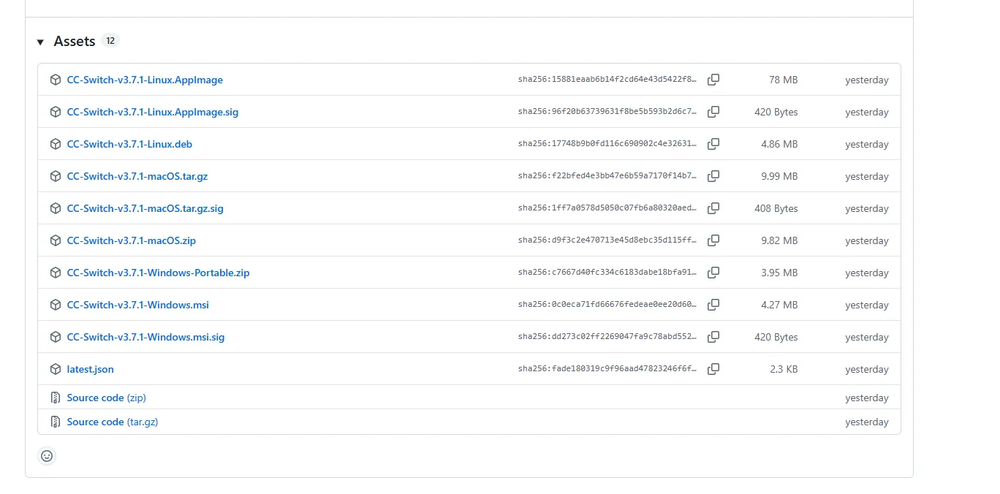
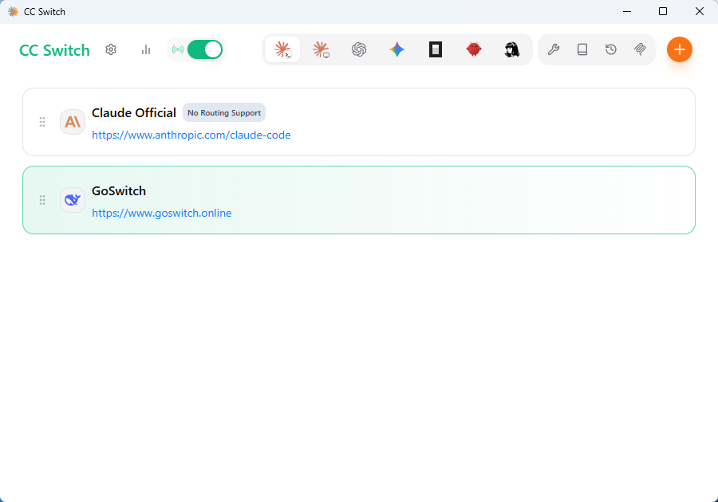

# CC-Switch Tutorial

<!-- Source: https://docs.goswitch.online/docs/ccswitch/ -->

Author: goswitch

Updated: 2026-06-13T10:02:01.000Z
## Common Steps

### CC-Switch Introduction

### Claude Code / Codex / Gemini CLI All-in-One Management Tool

[](https://github.com/farion1231/cc-switch/releases)
[](https://github.com/trending/typescript)
[](https://github.com/farion1231/cc-switch/releases)
[](https://tauri.app/)
[](https://github.com/farion1231/cc-switch/releases/latest)

[](https://trendshift.io/repositories/15372)

[Changelog](https://github.com/farion1231/cc-switch/blob/main/CHANGELOG.md) | [Download](https://github.com/farion1231/cc-switch/releases/latest)

**From Provider Switcher to AI CLI All-in-One Management Platform**

**Unified management of Claude Code, Codex, and Gemini CLI provider configurations, MCP servers, Skills extensions, and system prompts.**

With CC-Switch, you can:

-   ✅ One-click API switching - Quickly switch between multiple API providers
-   ✅ Visual configuration management - Easily manage all configurations through a graphical interface
-   ✅ Built-in GoSwitch templates - Pre-configured GoSwitch template presets
-   ✅ MCP server management - Manage Model Context Protocol servers
-   ✅ System tray quick actions - Quick switching through tray menu

::: tip Tip

CC-Switch has built-in GoSwitch quick configuration templates — no need to manually edit configuration files!
:::
### Software Download

<DocTabs storage-key="docs-ccswitch-index-platform-1" :tabs="[{ label: 'Windows', value: 'windows' }, { label: 'MacOS', value: 'macos' }]">
<template #windows>

### Windows

1.  Click the download link → [Link](https://github.com/farion1231/cc-switch/releases/latest) ← to go to CC-Switch's GitHub Release page

2.  Scroll to the bottom and select the appropriate installer package. For Windows, we recommend downloading the regular .msi installer



3.  After installation, run the CC-Switch main program. The interface looks like this.




</template>

<template #macos>

### MacOS

-   For MacOS, we recommend using HomeBrew

-   Open a terminal and run the following commands:

``` bash
# Add tap source
brew tap farion1231/ccswitch

# Install CC-Switch
brew install --cask cc-switch
```

-   After installation, find CC-Switch in "Launchpad" or the "Applications" folder and launch it.


</template>
</DocTabs>

### Environment Check

<div class="warning custom-block"><div style="overflow-x:auto;display:flex;pad"><svg width="23" height="23" viewBox="0 0 1024 1024"    class="icon" xmlns="http://www.w3.org/2000/svg" ><path d="M576.286 752.57v-95.425q0-7.031-4.771-11.802t-11.3-4.772h-96.43q-6.528 0-11.3 4.772t-4.77 11.802v95.424q0 7.031 4.77 11.803t11.3 4.77h96.43q6.528 0 11.3-4.77t4.77-11.803zm-1.005-187.836 9.04-230.524q0-6.027-5.022-9.543-6.529-5.524-12.053-5.524H456.754q-5.524 0-12.053 5.524-5.022 3.516-5.022 10.547l8.538 229.52q0 5.023 5.022 8.287t12.053 3.265h92.913q7.032 0 11.803-3.265t5.273-8.287zM568.25 95.65l385.714 707.142q17.578 31.641-1.004 63.282-8.538 14.564-23.354 23.102t-31.892 8.538H126.286q-17.076 0-31.892-8.538T71.04 866.074q-18.582-31.641-1.004-63.282L455.75 95.65q8.538-15.57 23.605-24.61T512 62t32.645 9.04 23.605 24.61z" fill="#c28100"></path></svg><span style="color: #c28100;padding-left: 7px;">Important</span></div> It is highly recommended that you complete the environment check step! If you have experience and can confirm that your Node.js environment and the cc, codex, and gemini CLI installations are working properly, and that the configuration directories all exist, you can skip this step and proceed directly to the subsequent CC-Switch configuration. <p>Click the link on the right to view <a href="./../cli/1-env">How to perform an environment check?</a></p></div>
