# CLI Configuration Tutorial

<!-- Source: https://docs.goswitcher.com/docs/cli/ -->

Author: goswitcher

Updated: 2026-06-13T10:02:01.000Z
## Environment Check (Common Steps)

### (1) Confirm Node.js is Installed

1.  Enter the following command in a Windows or macOS terminal

``` bash
npm list -g --depth-0

```

Normally it should look like the image below (no content is also fine). If you see "command not found", it means you haven't installed Node.js. You need to follow [this tutorial](https://www.runoob.com/nodejs/nodejs-install-setup.html) to install the environment required for Claude Code, Codex, and Gemini

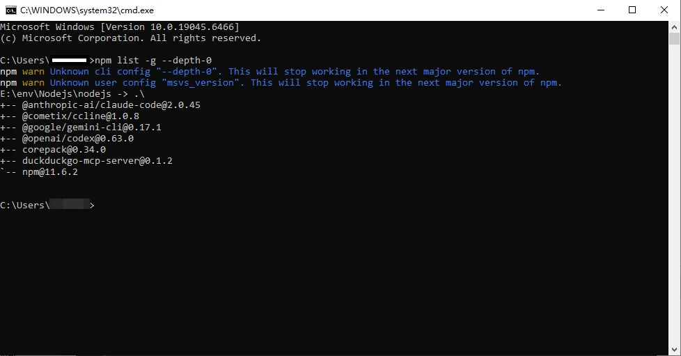

2.  If you discover Node.js isn't installed and have now completed the installation, please re-run the command above. If it no longer says "command not found", the installation was successful

### (2) Install CLI

1.  Enter the following commands in a Windows or macOS terminal to install all the CLI tools we need at once

``` bash
npm i -g @anthropic-ai/claude-code@latest
npm i -g @openai/codex@latest
npm i -g @google/gemini-cli@latest
```

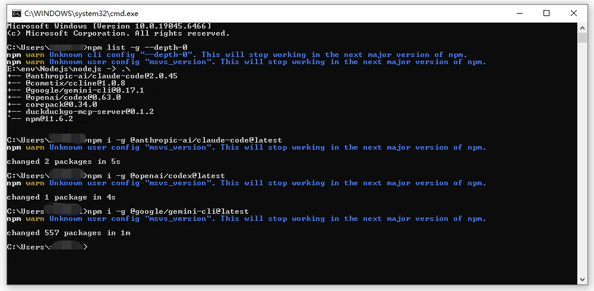

### (3) Test Installation

::: warning Important

**This step is very important. You must run the commands to test, because running these commands will generate the configuration directories for each CLI in your user directory, which is necessary for subsequent operations!**

<DocTabs :tabs="[{ label: 'Claude Code', value: 'claude' }, { label: 'Codex', value: 'codex' }, { label: 'Gemini', value: 'gemini' }]">
<template #claude>

Claude Code

Enter the following command in a Windows or macOS terminal. If you see the content shown in the image, or a selection prompt appears, Claude Code is installed successfully

``` bash
claude
```

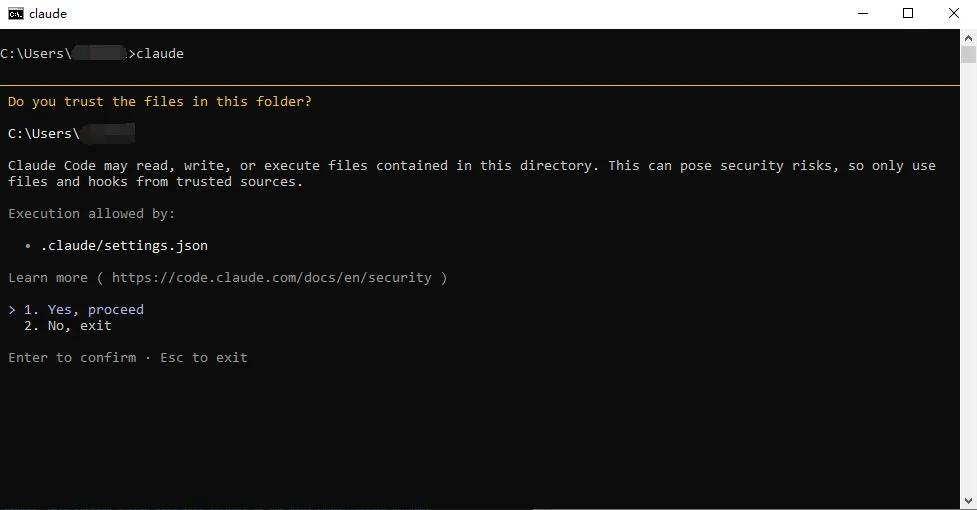

**The second step is very important. You must follow the link and run the command to configure**

1.  Click [Claude Code cannot connect to Anthropic service](../faq/CC.md#claude-code-cannot-connect-to-anthropic-service) to navigate, and follow the tutorial to run the command before continuing with the individual CLI configuration tutorials

</template>
<template #codex>

Codex

Enter the following command in a Windows or macOS terminal. If you see the content shown in the image, or a selection prompt appears, Codex is installed successfully

``` bash
codex
```

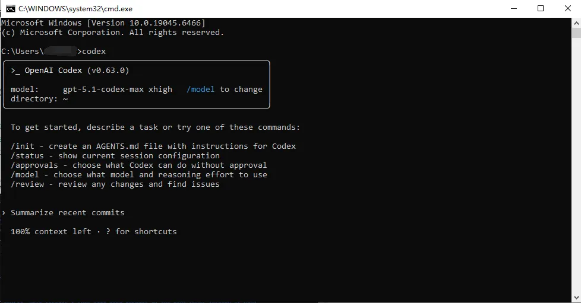

</template>
<template #gemini>

Gemini

Enter the following command in a Windows or macOS terminal. If you see the content shown in the image, or a selection prompt appears, Gemini is installed successfully

``` bash
gemini
```

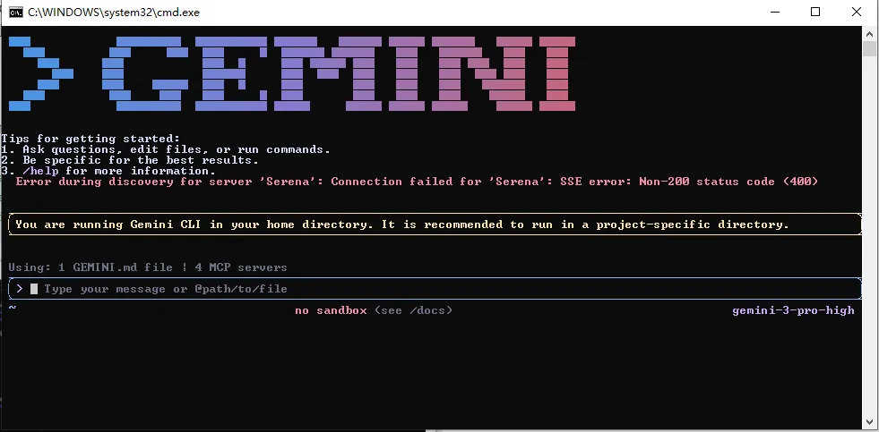

</template>
</DocTabs>

:::

## Claude Code Configuration

<DocTabs storage-key="docs-cli-index-platform-1" :tabs="[{ label: 'Windows', value: 'windows' }, { label: 'MacOS', value: 'macos' }]">
<template #windows>

### Windows

1.  Press "Win+R", enter `%userprofile%\.claude` and press Enter

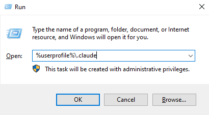

2.  If `settings.json` doesn't exist, create it manually

-   **settings.json**: Claude's main configuration file for relay address, ApiKey, hooks, plugins, etc.

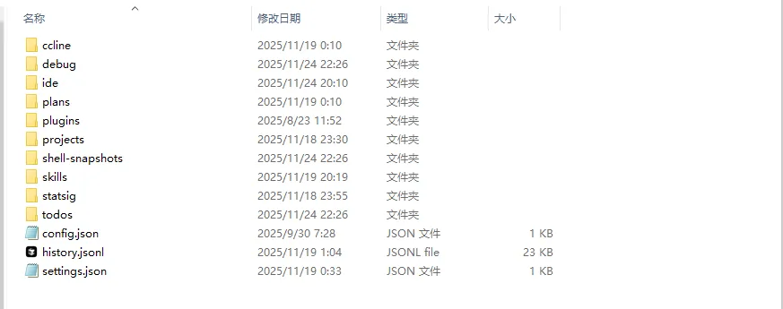

3.  Write the following content to `settings.json`

``` json
{
  "env": {
    "ANTHROPIC_BASE_URL": "https://goswitcher.com",
    "ANTHROPIC_AUTH_TOKEN": "xxx",
    "CLAUDE_CODE_ATTRIBUTION_HEADER": "0"
  }
}
```

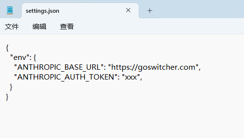

4.  Review [Create API Token](../register/4-token.md), create a **CC** group token in GoSwitcher, and replace `xxx`


5.  Run `claude` in the terminal. If you receive a reply, configuration is successful

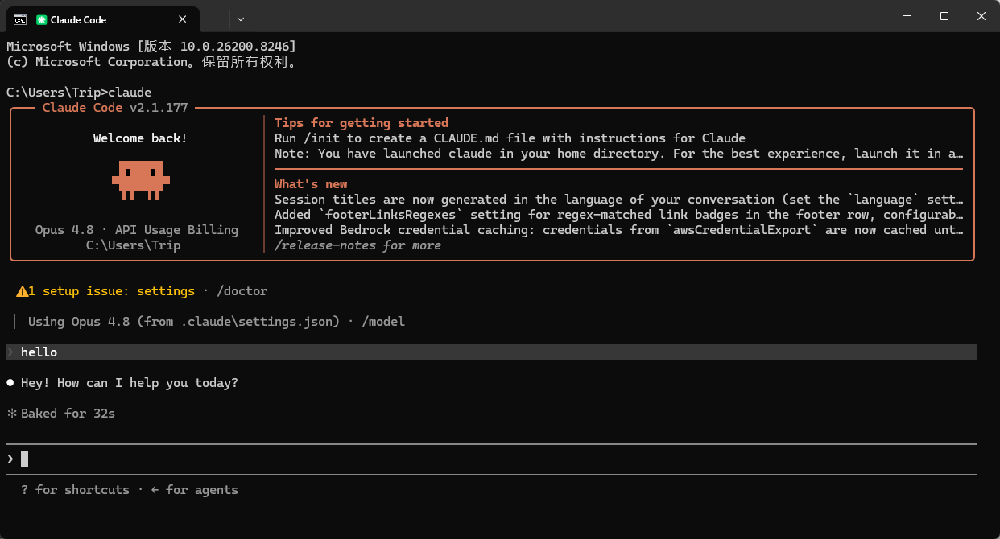


</template>

<template #macos>

### MacOS

1.  Press "Command+Shift+G" in Finder, enter `~/.claude` and press Enter

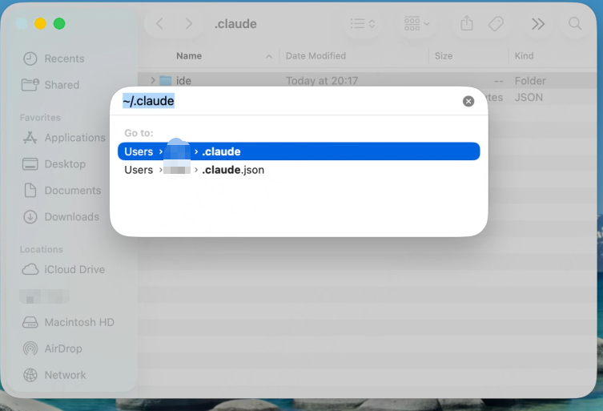

2.  If `settings.json` doesn't exist, create it manually

-   **settings.json**: Claude's main configuration file

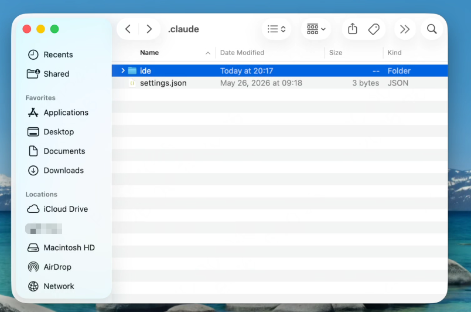

3.  Write the following content to `settings.json`

``` json
{
  "env": {
    "ANTHROPIC_BASE_URL": "https://goswitcher.com",
    "ANTHROPIC_AUTH_TOKEN": "xxx",
    "CLAUDE_CODE_ATTRIBUTION_HEADER": "0"
  }
}
```


4.  Review [Create API Token](../register/4-token.md), create a **CC** group token in GoSwitcher, replace `xxx`


5.  Run `claude` in the terminal. If it responds normally, configuration is complete


::: warning Important

**If you still encounter errors after configuration, such as a prompt requiring login, please refer to the following link**
[claude-code-cannot-connect-to-anthropic-service](../faq/CC.md#claude-code-cannot-connect-to-anthropic-service)

:::

</template>
</DocTabs>

## Codex Configuration

<DocTabs storage-key="docs-cli-index-platform-2" :tabs="[{ label: 'Windows', value: 'windows' }, { label: 'MacOS', value: 'macos' }]">
<template #windows>

### Windows

1.  Press "Win+R", enter `%userprofile%\.codex` and press Enter

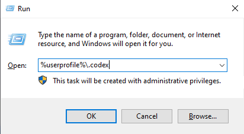

2.  We use three files, only two need configuration

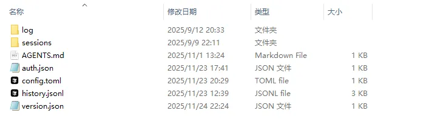

-   **config.toml**: Codex's core configuration file
-   **auth.json**: ApiKey configuration
-   **[AGENTS.md](http://AGENTS.md)**: Global prompts

::: warning Important

**Many people may not have these three files after installation. Create them manually**
:::
3.  Configure Config.toml

``` toml
disable_response_storage = true
model = "gpt-5.2"
model_provider = "goswitcher"
model_reasoning_effort = "xhigh"
model_verbosity = "high"

[features]
web_search_request = true

[model_providers.goswitcher]
base_url = "https://goswitcher.com/v1"
name = "goswitcher"
requires_openai_auth = true
wire_api = "responses"
```

4.  Configure ApiKey

``` json
{
  "OPENAI_API_KEY": "xxx"
}
```


Review [Create API Token](../register/4-token.md), create a **Codex** group token, copy the key and fill into `xxx`

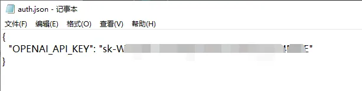

5.  Test Dialogue - run `codex` in terminal

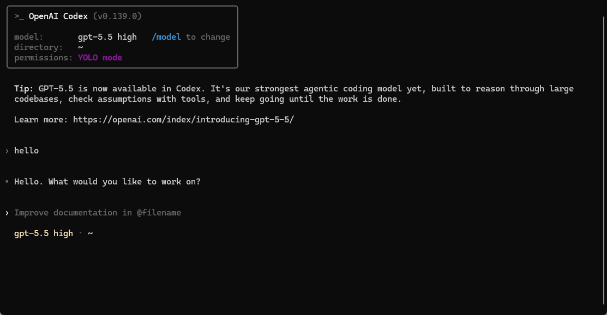


</template>

<template #macos>

### MacOS

1.  Press "Command+Shift+G", enter `~/.codex` and press Enter

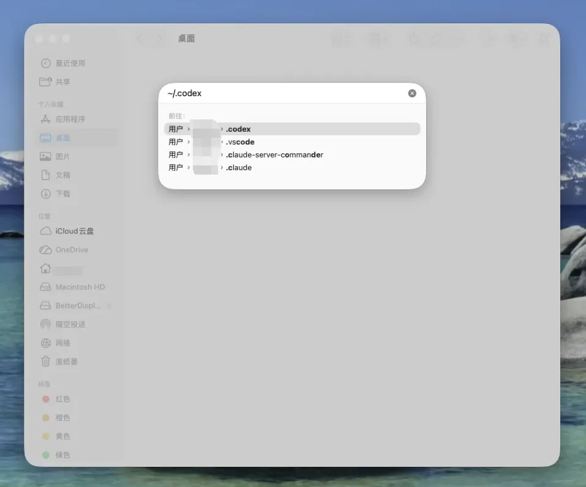

2.  We use three files, only two need configuration

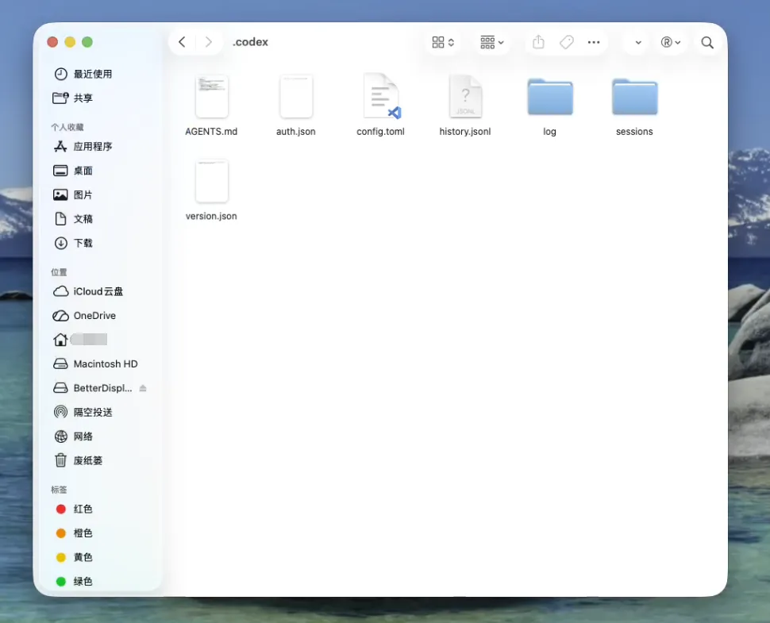

-   **config.toml**: Codex's core configuration file
-   **auth.json**: ApiKey storage
-   **[AGENTS.md](http://AGENTS.md)**: Global prompts
::: warning Important

Create the above three files manually if they don't exist
:::

1.  Configure Config.toml

``` toml
model_provider = "goswitcher"
model = "gpt-5.1-codex"
model_reasoning_effort = "high"
network_access = "enabled"
disable_response_storage = true
windows_wsl_setup_acknowledged = true
model_verbosity = "high"

[model_providers.goswitcher]
name = "goswitcher"
base_url = "https://goswitcher.com/v1"
wire_api = "responses"
requires_openai_auth = true
```

4.  Configure ApiKey

``` json
{
  "OPENAI_API_KEY": "xxx"
}
```


Review [Create API Token](../register/4-token.md), create a **Codex** group token, copy the key and fill into `xxx`


5.  Test - run `codex` in terminal


</template>
</DocTabs>

## Gemini Configuration

<DocTabs storage-key="docs-cli-index-platform-3" :tabs="[{ label: 'Windows', value: 'windows' }, { label: 'MacOS', value: 'macos' }]">
<template #windows>

### Windows

1.  Press "Win+R", enter `%userprofile%\.gemini` and press Enter

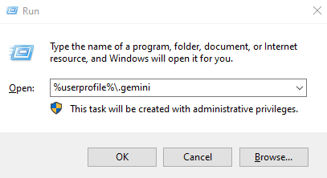

2.  Create `.env` file if it doesn't exist, write:

-   **.env**: Gemini CLI configuration file

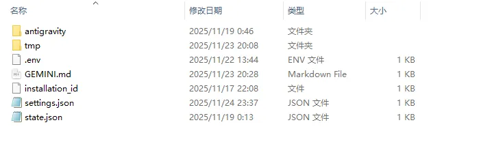

``` bash
GOOGLE_GEMINI_BASE_URL=https://goswitcher.com
GEMINI_API_KEY=xxx
GEMINI_MODEL=gemini-2.5-pro
```

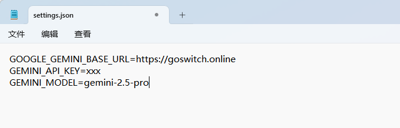

3.  Review [Create API Token](../register/4-token.md), create a **Gemini** group token, fill `xxx`


4.  Run `gemini` in terminal. If it responds normally, configuration is successful

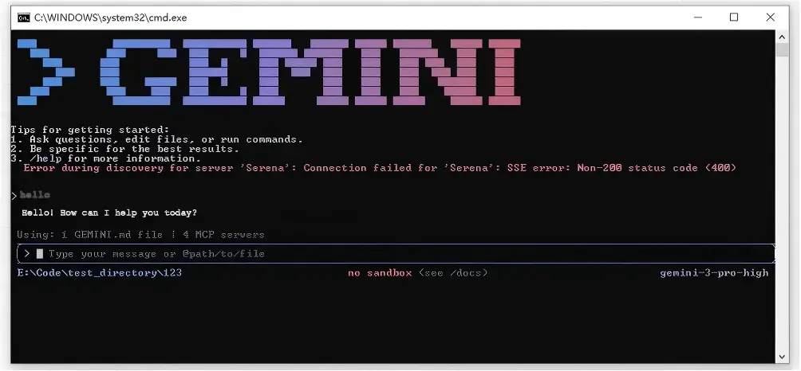


</template>

<template #macos>

### MacOS

1.  Press "Command+Shift+G", enter `~/.gemini` and press Enter

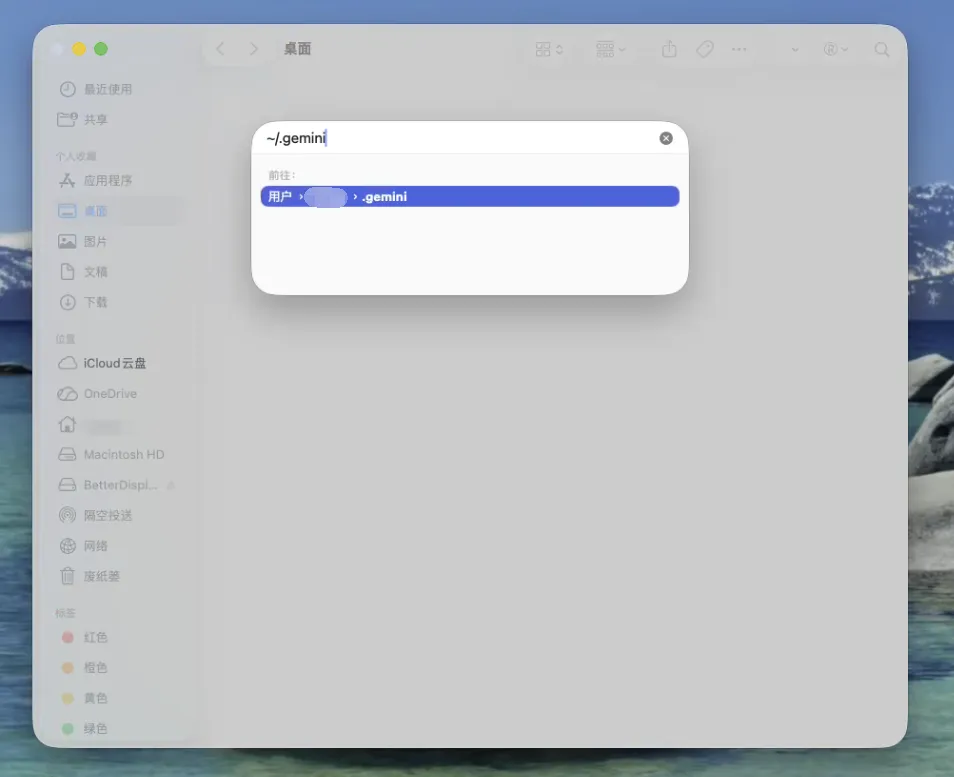

2.  Create `.env` file if it doesn't exist, write:

-   **.env**: Gemini CLI configuration file

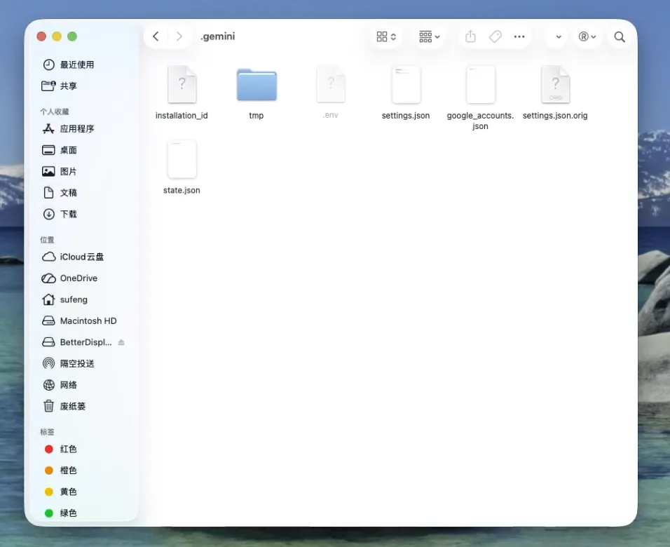

``` bash
GOOGLE_GEMINI_BASE_URL=https://goswitcher.com
GEMINI_API_KEY=xxx
GEMINI_MODEL=gemini-2.5-pro
```

3.  Review [Create API Token](../register/4-token.md), create a **Gemini** group token, fill `xxx`


4.  Run `gemini` in terminal. If it works normally, configuration is complete


</template>
</DocTabs>
