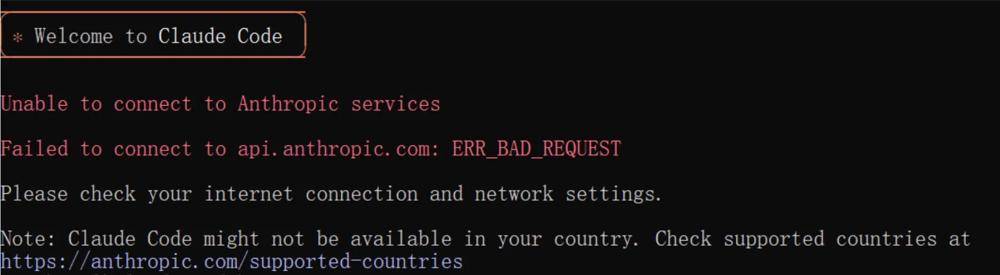
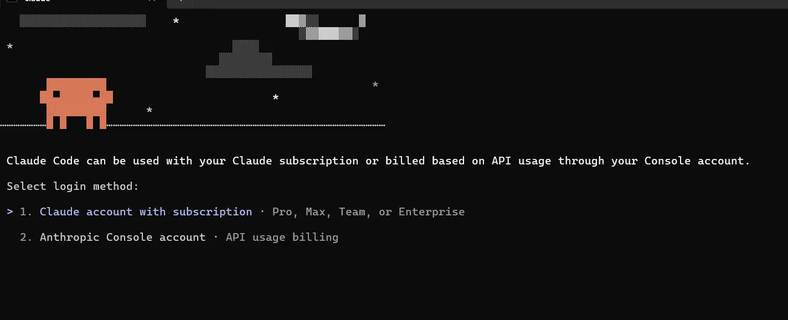
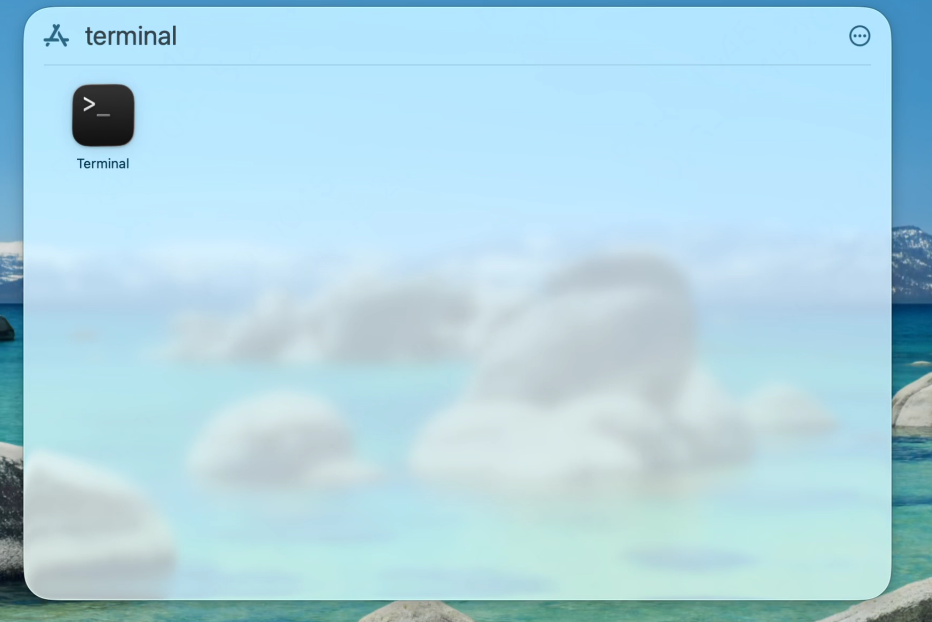

# Claude Code Related Questions

<!-- Source: https://docs.goswitcher.com/docs/faq/CC.html -->

Author: goswitcher

Updated: 2026-06-13T10:02:01.000Z
### How to Use GoSwitcher in VSCode CC Plugin

<DocTabs storage-key="docs-faq-cc-platform-1" :tabs="[{ label: 'Windows', value: 'windows' }, { label: 'MacOS', value: 'macos' }]">
<template #windows>

### Windows

1.  Ensure you have completed the [Environment Check](../cli/1-env.md) and your Claude Code CLI is working properly. If there are issues, follow the tutorial to configure it

2.  Press "Win+R" on your keyboard, enter the following content and press Enter to open the Claude Code configuration directory

``` bash
%userprofile%\.claude
```


3.  The directory contents should look like the image below. If `config.json` does not exist in the directory, you need to manually create it and open it

-   **config.json**: Configures some behavior of the VSCode Claude Code plugin


4.  Write the following content to `config.json` and save

``` json
{
  "primaryApiKey": "GoSwitcher"
}
```

5.  Restart your VSCode and enjoy!


</template>

<template #macos>

### MacOS

1.  Ensure you have completed the [Environment Check](../cli/1-env.md) and your Claude Code CLI is working properly. If there are issues, follow the tutorial to configure it

2.  In Finder, press "Command+Shift+G", enter the following path and press Enter to open the configuration directory

``` bash
~/.claude
```


3.  The directory contents should look like the image below. If `config.json` does not exist in the directory, you need to manually create it and open it

-   **config.json**: Configures some behavior of the VSCode Claude Code plugin


4.  Write the following content to `config.json` and save

``` json
{
  "primaryApiKey": "GoSwitcher"
}
```

5.  Restart your VSCode and enjoy!


</template>
</DocTabs>

### Common Claude Code Commands

| Command | Description |
| --- | --- |
| /claude | Start an interactive REPL in the current directory for conversational use of Claude Code. |
| /claude "Explain this project" | Start REPL with an initial question to let Claude analyze the project right away. |
| /claude -p "Explain this function" | Use print mode for one-time Q&A, output results and exit directly, suitable for scripts/CI. |
| /cat logs.txt \| claude -p "Help me summarize errors" | Feed file or command output to Claude via pipe, combined with `-p` for summarization/analysis. |
| /claude -c | Continue the most recent session in the current directory, picking up where you left off. |
| /claude -c -p "Check type errors" | Execute a one-time request in the recent session context, commonly used for automated checks. |
| /claude -r "abc123" "Complete this PR" | Resume a specific session by session ID and continue executing a new task. |
| /claude update | Update Claude Code CLI to the latest version. |
| /claude mcp | Manage and configure MCP servers, allowing Claude to access external data sources and tools. |
| /claude --add-dir ../apps ../lib | Add additional code directories accessible to Claude, supporting reading code across multiple paths. |
| /claude --agents '{"reviewer":{...}}' | Temporarily define sub-agents via JSON, e.g. code-reviewer, debugger, etc. |
| /claude -p "Generate API docs" --output-format json | Output answers in JSON format for subsequent script parsing. |
| /claude --model sonnet | Specify the model for the session (e.g. sonnet / opus or specific model name). |
| /claude --verbose | Enable verbose logging, showing tool calls and internal steps for debugging. |
| /claude --resume abc123 "Continue fixing this bug" | Resume a session by session ID, continuing previous work from any directory. |
| /claude --continue | Load the most recent session in the current directory, equivalent to "continue last conversation". |
| /claude --append-system-prompt "Always use TypeScript" | Append custom rules after the default system prompt without affecting default behavior. |
| /claude --dangerously-skip-permissions | Skip permission confirmations, letting Claude automatically execute file read/write/run commands (high risk, only in fully trusted environments). |

### Claude Code Cannot Connect to Anthropic Services

::: info Note

**If you're configuring for the first time and have been redirected here, simply follow the instructions below to run the command**
:::

After installing Claude via npm, running `claude` in the command line may show the following error:

``` text
Unable to connect to Anthropic services
Failed to connect to api.anthropic.com: ERR BAD REQUEST
lease check your internet connection and network settings.
Note: Claude Code might not be available in your country, Check supported countries atnttps://anthropic.com/supported-countriesS E:ltoollclaude code>
```



Or you may encounter the following issue during initial configuration:



<DocTabs storage-key="docs-faq-cc-platform-2" :tabs="[{ label: 'Windows', value: 'windows' }, { label: 'MacOS', value: 'macos' }]">
<template #windows>

### Windows

1.  Press `Win + R`, enter `cmd` and press Enter to open the command line

2.  Run the following command in the command line and press Enter

``` bash
powershell -Command "$f='%USERPROFILE%\.claude.json';$j=Get-Content $f|ConvertFrom-Json;$j|Add-Member -NotePropertyName 'hasCompletedOnboarding' -NotePropertyValue $true -Force;$j|ConvertTo-Json|Set-Content $f"
```

3.  Restart your Claude CLI


</template>

<template #macos>

### MacOS

1.  Find the Terminal app in your Applications list and launch it
    

2.  Run the following command in the terminal and press Enter

``` bash
jq '. + {"hasCompletedOnboarding": true}' ~/.claude.json > /tmp/tmp.json && mv /tmp/tmp.json ~/.claude.json
```
::: tip Tip

Note: if `jq` is not found, you can install it with `brew install jq`
:::

3.  Restart your Claude CLI

</template>
</DocTabs>

### How to Switch Claude Code Back to 200K Context and Disable Non-essential Traffic

If you want to switch Claude Code from 1M context back to 200K context and disable some non-essential requests and terminal title changes, you can add the following configuration to the `env` section of `settings.json`.

<DocTabs storage-key="docs-faq-cc-platform-3" :tabs="[{ label: 'Windows', value: 'windows' }, { label: 'MacOS', value: 'macos' }]">
<template #windows>

### Windows

1.  Press `Win + R`, enter the following content and press Enter

``` bash
%userprofile%\.claude
```

2.  Open or create `settings.json`

3.  Confirm that `env` contains the following

``` json
{
  "env": {
    "CLAUDE_CODE_DISABLE_1M_CONTEXT": "1",
    "CLAUDE_CODE_DISABLE_NONESSENTIAL_TRAFFIC": "1",
    "CLAUDE_CODE_DISABLE_TERMINAL_TITLE": "1"
  }
}
```


</template>

<template #macos>

### MacOS

1.  In Finder, press `Command + Shift + G`, enter the following path and press Enter

``` bash
~/.claude
```

2.  Open or create `settings.json`

3.  Confirm that `env` contains the following

``` json
{
  "env": {
    "CLAUDE_CODE_DISABLE_1M_CONTEXT": "1",
    "CLAUDE_CODE_DISABLE_NONESSENTIAL_TRAFFIC": "1",
    "CLAUDE_CODE_DISABLE_TERMINAL_TITLE": "1"
  }
}
```

</template>
</DocTabs>
