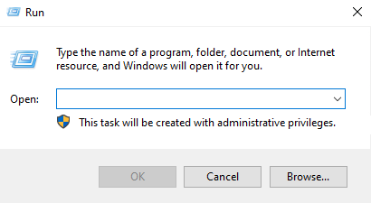
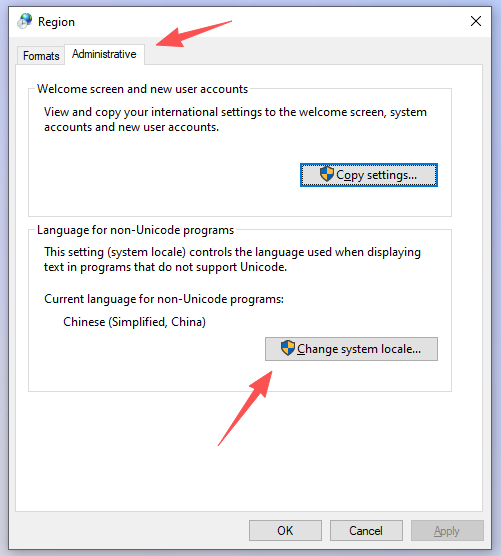
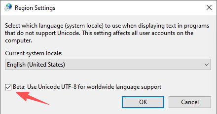
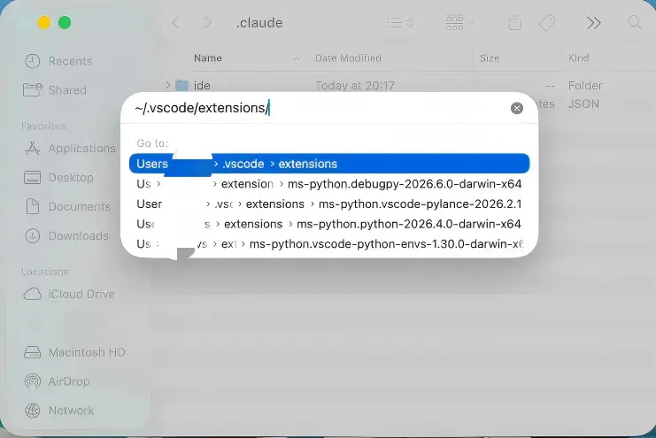
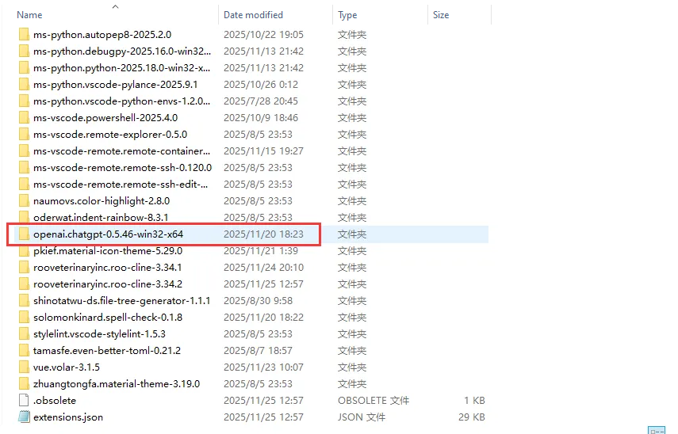
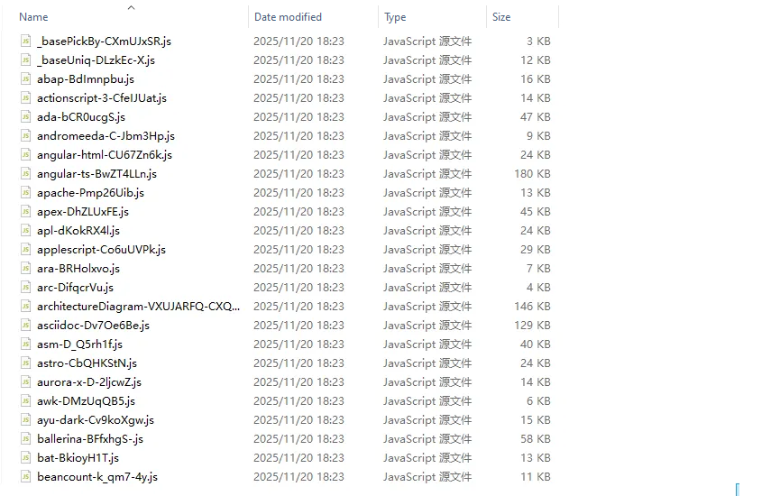
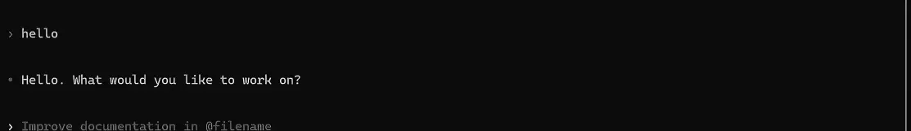

# Codex Related Questions

<!-- Source: https://docs.goswitcher.com/docs/faq/Codex.html -->

Author: goswitcher

Updated: 2026-06-13T10:02:01.000Z
### A Few Tips for More Efficient Use of Codex

> Many people may think that the model becomes less effective after using Codex for a period, experiencing so-called "degradation" phenomenon. However, based on my experience, the models provided in Codex have been upgraded many times without any "degradation" — the key is **how you use the model appropriately**

1.  **Task Breakdown:** Never submit a very vague task, such as "Please write a management system backend" — this will inevitably lead to degradation! Codex models are characterized by **rigorous and orderly, following instructions exactly** — you need to break down your tasks


2.  **Stay in Control:** Before starting a task, evaluate whether it is broken down enough and follows the "modular development" principle. Before submitting the task, you should be able to predict which files Codex will modify and what changes it will occur. Do not let AI go beyond your understanding and control — otherwise the project will become increasingly chaotic until having to start from scratch

::: info Some Thoughts

Honestly, AI has made many things very simple, but basic knowledge determines your upper limit for using AI. At the current stage, AI is just a very excellent Copilot role. This also means that the same AI can have used differently by different people!
:::
3.  **Avoid Compression:** In most scenarios, your task should be completed using at most about 60% of Codex's context. If your task exceeds 60% of context and still unresolved and even requires compression, then the task breakdown before execution has failed — you need to break down the task more carefully. An excellent Codex vibe coding user almost never needs to compress content!

### Smooth Codex Usage on Windows!

::: warning Important

This method simultaneously solves **file reading/writing, encoding issues, high token consumption, project no memory** and other pain points
:::
1.  Ensure your `Codex CLI` and `VSCode Codex` plugin are working properly, that i.e you can successfully converse with the model in the VSCode Codex plugin

2.  Press "Win+R" enter the following content and press Enter to open your user directory

``` bash
%userprofile%\.codex
```

3.  Find the `config.toml` file in the directory, open and edit it. Your configuration file should look like this:

``` toml
model_provider = "goswitcher"
model = "gpt-5.4"
model_reasoning_effort = "high"
network_access = "enabled"
disable_response_storage = true
windows_wsl_setup_acknowledged = true
model_verbosity = "high"

[model_providers.goswitcher]
name = "goswitcher"
base_url = "https://goswitcher.com/v1"
wire_api = "responses"
requires_openai_auth = true
```

4.  Open the `AGENTS.md` file in the directory (create it manually if it doesn't exist), write the following content and save

``` markdown
# Codex Global Work Guidelines

## Answer Style:
 - Answers must use English
 - For summaries, Plans, Tasks, and long content output, prioritize logical organization and use a beautiful Table format; output normal content normally
```

5.  Run VSCode, open the Codex plugin and and let's see what's different!

### Common Codex Commands

| Command | Description |
| --- | --- |
| /model | Select the current model |
| /approvals | Set approval rules for this session |
| /review | Let Codex review current workspace changes |
| /resume | Select and continue a previous session from the session history list |
| /new | Start a new conversation in the current CLI session |
| /init | Generate [AGENTS.md](http://AGENTS.md) template in the current directory |
| /compact | Sumize conversation content to release context |
| /undo | Undo Codex's last operation |
| /diff | View current git diff (including untracked files) |
| /mention | Add specified file or directory to the conversation context |
| /status | View session configuration and token usage |
| /mcp | List currently available MCP tools |
| /exit | Exit Codex CLI |

### Codex Encoding Issues on Windows

1.  Press `Win + R` to open the run window, enter the following command and press Enter

``` bash
intl.cpl
```



2.  Click the "Administrative" tab above, then click the "Change System Locale Settings" button shown by the red arrow



3.  Check the option shown by the red arrow, click OK. Then click OK in the previous window, restart your computer, and use Codex to avoid encoding issues



### Set Latest Model in VSCode Codex Plugin

<DocTabs storage-key="docs-faq-codex-platform-1" :tabs="[{ label: 'Windows', value: 'windows' }, { label: 'MacOS', value: 'macos' }]">
<template #windows>

### Windows

1.  Press `Win + R` to open the run window, enter the following command in press Enter

``` bash
%userprofile%\.vscode\extensions
```


</template>

<template #macos>

### MacOS

1.  In Finder, press "Command+Shift+G", enter the following path in press Enter to open the VSCode extension directory

``` bash
~/.vscode/extensions
```




</template>
</DocTabs>

2.  Find the folder starting with `openai.chatgpt`, - the numbers after it are the version number, if there are multiple such directories, enter the directory with the latest version number



3.  Navigate to `webview\assets` folder, you will see many js files



4.  Download the **replace script**, and unzip it, copy this js file to the directory with many js files


    Download the replace script


    Automatically read the latest version number and file name, click to download directly

    Waiting to get

    File name Download now

5.  Restart VSCode, and you can see that you can now select the latest model!


### How to Configure Global Prompt in Codex
1.  Please check the first two steps in [Codex CLI Configuration](../cli/3-codex.md)

 2.  The `AGENTS.md` file mentioned in the tutorial is the global prompt file in Codex. If this file does not be present, you need to create it manually, then write the prompt
 3.  Save the prompt, restart Codex or VSCode, the prompt will take effect
### Enable Built-in Web Search in Codex
1.  Please check the first two steps in [Codex CLI Configuration](../cli/3-codex.md)

2.  Open the `config.toml` file mentioned in the tutorial, add the following content

``` toml
[features]
web_search_request = true
```

3.  Run Codex and try


### Codex Network Connection Issues in Container or CLI Sandbox

> When Codex encounters network connection issues in the CLI sandbox or container (such as tun mode) (such as unable to pull installation packages), and other tools (such as terminal, Claude Code) work normally, this is usually caused by improper MTU settings.
**Solution:**
-   Change the MTU value to 1500, this setting can usually be changed in your Clash client.
-   For users who cannot find Clash MTU settings on Linux, refer to this link: [https://linux.do/t/topic/1220328](https://linux.do/t/topic/1220328)
### Connection failed Issue

Error message similar to:``` text
Connection failed: error sending request for url (https://www.goswitcher.com/v1/responses)```This situation is caused by local network problems, troubleshoot according to the following steps:
1.  Check whether the local network is working properly, and whether you can access other pages
2.  Check whether your computer uses using a `network proxy (VPN)` tool, if so please turn it off
3.  Use the terminal, run the `codex` command, try to send a conversation message in the CLI to determine whether it is a VSCode Codex plugin issue. If so, please restart VSCode and try again
4.  If it still not work, bring your error screenshot and consult customer service or friends in the group

### 401 Error

Error message similar to:``` text
exceeded retry limit, last status: 401 Unauthorized, request id: xxxxxx```
1.  Run the following command in Windows or MacOS terminal to determine whether environment variables exist

Windows
``` bash
cmd /c "echo ================= OPENAI ENV CHECK ================= & ^if defined OPENAI_API_KEY (echo OPENAI_API_KEY = OK) else (echo OPENAI_API_KEY = MISSING) & ^if defined OPENAI_BASE_URL (echo OPENAI_BASE_URL = OK) else (echo OPENAI_BASE_URL = MISSING) & ^echo ========================================================="
```

If the following output appears, proceed directly to step 2
``` text
OPENAI_API_KEY = MISSINGOPENAI_BASE_URL = MISSING
```

If the output is different, please run the following command in the terminal and then proceed to step 2
``` bash
cmd /c "setx OPENAI_API_KEY \"\" & setx OPENAI_BASE_URL \"\""
```

macOS``` bash
echo "================= OPENAI ENV CHECK ================="if [ -z "$OPENAI_API_KEY" ]; then  echo "OPENAI_API_KEY = MISSING"else  echo "OPENAI_API_KEY = OK"fiif [ -z "$OPENAI_BASE_URL" ]; then  echo "OPENAI_BASE_URL = MISSING"else  echo "OPENAI_BASE_URL = OK"fiecho "========================================================"
```

If the following output appears, proceed directly to step 2
``` text
OPENAI_API_KEY = MISSINGOPENAI_BASE_URL = MISSING
```

If the output is different, run the following command in the terminal and then proceed to step 2
``` bash
unset OPENAI_API_KEY OPENAI_BASE_URL
```

2.  See the [Codex Configuration in CLI](../cli/3-codex.md) chapter

::: warning Important
**You need:**
1.  Check whether the **ApiKey** configuration in ~/.codex/auth.json is correct
2.  Check whether the **request address** in ~/.codex/config.toml is correct
:::

### 403 Error
Error message similar to:``` text
unexpected status 403 Forbidden: {"error":{"message":"Usage not included in yourplan","type":"usage_not_included","param":null,"code":null,"plan_type":"basic"}}
```

This situation is caused by an account issue in the pool, you need to:1.  Use `Ctrl+C` to interrupt the conversation, if in VSCode, click the stop button

2.  Re-initiate the conversation and try again, observe whether this problem appears again
3.  If retrying more than 3 times is invalid, bring your error screenshot and consult customer service or friends in the group