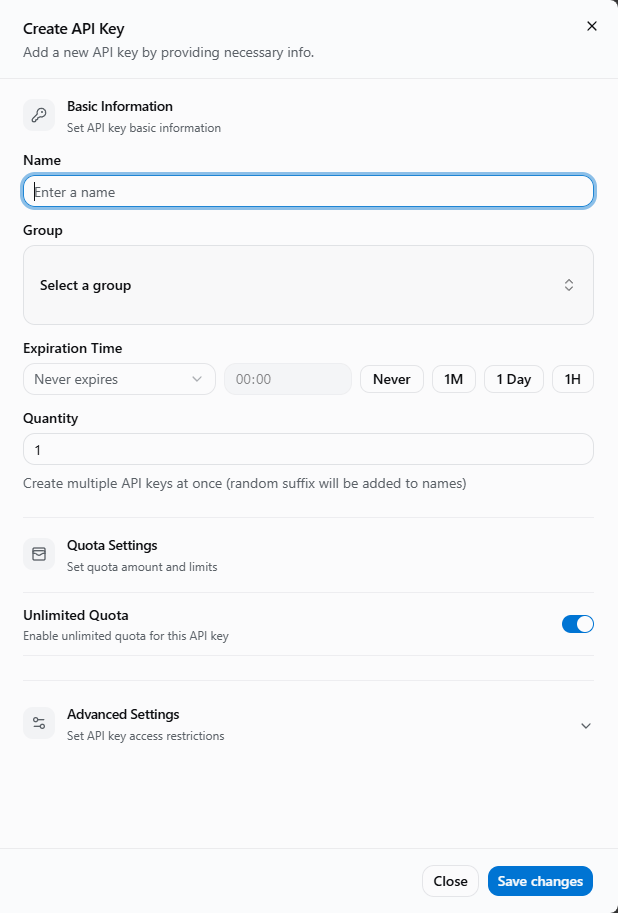

# Gemini Related Questions

<!-- Source: https://docs.goswitch.online/docs/faq/Gemini.html -->

Author: goswitch

Updated: 2026-06-13T10:02:01.000Z
-   [Gemini CLI Usage Issues and Recommendations](./Gemini.md#gemini-cli-usage-issues-and-recommendations)
-   [How to Use Gemini-3 in Cline](./Gemini.md#how-to-use-gemini-3-in-cline)

### Gemini CLI Usage Issues and Recommendation

::: warning Current Status

Gemini CLI currently has multiple usage issues, such as possibly not being able to call models properly or not being able to paste images.
Therefore, it is generally not recommended to connect Gemini-3 to Gemini CLI.
:::
::: tip More Recommended Approach

-   Prioritize using third-party VSCode plugins like Roo Code
-   If you must use Gemini CLI, we recommended using the Gemini-slb group channel (enterprise account pool, more stable)


:::
::: warning Important

If you don't know how to use Roo Code, we recommend using Gemini-slb group channel models in Gemini CLI. Gemini-3 generally connects to this group's account pool with a good experience. The models supported by each group can be found in the [Gemini-slb group description](../token/2-group.md#gemini-slb%E5%88%96%E7%BB%84) content to avoid configuration issues with "no available channels" or "model not found" errors.
:::
::: info Special Reminder

-   When using third-party tools like Roo Code, select the `OpenAI Response` request format
:::
### How to Use Gemini-3 in Cline

#### Software Requirements

| Software | Version Requirement | Download Link |
| --- | --- | --- |
| **VSCode** | 1.80.0+ | [Download VSCode](https://code.visualstudio.com/) |

#### 1. Create Gemini Group Token

Follow the method in [Create API Token](../register/4-token.md) to create a token in the `gemini` group as shown below:



Create API select group diagram

#### 2. Install Cline Plugin

-   Open VSCode
-   Click the **Extensions** icon in the left sidebar (or press `Ctrl+Shift+X` / `Cmd+Shift+X`)
-   Search for **Cline** in the search box
-   Find the Cline plugin and click **Install**

::: info Installation Tips

-   After installation, the Cline icon will appear in the left sidebar
-   First-time use requires API Key configuration
-   Recommended to install the latest version for the best experience
:::
#### 3. Open Cline Interface

After installation, there are two ways to open Cline:

**Method 1: Sidebar Icon**

-   Click the Cline icon in the VSCode left sidebar

**Method 2: Command Palette**

-   Press `Ctrl+Shift+P` (Windows/Linux) or `Cmd+Shift+P` (macOS)
-   Enter `Cline: Open`
-   Press Enter

#### 4. Initial Configuration

After opening the Cline interface, follow these steps to configure:

1.  Click the **API Configuration** button
2.  Fill in the configuration information as follows

``` yaml
API Provider: OpenAI-compatible
Base URL: https://goswitch.online/v1
API Key: sk-*****
Model ID: gemini-3-pro-preview
```


Cline configuration interface diagram

:::: warning Security Reminder

Please keep your `API Key` safe and do not disclose it group chats or public screenshots.
::: details Existing User Note

If you previously used Cline, click the **⚙️ Settings** button in the top right corner to enter the configuration interface.
:::

**Configuration Parameter Description**
::::
| Configuration Item | Recommended Value | Description |
| --- | --- | --- |
| **API Provider** | `OpenAI-compatible` | Recommended to select this option, which supports more models |
| **Base URL** | `https://goswitch.online/v1` | GoSwitch compatible endpoint |
| **API Key** | `sk-******` | Your GoSwitch API Key |
| **Model ID** | `gemini-3-pro-preview` | Recommended to use the code-specialized model |

#### 5. Complete Configuration

Click **Done** in the top right corner.
