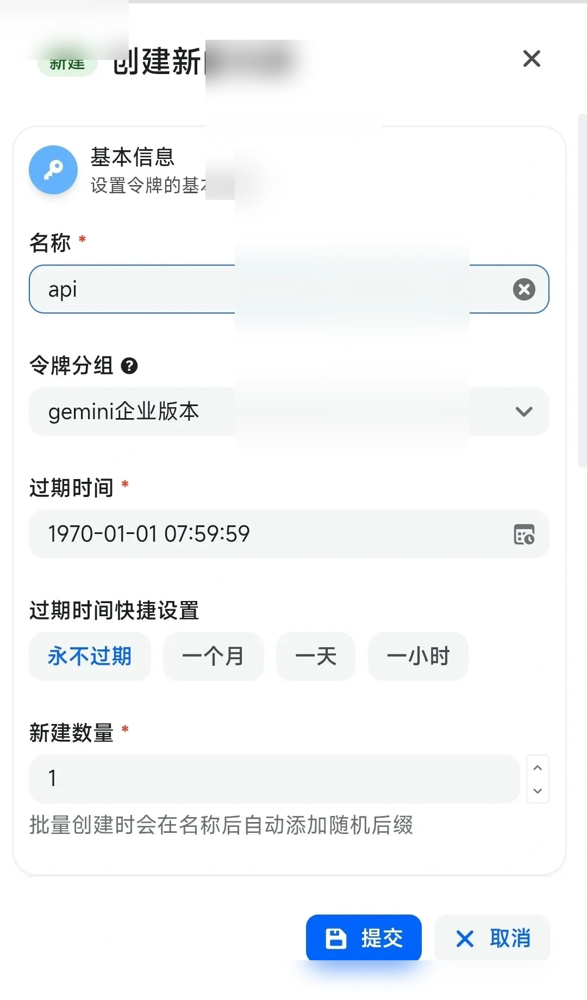
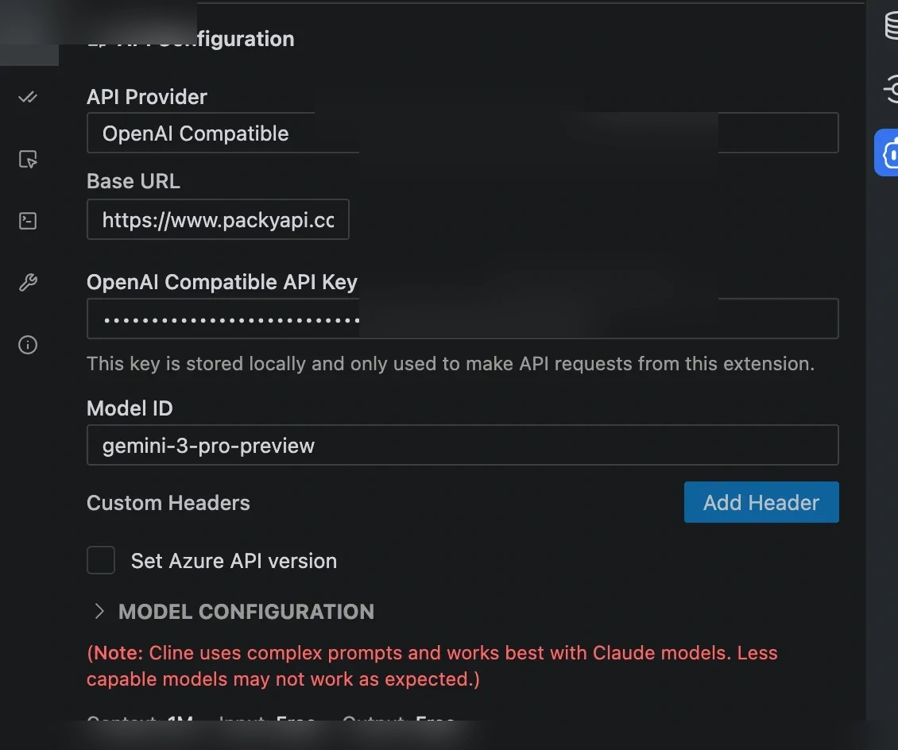

# Gemini相关问题

Source: https://docs.goswitch.online/docs/faq/Gemini.html

Updated: 2026-06-13T10:02:01.000Z
-   [Gemini CLI 使用难题与建议](./Gemini.md#gemini-cli-%E4%BD%BF%E7%94%A8%E9%9A%BE%E9%A2%98%E4%B8%8E%E5%BB%BA%E8%AE%AE)
-   [如何在 Cline 使用 Gemini-3](./Gemini.md#%E5%A6%82%E4%BD%95%E5%9C%A8-cline-%E4%BD%BF%E7%94%A8-gemini-3)

### Gemini CLI 使用难题与建议

::: warning 现状说明

Gemini CLI 目前存在多种使用问题，例如可能无法正常调用模型、无法粘贴图片。
因此通常不建议将 Gemini-3 接入 Gemini CLI。
:::
::: tip 更推荐的方式

-   优先使用 Roo Code 等第三方 VSCode 插件
-   如必须使用 Gemini CLI，建议使用 Gemini-slb 分组渠道（企业号池，更加稳定）


:::
::: warning 重要

如果你不会使用 Roo Code，我们推荐你使用 Gemini-slb 分组渠道的模型在 Gemini CLI 使用，使用 Gemini-3 一般接入这个分组的号池，体验很不错。每个分组支持的模型可查看 [Gemini-slb 分组说明](../token/2-group.md#gemini-slb%E5%88%86%E7%BB%84) 内容，避免配置时出现“无可用渠道”或“模型不存在”问题。
:::
::: info 特别提醒

-   在 Roo Code 等第三方使用时，选取 `OpenAI Response` 请求格式
:::
### 如何在 Cline 使用 Gemini-3

#### 软件要求

| 软件 | 版本要求 | 下载链接 |
| --- | --- | --- |
| **VSCode** | 1.80.0+ | [下载 VSCode](https://code.visualstudio.com/) |

#### 1\. 创建 Gemini 分组令牌

按照 [创建 API 令牌](../register/4-token.md) 一章提到的方法，创建如下图中 `gemini` 分组的令牌：



创建 API 选择分组示意图

#### 2\. 安装 Cline 插件

-   打开 VSCode
-   单击左侧边栏的 **扩展** 图标（或按 `Ctrl+Shift+X` / `Cmd+Shift+X`）
-   在搜索框输入 **Cline**
-   找到 Cline 插件，单击 **安装**

::: info 安装提示

-   安装完成后，左侧边栏会出现 Cline 图标
-   首次使用需要配置 API Key
-   建议安装最新版本以获得最佳体验
:::
#### 3\. 打开 Cline 界面

安装完成后，有两种方式打开 Cline：

**方式一：侧边栏图标**

-   单击 VSCode 左侧边栏的 Cline 图标

**方式二：命令面板**

-   按 `Ctrl+Shift+P` (Windows/Linux) 或 `Cmd+Shift+P` (macOS)
-   输入 `Cline: Open`
-   按 Enter

#### 4\. 首次配置

打开 Cline 界面后，按以下步骤配置：

1.  单击 **API Configuration** 按钮
2.  按下方填写配置信息

```yaml
API Provider: OpenAI-compatible
Base URL: https://goswitch.online/v1
API Key: sk-*****
Model ID: gemini-3-pro-preview
```



Cline 配置界面示意图

:::: warning 安全提醒

请妥善保管你的 `API Key`，不要在群聊或公开截图中泄露。

::: details 已有用户提示

如果您之前使用过 Cline，请单击右上角的 **⚙️ 设置**按钮进入配置界面。
:::

**配置参数说明**
::::
| 配置项 | 推荐值 | 说明 |
| --- | --- | --- |
| **API Provider** | `OpenAI-compatible` | 推荐选择此项，支持更多模型 |
| **Base URL** | `https://goswitch.online/v1` | GoSwitch 的兼容端点 |
| **API Key** | `sk-******` | 您的 GoSwitch API Key |
| **Model ID** | `gemini-3-pro-preview` | 推荐使用代码专精模型 |

#### 5\. 完成配置

单击右上角 **Done**。
