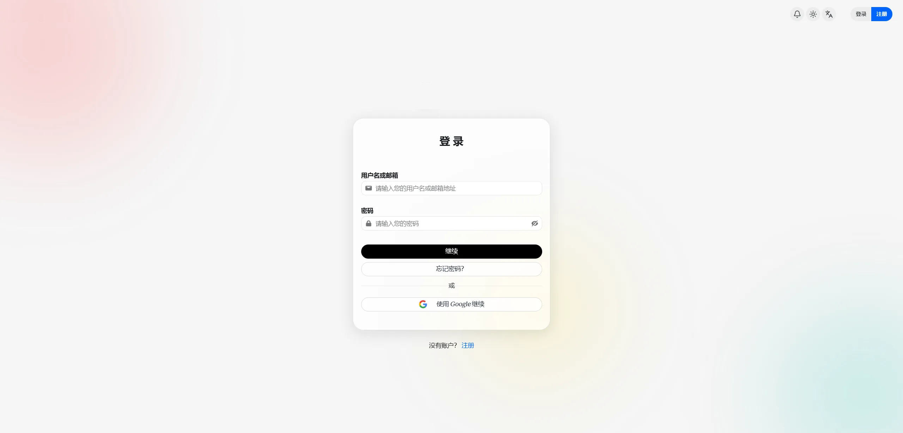
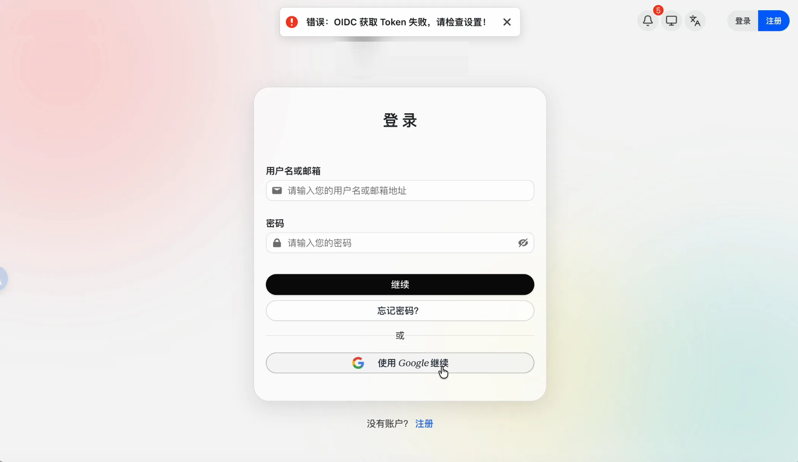
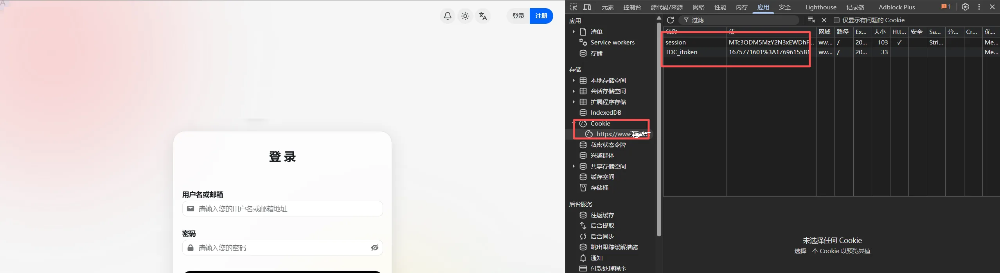

# 登录账号

Source: https://docs.goswitch.online/docs/register/2-login.html

Updated: 2026-06-13T10:02:01.000Z

登录入口：[https://goswitch.online/sign-in](https://goswitch.online/sign-in)

<!-- ## 使用 Google 账号登录

1.  点击“使用 Google 继续”。
2.  选择注册时绑定的 Google 账号。
3.  授权成功后即可自动登录。 -->

## 使用邮箱/用户名登录

1.  输入邮箱地址或用户名。
2.  输入账号密码。
3.  点击“继续”完成登录。

::: info 设备登录说明

浏览器会保持登录状态；在新设备需重复登录流程。
:::
<!-- ## Google 登录异常处理

如果点击“使用 Google 继续”后出现“错误：OIDC 获取 Token 失败，请检查设置！”，通常是浏览器缓存或 Cookie 状态异常导致。

可以先清空浏览器缓存后重试：

-   Windows / Linux Chrome：按 `Ctrl + Shift + Delete` 打开清除浏览数据页面。
-   macOS Chrome：按 `Command + Shift + Delete` 打开清除浏览数据页面。

如果清理缓存后仍然无效，请手动删除 `goswitch.online` 相关 Cookie：

1.  在登录页按 `F12` 打开开发者工具。
2.  进入“应用”面板。
3.  在左侧依次选择“存储” → “Cookie” → `https://goswitch.online`。
4.  删除 `session`、`TDC_itoken` 等站点 Cookie 后刷新页面，再重新登录。

 -->
