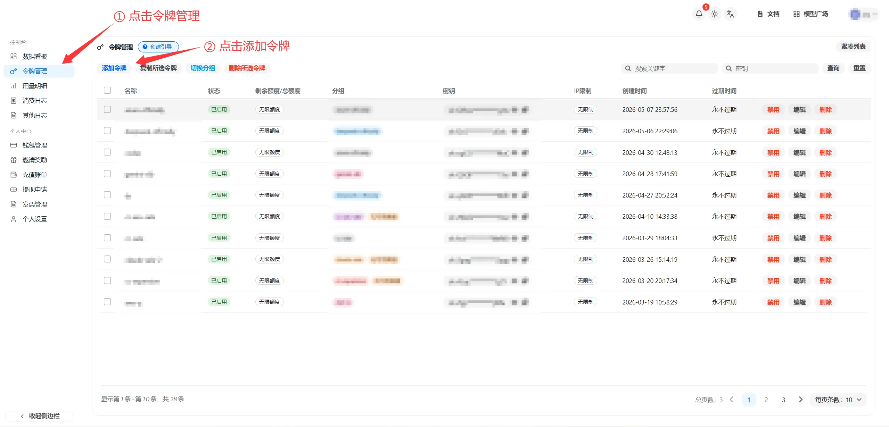
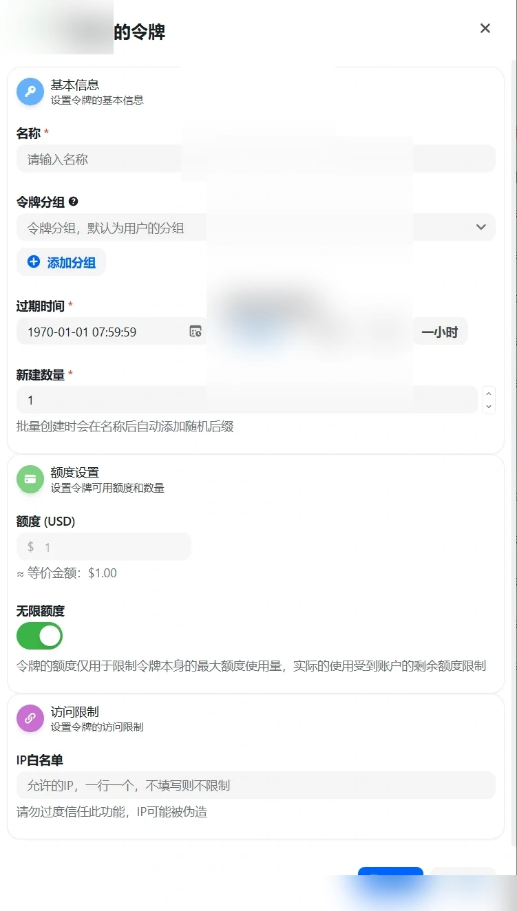
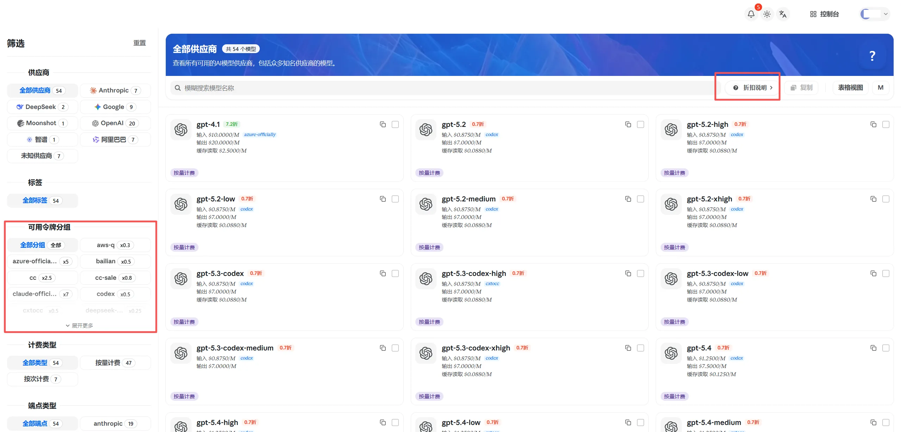
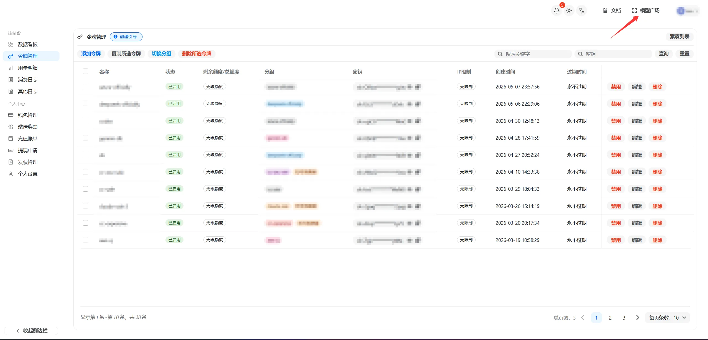

# 创建 API 令牌

Source: https://docs.goswitch.online/docs/register/4-token.html

Updated: 2026-06-13T10:02:01.000Z
登录后进入控制台面板，左侧选择“令牌管理”。

### 进入令牌管理

1.  在左侧菜单点击“令牌管理”。
2.  点击页面上方的“添加令牌”。

### 创建新令牌

在弹窗中填写令牌信息：

-   令牌名称：用于区分不同用途，例如 `Claude Code`、`Codex`、`Gemini`。
-   令牌分组：必须选择，分组决定这个令牌可以使用哪些模型。
-   过期时间：默认“永不过期”，也可以按需要设置有效期。
-   新建数量：一般保持 `1` 即可。
-   额度设置：开启“无限额度”时，令牌实际可用额度仍受账户余额限制。
-   访问限制：不熟悉时建议先保持默认，不要开启模型限制或 IP 白名单。

::: warning 令牌分组一定要选对

令牌分组会直接影响可用模型。比如 Claude Code、Codex、Gemini CLI 需要选择对应分组；如果分组选错，后续配置 CLI 时很容易出现“模型不存在”或无法调用的问题。

如果你不确定每个分组适合什么场景，请先阅读 [GoSwitch 各分组介绍](../token/)。

填写完成后，点击右下角“提交”完成创建。
:::
### 查看分组可用模型

你可以在“模型广场”查看每个令牌分组下支持哪些模型。

1.  点击页面右上角“模型广场”。
2.  在左侧“可用令牌分组”中选择分组。
3.  右侧模型卡片会显示该分组可用的模型、价格和折扣倍率。

如果你想了解折扣含义，可以点击模型广场右上方的“折扣说明”。
