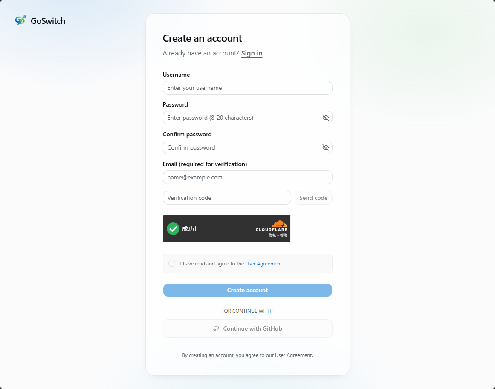
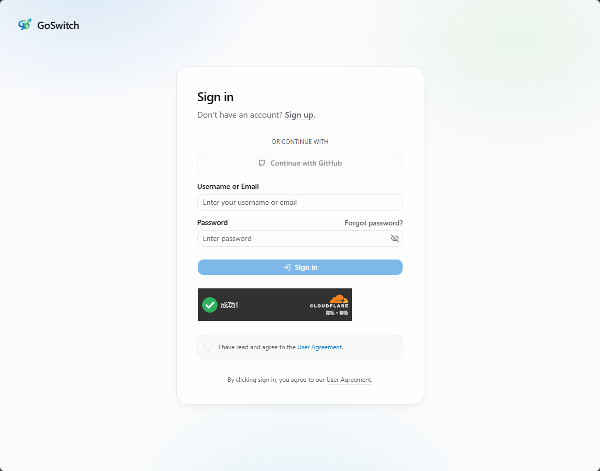
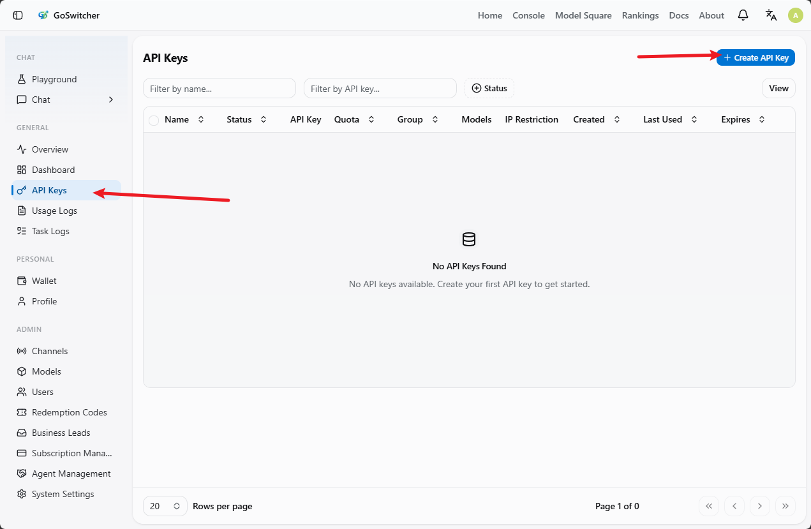
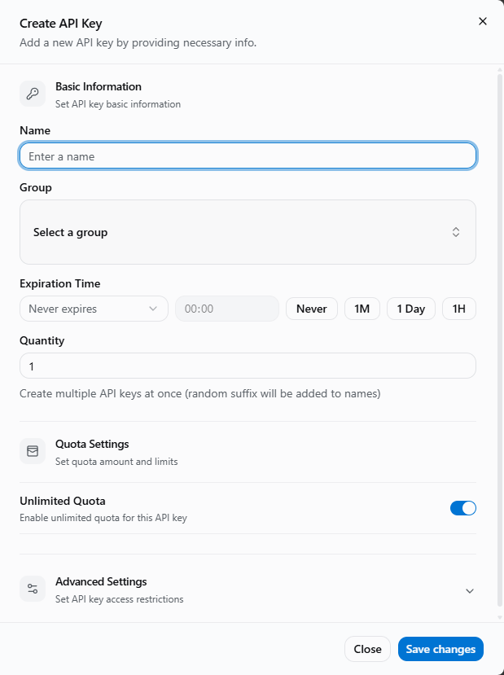
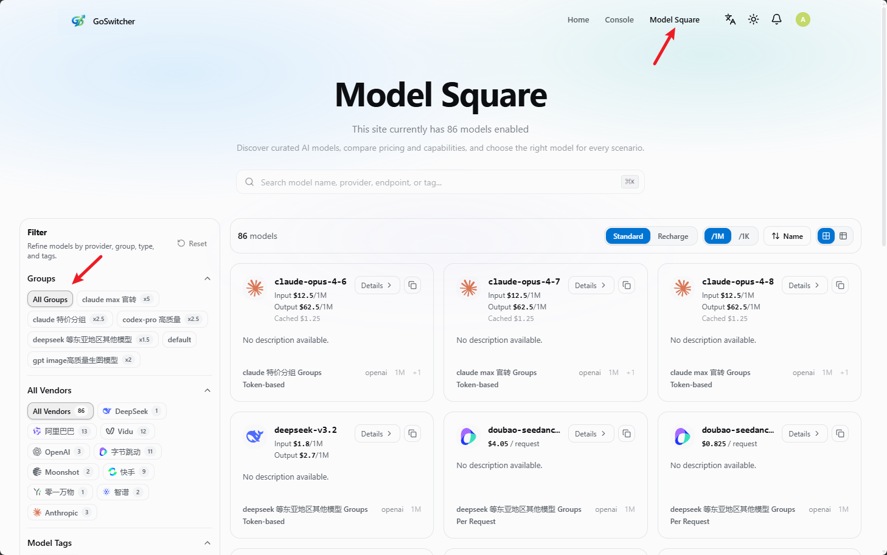

# Getting Started

<!-- Source: https://docs.goswitcher.com/docs/register/ -->

Author: goswitcher

Updated: 2026-06-13T10:02:01.000Z
<div class="important-notice">
  <div class="notice-glow"></div>
  <div class="notice-header">
    <div class="header-bg-pattern"></div>
    <div class="notice-badge"><span class="badge-icon">⚠️</span></div>
    <div class="header-text">
      <span class="notice-label">IMPORTANT</span>
      <span class="notice-title">Advice for readers!</span>
    </div>
    <div class="header-decoration">
      <span class="deco-dot"></span>
      <span class="deco-dot"></span>
      <span class="deco-dot"></span>
    </div>
  </div>
  <div class="notice-content">
    <div class="notice-item" style="--delay: 0s">
      <div class="item-number">01</div>
      <div class="item-body">
        <div class="item-icon-wrap"><span class="item-icon">📖</span></div>
        <span>Before deploying and using, please read the <strong class="highlight-red">Model Groups Introduction</strong> and <strong class="highlight-red">FAQ</strong> sections. If you have time, it's best to read the entire documentation</span>
      </div>
    </div>
    <div class="notice-item" style="--delay: .1s">
      <div class="item-number">02</div>
      <div class="item-body">
        <div class="item-icon-wrap"><span class="item-icon">💡</span></div>
        <span>We always believe in <strong class="highlight-blue">"teaching someone to fish is better than giving them a fish"</strong></span>
      </div>
    </div>
    <div class="notice-item" style="--delay: .2s">
      <div class="item-number">03</div>
      <div class="item-body">
        <div class="item-icon-wrap"><span class="item-icon">✅</span></div>
        <span>These two sections not only improve your experience, but also answer <strong class="highlight-gold">90%</strong> of the questions you might ask in the group later</span>
      </div>
    </div>
  </div>
  <div class="notice-footer">
    <span class="footer-text">Please read the above content carefully</span>
    <div class="footer-line"></div>
  </div>
</div>

::: info Let's start here!

Your GoSwitcher journey from zero~

Follow the steps and you'll be fine!
:::
## Step 1: Register an Account

-   Registration link: [https://goswitcher.com/sign-up](https://goswitcher.com/sign-up)



-   Open the registration link, then click "Register" in the upper right corner of the page.
-   If you are on the login page, you can also click "No account? Register" at the bottom to enter the registration process.

**Method 1 (Recommended): Register with GitHub Account**

1.  Click "Continue with GitHub".
2.  Select the GitHub account you want to bind in the popup and complete authorization.
3.  After successful authorization, the system will automatically create your account and log you in.

Registering with GitHub doesn't require a separate password. For future logins, just select the same GitHub account.

**Method 2: Register with Email**

1.  Click "Register with Username".
2.  Fill in your email, username, and password.
3.  Follow the page prompts to submit and complete registration.

::: warning Note

Your email will be used for verification and notifications. We recommend using a combination of letters, numbers, and special characters for your password. Keep your login credentials safe to prevent account theft.
:::
## Step 2: Login

-   Login link: [https://goswitcher.com/sign-in](https://goswitcher.com/sign-in)



**Login with GitHub Account**

1.  Click "Continue with GitHub".
2.  Select the GitHub account you used during registration.
3.  After successful authorization, you'll be automatically logged in.

**Login with Email/Username**

1.  Enter your email address or username.
2.  Enter your account password.
3.  Click "Continue" to complete login.


## Step 3: Purchase Quota

After logging into the console, go to the "Wallet Management" page on the left side to purchase quota.

1.  Select a fixed quota amount in "Select recharge quota", or enter a custom amount in "Custom quota".
2.  Confirm the "Actual payment amount" at the bottom of the page, then click "Pay Now".

::: info Payment Notes

The current exchange rate is `1:1`, meaning **1 USDT equals 1 USD quota**. If the payment page doesn't appear when using Alipay or WeChat Pay, please disable your proxy and try again.
:::

## Step 4: Create an API Token

After logging in, go to the console panel and select "Token Management" from the left side.



### Enter Token Management

1.  Click "Token Management" in the left menu.
2.  Click "Add Token" at the top of the page.

### Create a New Token

Fill in the token information in the popup:



-   Token Name: Used to distinguish different purposes, e.g., `Claude Code`, `Codex`, `Gemini`.
-   Token Group: Must be selected. The group determines which models this token can use.
-   Expiration Time: Default is "Never expire", or you can set a validity period as needed.
-   Quantity: Generally keep `1`.
-   Quota Setting: When "Unlimited quota" is enabled, the token's actual available quota is still limited by your account balance.
-   Access Restriction: If you're not familiar with this, it's recommended to keep the default settings. Don't enable model restrictions or IP whitelist.

::: warning Choose the correct token group

The token group directly affects available models. For example, Claude Code, Codex, and Gemini CLI need to select their corresponding groups. If you select the wrong group, you may encounter "model not found" errors or unable to call models during CLI configuration.

If you're unsure which group fits your scenario, please read the [GoSwitcher Group Introduction](../token/) first.

After filling in, click "Submit" at the bottom right to complete the creation.
:::
### View Group Available Models

You can view the models supported by each token group in "Model Plaza".



1.  Click "Model Plaza" in the upper right corner of the page.
2.  Select a group from "Available token groups" on the left.

## Step 5: Environment Check

Before configuring Claude Code, Codex, or Gemini CLI, please confirm that Node.js is properly installed on your machine.

Execute the following in a Windows, macOS, or Linux terminal:

``` bash
npm list -g --depth-0
```

If the command runs successfully, Node.js and npm are available. Even if no global packages are shown in the output, it doesn't affect subsequent configuration.

If you see "command not found" or similar errors, it means Node.js isn't installed or hasn't been properly added to the system PATH. Please install Node.js first, then re-run the command to confirm.

::: warning Environment check must be completed first

CLI tools depend on Node.js and npm. If the environment isn't ready, subsequent installations of Claude Code, Codex, or Gemini CLI may fail.
:::
## Step 6: Configure CLI Tools

GoSwitcher supports using Claude Code, Codex, and Gemini CLI in the command line

### Prerequisites

Before configuring CLI, please complete the following steps:

1.  Complete [Environment Check](./5-env.md), ensuring Node.js and npm are working properly.
2.  Complete [Install CLI](../cli/1-env.md#_2-install-cli), installing Claude Code, Codex, and Gemini CLI.


::: warning Recommended Configuration

To make the configuration process simpler and easier, we **strongly recommend** using the open-source GitHub project [CC-Switch](https://github.com/farion1231/cc-switch) to configure your environment.

[CC-Switch Configuration Tutorial for CC, Codex, Gemini](../ccswitch/)

If you're experienced or prefer not to use this tool, you can refer to the CLI manual configuration tutorials below. **But we still strongly recommend using this tool to save time!**
:::
::: info CLI Manual Configuration Tutorial Links

Note: Regardless of which CLI you use, please complete the prerequisites above first, ensuring Node.js, npm, and the corresponding CLI are all working properly.

[Claude Code Configuration Tutorial](../cli/2-claude.md)

[Codex Configuration Tutorial](../cli/3-codex.md)

[Gemini Configuration Tutorial](../cli/4-gemini.md)

:::
