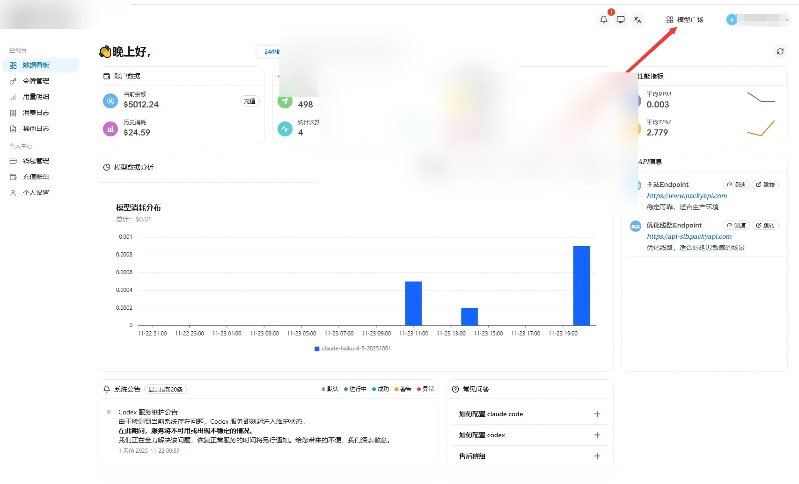
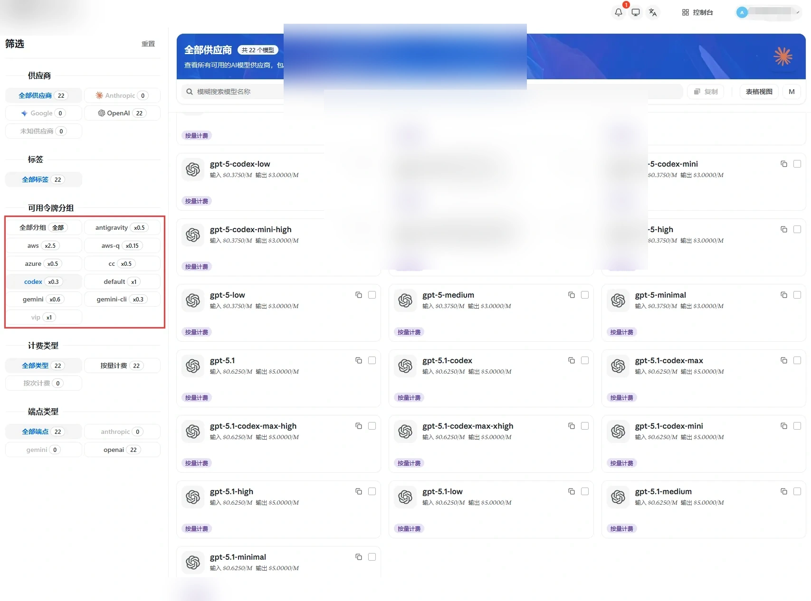

# 分组介绍

Source: https://docs.goswitch.online/docs/token/

Updated: 2026-06-13T10:02:01.000Z
## 如何查看最新分组

1.  在控制台面板，点击右上角“模型广场”，进入分组与模型的查看

2.  进入模型广场，左侧红框处就是[创建API令牌](../register/4-token.md)
    步骤提到的令牌分组，右侧就是该分组下所存在的模型

3.  左侧分组名后显示的类似x0.5就是该模型的倍率：

    -   选择不同令牌分组可以享受不同的计费倍率
    -   倍率 < 1 享折扣：0.8倍 = 8折，0.5倍 = 5折
    -   倍率 > 1 需加价：1.5倍 = 额外支付50%费用
    -   不选择则使用您的默认计费倍率（1x）

::: warning 为什么要教你这一步？

授人以鱼不如授人以渔，很多人只知道去看分组名，其实压根不知道这个分组下有哪些模型，稀里糊涂配置以后，使用就会提示“模型不存在”。

**为了杜绝这种情况发生，我们直接教你怎么去查看每个分组的详细信息。**

:::
## 令牌分组介绍

### Default分组

::: info 详情卡片

-   **分组介绍：**
    -   一个默认的分组，没有对模型进行特定区分，一些测试模型，或无需分类的模型，以及其他一些乱七八糟的模型放在这个分组中，一般用不上，了解即可
:::
::: warning 重要

**你要用CC或者Codex或者Gemini cli的话，这个分组与你无关，生成令牌的时候不要选这个分组！！！**

-   **支持的CLI：**

    -   无
-   **是否支持接入第三方：**

    -   ×不支持
-   **模型列表（实时查询）：**
:::
### Aws分组

::: info 详情卡片

-   **分组介绍：**

    -   亚马逊AWS平台逆向的claude模型，相比AWS官渠，稍微便宜一些，但是稳定性稍微低一些。可用于Claude Code以及其他第三方平台
-   **支持的CLI：**

    -   Claude Code
-   **是否支持接入第三方：**

    -   √支持
-   **模型列表（实时查询）：**
:::
### Aws-officially分组

::: info 详情卡片

-   **分组介绍：**

    -   从亚马逊AWS平台购买的正规Claude API。此模型与Claude官方模型分开部署，价格贵但稳定，适合兜底使用，仅了解即可
-   **支持的CLI：**

    -   Claude Code
-   **是否支持接入第三方：**

    -   √支持
-   **模型列表（实时查询）：**
:::
### Aws-Q分组

::: info 详情卡片

-   **分组介绍：**
    -   逆向Kiro的AWSQ的Claude模型，转换为API使用形式。此模型渠道特殊，使用了一系列手法，价格极其低廉。此分组模型相较于Claude官方的模型，上下文为200K，可进行思考，适合拿来日常使用，或做任务规划，翻译等。
:::
::: warning 重要

**注意，此分组在ClaudeCode使用的时候容易出现422错误等问题，稳定性不如cc和Aws分组**

-   **支持的CLI：**

    -   Claude Code
-   **是否支持接入第三方：**

    -   √支持
-   **模型列表（实时查询）：**
:::
### Azure-officially分组

::: info 详情卡片

-   **分组介绍：**

    -   Azure官方渠道，提供GPT相关模型，可以使用在OpenCode等第三方工具中，也可以拿来聊天
-   **支持的CLI：**

    -   无
-   **是否支持接入第三方：**

    -   √支持
-   **模型列表（实时查询）：**
:::
### Bailian分组

::: info 详情卡片

-   **分组介绍：**

    -   阿里百炼官方版本渠道，此分组模型使用会按阶梯计价
-   **支持的CLI：**

    -   Claude Code
-   **是否支持接入第三方：**

    -   √支持
-   **模型列表（实时查询）：**
:::
### CC分组

::: info 详情卡片

-   **分组介绍：**

    -   使用Claude Code需要选择此分组！主要分组之一，专门用于Claude Code使用，不能接入任何第三方，如果触发GoSwitch的环境审查，会封停你的GoSwitch账号，并进入退款流程。这样做是因为有些人向Claude询问一些NSFW问题，会触发道德审查，导致账号被封且无法退款，为了号池稳定，请勿接入任何第三方
-   **支持的CLI：**

    -   Claude Code
-   **是否支持接入第三方：**

    -   ×不支持
-   **模型列表（实时查询）：**
:::
### CC-azu-sale分组

::: info 详情卡片

-   **分组介绍：**

    -   可用于第三方、Claude Code 的宝贝物品
-   **支持的CLI：**

    -   Claude Code
-   **是否支持接入第三方：**

    -   √支持
-   **模型列表（实时查询）：**
:::
### CC-expensive分组

::: info 详情卡片

-   **分组介绍：**

    -   昂贵的 Claude Code 分组，可用于第三方
-   **支持的CLI：**

    -   Claude Code
-   **是否支持接入第三方：**

    -   √支持
-   **模型列表（实时查询）：**
:::
### CC-sale分组

::: info 详情卡片

-   **分组介绍：**
    -   便宜的Claude Code分组，提供较为廉价的Claude模型，跟官渠效果差不多，可以接入OpenClaw等第三方使用（养龙虾）
:::
::: warning 重要

**此分组缓存可能会有异常**

-   **支持的CLI：**

    -   Claude Code
-   **是否支持接入第三方：**

    -   √支持
-   **模型列表（实时查询）：**
:::
### claude-officially分组

::: info 详情卡片

-   **分组介绍：**

    -   Claude 官方key渠道，价格基本对标官方价，适合应急使用
-   **支持的CLI：**

    -   Claude Code
-   **是否支持接入第三方：**

    -   √支持
-   **模型列表（实时查询）：**
:::
### claude-sale分组

::: info 详情卡片

-   **分组介绍：**

    -   逆向出来的Claude模型，贵一些，类似官渠，适合应急时候使用
-   **支持的CLI：**

    -   Claude Code
-   **是否支持接入第三方：**

    -   √支持
-   **模型列表（实时查询）：**
:::
### Codex分组

::: info 详情卡片

-   **分组介绍：**

    -   使用Codex需要选择此分组！主要分组之一，专门用于Codex使用，可以接入第三方使用。尽量还是在Codex中使用，因为这个分组的模型都是对编程特化的，用在其他方面可能效果并不理想
-   **支持的CLI：**

    -   Codex
-   **是否支持接入第三方：**

    -   √支持
-   **模型列表（实时查询）：**
:::
### Codex-sale分组

::: info 详情卡片

-   **分组介绍：**

    -   Codex分组的优惠版本，价格更加廉价
-   **支持的CLI：**

    -   Codex
-   **是否支持接入第三方：**

    -   √支持
-   **模型列表（实时查询）：**
:::
### Cxtocc分组

::: info 详情卡片

-   **分组介绍：**
    -   早期为将 codex 分组模型接入 Claude Code 做过兼容适配的分组。由于该方案稳定性和缓存表现不再符合推荐使用标准，仅保留给已有配置用户参考。
:::
::: warning 重要

**此分组已不再建议使用。新用户请优先按照对应工具选择推荐分组：GPT 模型建议在 Codex 中使用，Claude 模型建议在 Claude Code 中使用。**

-   **支持的CLI：**

    -   Claude Code
-   **是否支持接入第三方：**

    -   ×不支持
-   **模型列表（实时查询）：**
:::
### DeepSeek-officially分组

::: info 详情卡片

-   **分组介绍：**

    -   DeepSeek官方渠道，提供DeepSeek相关模型
-   **支持的CLI：**

    -   无
-   **是否支持接入第三方：**

    -   √支持
-   **模型列表（实时查询）：**
:::
### Doubao分组

::: info 详情卡片

-   **分组介绍：**

    -   火山方舟官方渠道，比官方稍微廉价一些，提供豆包相关模型
-   **支持的CLI：**

    -   Claude Code
-   **是否支持接入第三方：**

    -   √支持
-   **模型列表（实时查询）：**
:::
### Gemini分组

::: info 详情卡片

-   **分组介绍：**

    -   Gemini普通号池，适合一般场景使用，稳定性略差，较为经济的选择
-   **支持的CLI：**

    -   Gemini
-   **是否支持接入第三方：**

    -   √支持
-   **模型列表（实时查询）：**
:::
### Gemini-officially分组

::: info 详情卡片

-   **分组介绍：**

    -   完全接的官方渠道的Gemini API，价格对标官方，适合企业用户
-   **支持的CLI：**

    -   Gemini Cli
-   **是否支持接入第三方：**

    -   √支持
-   **模型列表（实时查询）：**
:::
### Gemini-slb分组

::: info 详情卡片

-   **分组介绍：**

    -   Gemini企业号池，更加稳定一些，不过价格稍贵，使用Gemini-3 一般接入这个分组的号池，体验很不错
-   **支持的CLI：**

    -   Gemini
-   **是否支持接入第三方：**

    -   √支持
-   **模型列表（实时查询）：**
:::
### GPT-officially分组

::: info 详情卡片

-   **分组介绍：**

    -   谨慎选择此分组！GPT官方ApiKey分发模型，适合特殊需要人群使用，普通用户不要选择这个分组，会快速扣额度
-   **支持的CLI：**

    -   无
-   **是否支持接入第三方：**

    -   √支持
-   **模型列表（实时查询）：**
:::
### Image分组

::: info 详情卡片

-   **分组介绍：**

    -   官方稳定的Image绘图模型聚合分组，具体使用方法可参考「绘图模型教程」章节
-   **支持的CLI：**

    -   无
-   **是否支持接入第三方：**

    -   √支持
-   **模型列表（实时查询）：**
:::
### Mimo-officially分组

::: info 详情卡片

-   **分组介绍：**

    -   小米MiMo官方版本渠道
-   **支持的CLI：**

    -   无
-   **是否支持接入第三方：**

    -   √支持
-   **模型列表（实时查询）：**
:::
### Minimax-officially分组

::: info 详情卡片

-   **分组介绍：**

    -   minimax官方渠道，提供较为廉价的minimax模型
-   **支持的CLI：**

    -   Claude Code
-   **是否支持接入第三方：**

    -   √支持
-   **模型列表（实时查询）：**
:::
### Pplx分组

::: info 详情卡片

-   **分组介绍：**

    -   perplexity相关模型逆向，不做深入解释，了解即可
-   **支持的CLI：**

    -   无
-   **是否支持接入第三方：**

    -   √支持
-   **模型列表（实时查询）：**
:::
### Sora分组

::: info 详情卡片

-   **分组介绍：**

    -   Sora视频生成模型专用分组
-   **支持的CLI：**

    -   无
-   **是否支持接入第三方：**

    -   √支持
-   **模型列表（实时查询）：**
:::
### zai-officially分组

::: info 详情卡片

-   **分组介绍：**

    -   智谱清言GLM官方渠道，适合接入Claude Code使用，或作为日常对话使用
-   **支持的CLI：**

    -   Claude Code
-   **是否支持接入第三方：**

    -   √支持
-   **模型列表（实时查询）：**

:::