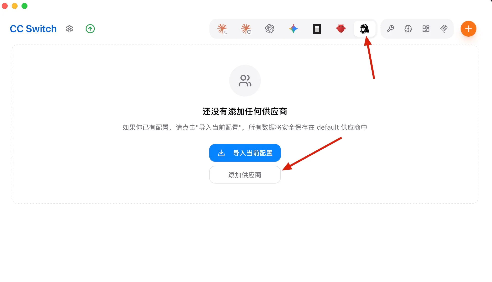
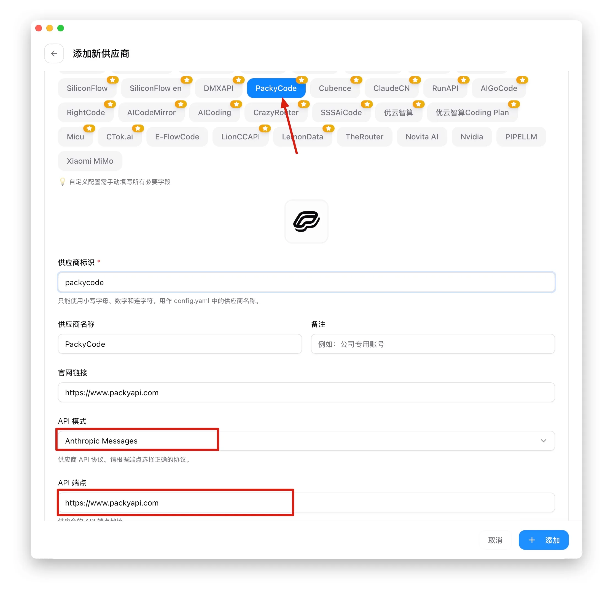
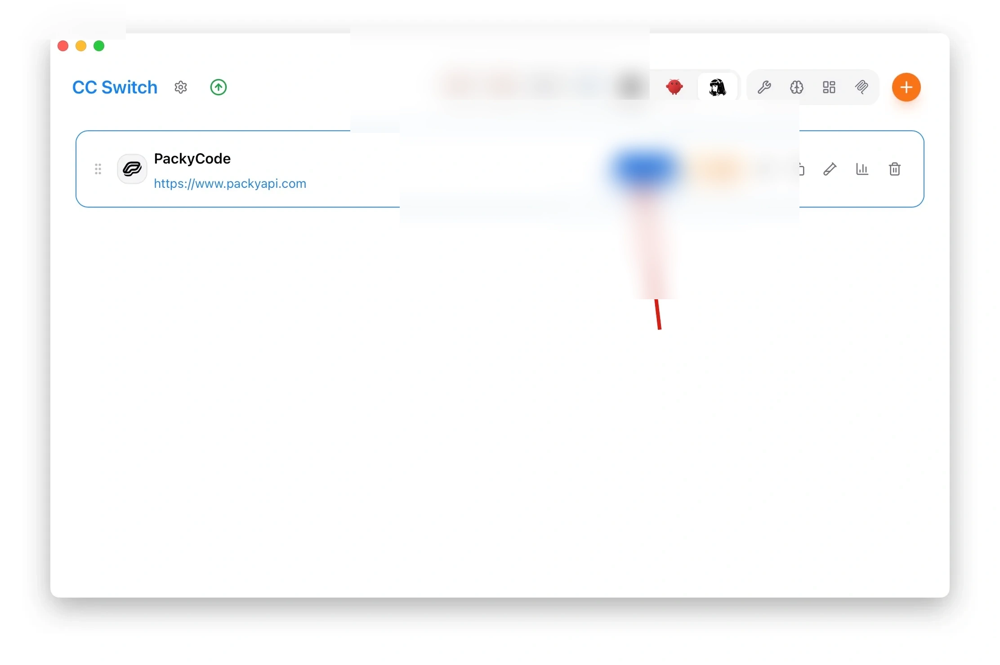

# Hermes

<!-- Source: https://docs.goswitch.online/docs/advanced/Hermes.html -->

Author: goswitch

Updated: 2026-06-13T10:02:01.000Z
## 项目介绍

-   **项目定位**: [Hermes Agent](https://github.com/NousResearch/hermes-agent) 是 Nous Research 开源的全功能 AI Agent，可在终端中对话编程，也可以作为常驻服务接入 Telegram、Discord、Slack、WhatsApp 等社交平台。
-   **核心特色**:
    -   完整的 CLI 对话体验，内置工具调用、记忆（Memory）与技能（Skills）系统。
    -   支持 Nous Portal、OpenRouter、OpenAI 等多种供应商，也支持**任意 OpenAI / Anthropic 兼容端点**，因此可以直接接入 GoSwitch。
    -   `hermes gateway` 一条命令即可把 Agent 挂到社交软件上作为机器人使用。
    -   数据全部保存在本地 `~/.hermes/` 目录，无遥测上报。
    -   支持本地终端、Docker、SSH 远程等多种执行后端。
-   **平台支持**: Linux、MacOS、WSL2（原生 Windows 处于实验阶段，推荐使用 WSL2）。

## 安装与初始化

1.  打开终端，运行以下命令进行一键安装（脚本会自动安装 uv、Python 3.11 等依赖，无需 sudo）

Linux / MacOS / WSL2

``` bash
curl -fsSL https://hermes-agent.nousresearch.com/install.sh | bash
```

Windows（PowerShell，实验性）

``` powershell
iex (irm https://hermes-agent.nousresearch.com/install.ps1)
```

2.  安装完成后重载一下 shell 配置，再输入 `hermes` 能看到交互界面即安装成功

``` bash
source ~/.bashrc   # zsh 用户执行 source ~/.zshrc
hermes
```

3.  首次启动会进入设置向导，供应商选择部分可以先跳过，下面我们通过 CC-Switch 配置 GoSwitch 渠道。

## 配置 GoSwitch 渠道

1.  查看 [CC Switch下载](../ccswitch/1-common.md) 一节的内容，下载并安装 CC-Switch 到本地，安装并打开软件

2.  上方配置项选择到 `Hermes`，然后点击 `添加供应商` 按钮



3.  进行多项配置：

    -   在 `预设供应商` 中选择 `GoSwitch`
    -   在 `供应商标识` 中填写名称（只能使用小写字母、数字和连字符），比如 goswitch
    -   `API 模式` 保持 `Anthropic Messages`，`API 端点` 保持 `https://goswitch.online`
    -   在 `API Key` 中填入 [创建API令牌](../register/4-token.md) 一节中你创建的Key

    ::: warning 重要

    **目前推荐在 Hermes 使用的分组：**

    -   **Claude：[aws-q分组](../token/2-group.md#aws-q%E5%88%86%E7%BB%84)、[cc-sale分组](../token/2-group.md#cc-sale%E5%88%86%E7%BB%84)、[claude-officially分组](../token/2-group.md#claude-officially%E5%88%86%E7%BB%84)、cc-expensive分组**

    **请您创建正确分组的APIKEY后填入**

    -   在 `模型列表` 中配置ApiKey对应分组下正确的模型名，每个模型需要填写 `模型 ID` 和 `显示名称`（`高级选项` 保持默认即可），每个分组下的模型可在 [令牌分组介绍](../token/2-group.md) 一节中查询。
        **比如现在我的ApiKey对应的是cc-sale分组，那么我可以配置：**
        -   默认模型 → 模型 ID：claude-opus-4-8 显示名称：Claude Opus 4.8
        -   备选模型 → 模型 ID：claude-sonnet-4-6 显示名称：Claude Sonnet 4.6
    -   全部配置好后，点击右下角 `添加` 按钮




4.  在界面中选择刚配置好的 GoSwitch 渠道，点击 `启用` 按钮，即可完成渠道启用


:::
::: tip 提示

CC-Switch 实际写入的是 `~/.hermes/` 目录下的 `.env`（ApiKey 等敏感信息）与 `config.yaml`（供应商、模型等配置），熟悉 Hermes 的用户也可以直接手动编辑这两个文件。
:::
## 验证配置

1.  重新打开终端，输入 `hermes` 进入对话界面

2.  输入 `/model` 命令，在模型选择器中能看到刚配置的 GoSwitch 渠道及模型列表，选中想要的模型回车确认；后续切换渠道时回到 CC-Switch 一键切换即可


3.  随便发送一句话，能正常收到回复即表示配置成功，开始愉快的对话吧~


::: tip 常用命令速查
:::
| 命令 | 说明 |
| --- | --- |
| `hermes` | 进入交互式 CLI |
| `hermes model` | 交互式选择供应商 / 模型 |
| `hermes dashboard` | 启动 Web 界面 |
| `hermes config set KEY VALUE` | 写入配置（密钥会保存到 `.env`） |
| `hermes gateway setup` | 配置 Telegram / Discord 等社交平台机器人 |
| `hermes doctor` | 诊断环境问题 |
| `hermes update` | 更新 Hermes 到最新版本 |
