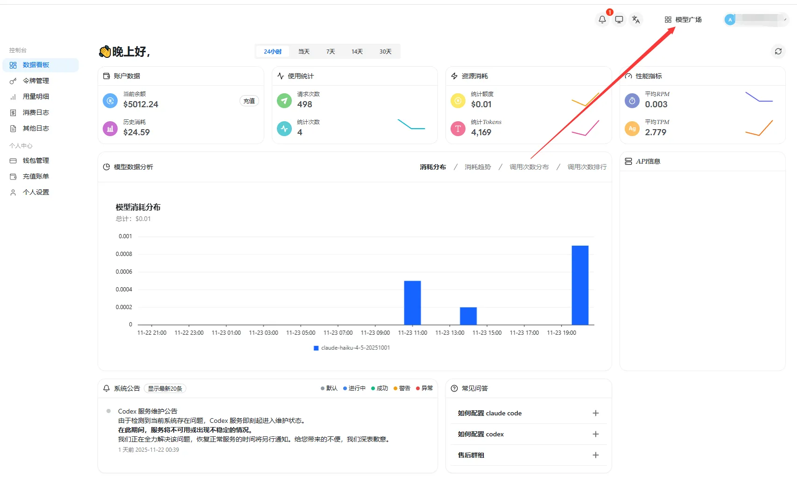

# 令牌分组查看

<!-- Source: https://docs.goswitcher.com/docs/token/1-intro.html -->

Author: goswitcher

Updated: 2026-06-13T10:02:01.000Z
## 如何查看最新分组

1.  在控制台面板，点击右上角“模型广场”，进入分组与模型的查看

2.  进入模型广场，左侧红框处就是[创建API令牌](../register/4-token.md)
    步骤提到的令牌分组，右侧就是该分组下所存在的模型

::: warning 为什么要教你这一步？

授人以鱼不如授人以渔，很多人只知道去看分组名，其实压根不知道这个分组下有哪些模型，稀里糊涂配置以后，使用就会提示“模型不存在”。

**为了杜绝这种情况发生，我们直接教你怎么去查看每个分组的详细信息。**

:::