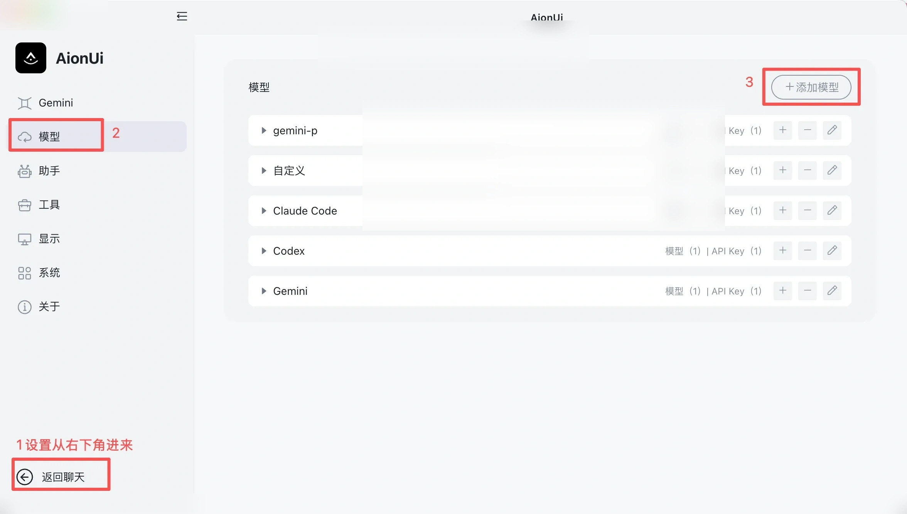
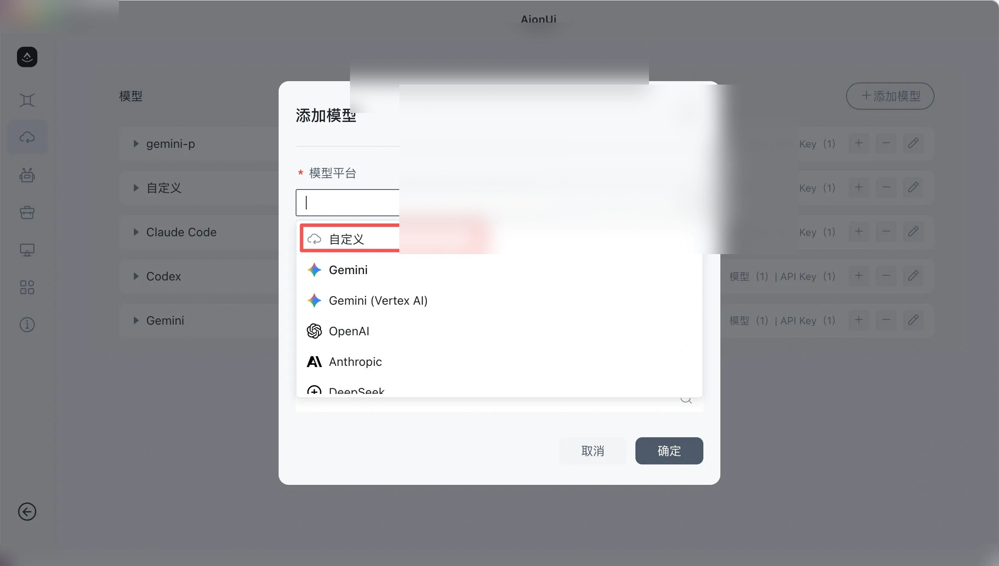
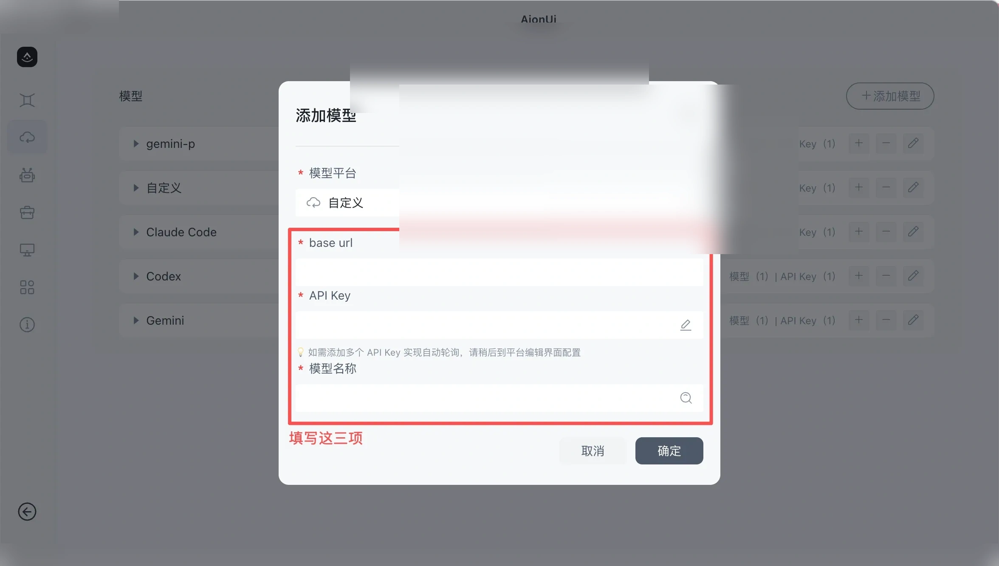
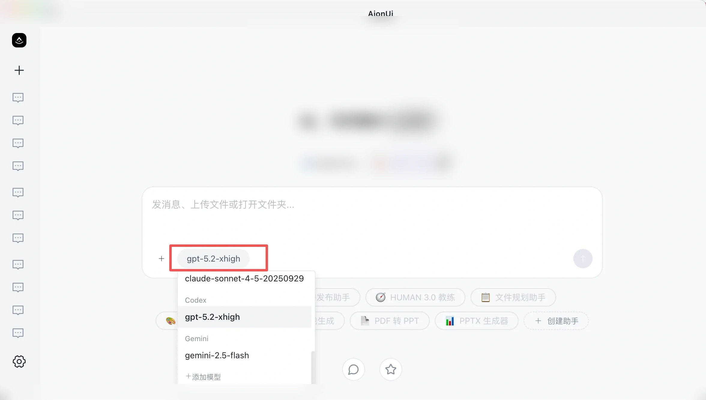

# AionUI

<!-- Source: https://docs.goswitch.online/docs/advanced/AionUI.html -->

Author: goswitch

Updated: 2026-06-13T10:02:01.000Z
## AionUi 介绍


### Cowork with Your CLI AI Agent

[](https://github.com/iOfficeAI/AionUi/releases)
[](https://github.com/iOfficeAI/AionUi/blob/main/LICENSE)
[](https://github.com/iOfficeAI/AionUi/releases)

[](https://trendshift.io/repositories/15423)

**🚀 Cowork 与你的AI, Gemini CLI, Claude Code, Codex, Qwen Code, Goose Cli, Auggie, 等Ai Agent**

**任何用户友好 | 可视的图形化界面 | 多模型支持 | 本地数据安全**

[](https://github.com/iOfficeAI/AionUi/releases)

**使用 AionUi，您可以拥有：**

-   ✅ **统一图形界面** - 自动识别本地 CLI 工具，提供统一的图形界面，告别命令行 → [多代理模式设置](https://github.com/iOfficeAI/AionUi/wiki/ACP-Setup-Chinese)
-   ✅ **多会话并行** - 同时开启多个对话，每个会话独立上下文，互不干扰
-   ✅ **本地数据安全** - 所有对话和文件保存在本地 SQLite 数据库，数据不离开您的设备
-   ✅ **9+ 种格式预览** - PDF、Word、Excel、PPT、代码、Markdown、图片、HTML、Diff 等即时预览
-   ✅ **智能文件管理** - AI 驱动的文件整理、批量重命名、自动分类 → [文件管理详细教程](https://github.com/iOfficeAI/AionUi/wiki/file-management)
-   ✅ **AI 图像生成** - 支持多种图像生成模型，智能图像编辑和识别 → [图像生成模型配置指南](https://github.com/iOfficeAI/AionUi/wiki/AionUi-Image-Generation-Tool-Model-Configuration-Guide-Chinese)
-   ✅ **WebUI 远程访问** - 从任何设备通过浏览器访问，支持移动端 → [WebUI 配置教程](https://github.com/iOfficeAI/AionUi/wiki/WebUI-Configuration-Guide-Chinese)
-   ✅ **多模型切换** - 灵活切换 Gemini、Claude、OpenAI、Qwen、Ollama 等主流模型
-   ✅ **完全免费开源** - Apache-2.0 许可证，完全免费使用

*AionUi WebUI 的案例*

* * *

## 软件下载

Windows

1.  访问 [GitHub Releases](https://github.com/iOfficeAI/AionUi/releases) 页面
2.  下载适合 Windows 的安装包（`.exe` 文件）
3.  运行安装程序，按照提示完成安装

MacOS

``` bash
brew install aionui
```

1.  访问 [GitHub Releases](https://github.com/iOfficeAI/AionUi/releases) 页面
2.  下载适合 macOS 的安装包（`.dmg` 或 `.zip` 文件，支持 Intel 和 Apple Silicon）
3.  运行安装程序，按照提示完成安装

Linux

``` bash
# 下载 .deb 包（请访问 GitHub Releases 查看最新版本号）
wget https://github.com/iOfficeAI/AionUi/releases/latest/download/AionUi-x.x.x-linux-amd64.deb

# 安装
sudo dpkg -i AionUi-x.x.x-linux-amd64.deb
```

请访问 [GitHub Releases](https://github.com/iOfficeAI/AionUi/releases) 页面查看最新版本号，将命令中的 `x.x.x` 替换为实际版本号（例如 `1.7.3`）。

访问 [GitHub Releases](https://github.com/iOfficeAI/AionUi/releases) 页面下载适合您系统的安装包（`.AppImage` 或 `.deb` 文件）。

* * *

## 配置

### 获取 API

回顾 [创建 API 令牌](https://goswitch.online/)，在 GoSwitch 中创建对应分组的令牌，点击复制按钮，复制 API Key 到剪切板：

-   **Gemini** → 创建 **Gemini** 分组的令牌
-   **Claude** → 创建 **CC** 分组的令牌
-   **Codex** → 创建 **Codex** 分组的令牌

### 配置 LLM 模型

1.  打开 AionUi，点击设置 → LLM 配置 → 添加模型



2.  选择平台 "自定义"



3.  根据下方各模型配置，填入对应的 API Key 和配置信息、选择模型



4.  保存后返回主界面，选择配置的模型开始使用



* * *

## 模型配置

Gemini

使用 **Gemini** 分组的 API Key，填入以下配置：

-   **API Key**：粘贴从 GoSwitch 复制的 API Key
-   **API 请求地址**：`https://goswitch.online`
-   **模型**：选择 GoSwitch 支持的 Gemini 模型

Claude

使用 **CC** 分组的 API Key，填入以下配置：

-   **API Key**：粘贴从 GoSwitch 复制的 API Key
-   **API 请求地址**：`https://goswitch.online`
-   **模型**：选择 GoSwitch 支持的 Claude 模型

Codex

使用 **Codex** 分组的 API Key，填入以下配置：

-   **API Key**：粘贴从 GoSwitch 复制的 API Key
-   **API 请求地址**：`https://goswitch.online/v1`
-   **模型**：选择 GoSwitch 支持的 Codex 模型

* * *

## 常见问题

-   [❓ FAQ 常见问题](https://github.com/iOfficeAI/AionUi/wiki/FAQ-Chinese) - 问题解答和故障排除
-   [🔧 配置与使用教程](https://github.com/iOfficeAI/AionUi/wiki/Configuration-Guides-Chinese) - 完整配置文档
