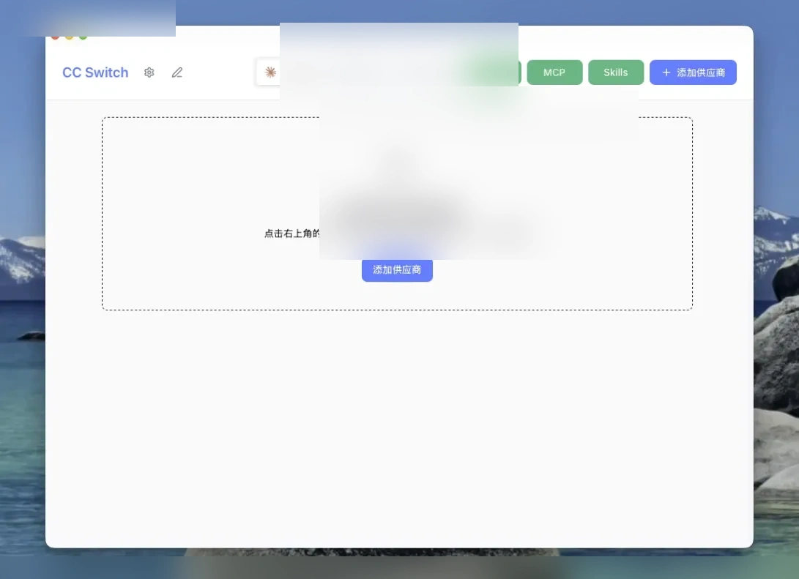
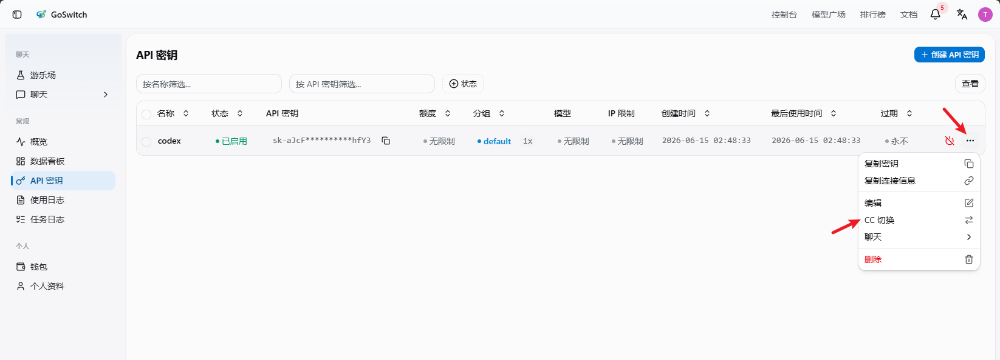
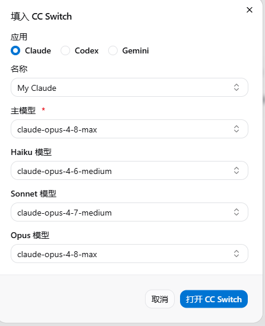
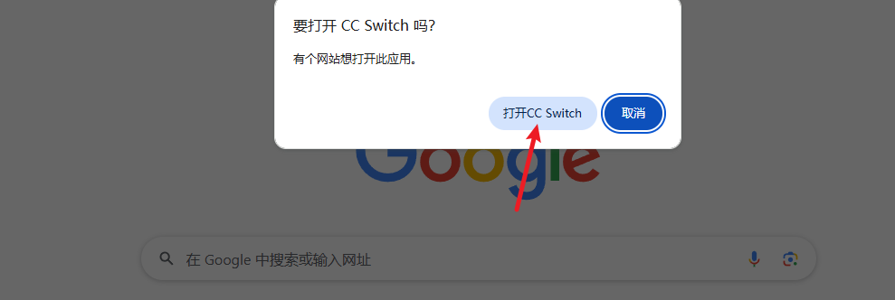
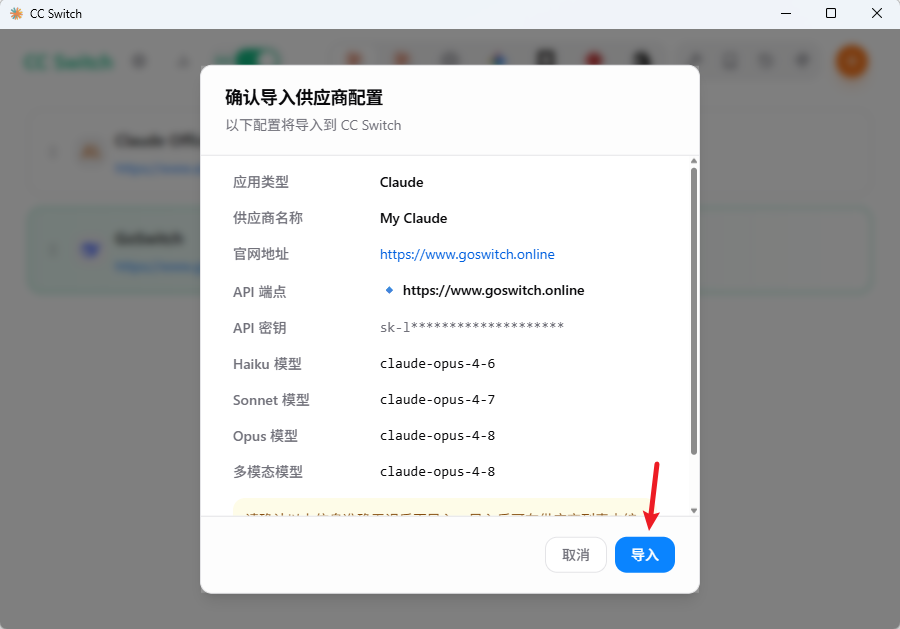
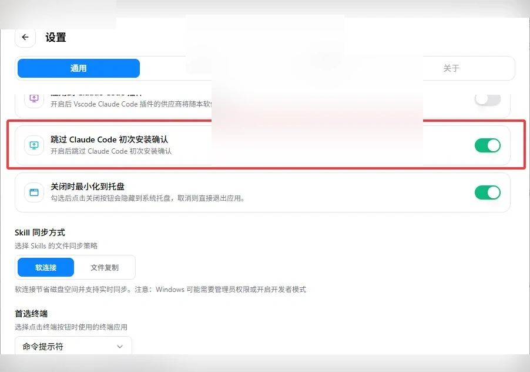
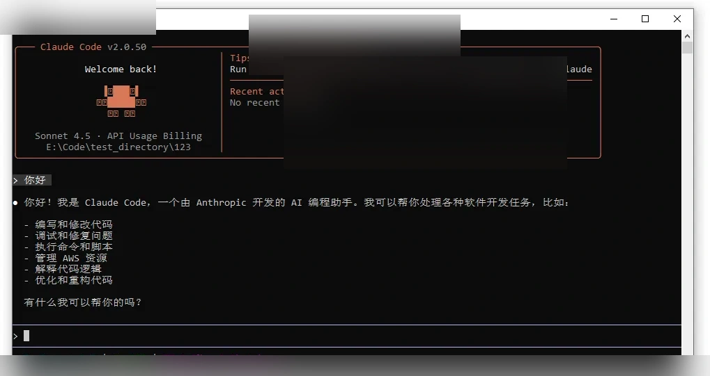

# Claude Code配置

<!-- Source: https://docs.goswitch.online/docs/ccswitch/2-claude.html -->

Author: goswitch

Updated: 2026-06-13T10:02:01.000Z
1.  打开你下载的CC Switch软件，你会看到如下图的初始界面

2.  在分组条中，将分组选择至“Claude / Claude Desktop”

3.  切换到控制台的api密钥，点击更多，选择"cc 切换"

4.  设置你的配置名称和对应的模型后点击 "打开 ccswitch"

5.  cc-switch会自动弹出确认窗口，核对确认信息后点击 "导入"，完成后会自动关闭窗口

6.  添加成功后，在主界面会看到我们配置的分组，在右侧点击“启用”按钮，显示“使用中”，则配置完成

7.  点击左上角“设置”按钮，在通用页面下拉找到 `跳过 Claude Code初次安装确认` ，务必勾选

8.  在终端运行 `claude`，看到对话界面并能正常回复即表示配置完成

::: warning 使用提醒

如果你使用的是 [Claude分组](../token/2-group.md#cc%E5%88%86%E7%BB%84)，请注意该分组**不支持第三方接入**，因此无法在 CC Switch 中完成完整的调用测试。

这类配置是否生效，请直接以 Claude Code 内的实际对话结果为准，并在 Claude Code 中完成最终测试。

:::