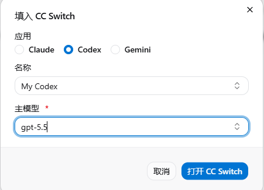
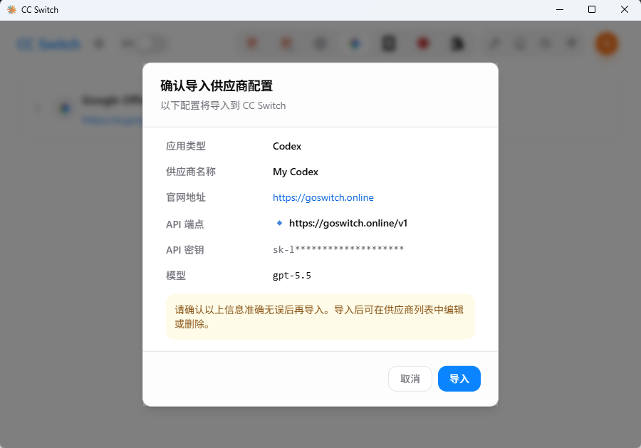
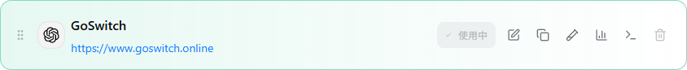
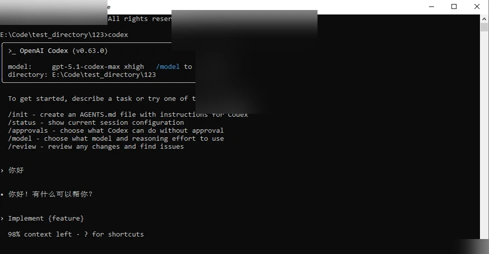

# Codex配置

<!-- Source: https://docs.goswitcher.com/docs/ccswitch/3-codex.html -->

Author: goswitcher

Updated: 2026-06-13T10:02:01.000Z
1.  打开你下载的CC Switch软件，你会看到如下图的初始界面

2.  在分组条中，将分组选择至“Codex”

3.  切换到控制台的api密钥，点击更多，选择"cc 切换"

4.  设置你的配置名称和对应的模型后点击 "打开 ccswitch"

5.  cc-switch会自动弹出确认窗口，核对确认信息后点击 "导入"，完成后会自动关闭窗口

6.  添加成功后，在主界面会看到我们配置的分组，在右侧点击“启用”按钮，显示“使用中”，则配置完成

1.  在终端运行 `codex`，看到对话界面并能正常回复即表示配置完成

