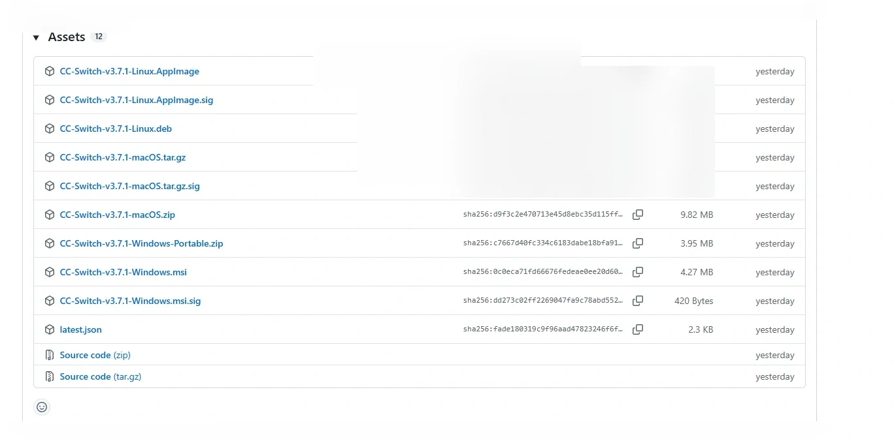
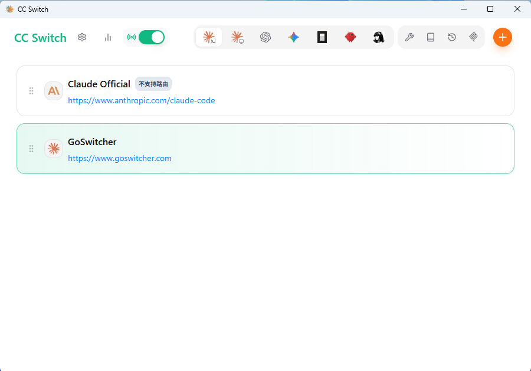

# CC-Switch使用教程

<!-- Source: https://docs.goswitcher.com/docs/ccswitch/ -->

Author: goswitcher

Updated: 2026-06-13T10:02:01.000Z
## 通用步骤

### CC-Switch介绍

### Claude Code / Codex / Gemini CLI 全方位辅助工具

[](https://github.com/farion1231/cc-switch/releases)
[](https://github.com/trending/typescript)
[](https://github.com/farion1231/cc-switch/releases)
[](https://tauri.app/)
[](https://github.com/farion1231/cc-switch/releases/latest)

[](https://trendshift.io/repositories/15372)

[更新日志](https://github.com/farion1231/cc-switch/blob/main/CHANGELOG.md) | [下载地址](https://github.com/farion1231/cc-switch/releases/latest)

**从供应商切换器到 AI CLI 一体化管理平台**

**统一管理 Claude Code、Codex 与 Gemini CLI 的供应商配置、MCP 服务器、Skills 扩展和系统提示词。**

使用 CC-Switch，您可以：

-   ✅ 一键切换 API 配置 - 在多个 API 提供商之间快速切换
-   ✅ 可视化配置管理 - 通过图形界面轻松管理所有配置
-   ✅ 内置 GoSwitcher 模板 - 预设了 GoSwitcher 的配置模板
-   ✅ MCP 服务器管理 - 管理 Model Context Protocol 服务器
-   ✅ 系统托盘快捷操作 - 通过托盘菜单快速切换

::: tip 温馨提示

CC-Switch 已经内置了 GoSwitcher 的快捷配置模板，无需手动编辑配置文件！
:::
### 软件下载

<DocTabs storage-key="zh-docs-ccswitch-index-platform-1" :tabs="[{ label: 'Windows', value: 'windows' }, { label: 'MacOS', value: 'macos' }]">
<template #windows>

### Windows

1.  点击下载链接→[传送门](https://github.com/farion1231/cc-switch/releases/latest)←，进入CC-Switch的Github Release页面

2.  鼠标滚动到最下方选择适合自己版本的安装包，windows系统推荐下载普通msi后缀的安装包进行安装



3.  安装后运行CC-Switch主程序，界面如下。




</template>

<template #macos>

### MacOS

-   MacOS安装推荐使用HomeBrew

-   开启终端后，分别运行以下命令：

``` bash
# 添加 tap 源
brew tap farion1231/ccswitch

# 安装 CC-Switch
brew install --cask cc-switch
```

-   安装完成后，在“启动台”或“应用程序”文件夹中找到 CC-Switch 并启动。


</template>
</DocTabs>
### 环境检查

<div class="warning custom-block"><div style="overflow-x:auto;display:flex;pad"><svg width="23" height="23" viewBox="0 0 1024 1024"    class="icon" xmlns="http://www.w3.org/2000/svg" ><path d="M576.286 752.57v-95.425q0-7.031-4.771-11.802t-11.3-4.772h-96.43q-6.528 0-11.3 4.772t-4.77 11.802v95.424q0 7.031 4.77 11.803t11.3 4.77h96.43q6.528 0 11.3-4.77t4.77-11.803zm-1.005-187.836 9.04-230.524q0-6.027-5.022-9.543-6.529-5.524-12.053-5.524H456.754q-5.524 0-12.053 5.524-5.022 3.516-5.022 10.547l8.538 229.52q0 5.023 5.022 8.287t12.053 3.265h92.913q7.032 0 11.803-3.265t5.273-8.287zM568.25 95.65l385.714 707.142q17.578 31.641-1.004 63.282-8.538 14.564-23.354 23.102t-31.892 8.538H126.286q-17.076 0-31.892-8.538T71.04 866.074q-18.582-31.641-1.004-63.282L455.75 95.65q8.538-15.57 23.605-24.61T512 62t32.645 9.04 23.605 24.61z" fill="#c28100"></path></svg><span style="color: #c28100;padding-left: 7px;">注意</span></div> 请你最好进行此步的环境检查步骤！！！ 如果你有经验，能确认你的Nodejs环境以及cc、codex、gemini的cli安装没问题，配置目录也都存在，可以忽略这一步，直接进入后续的CC Switch配置 <p>点击右侧传送门查看 <a href="./../cli/1-env">如何进行环境检查？</a></p></div>
