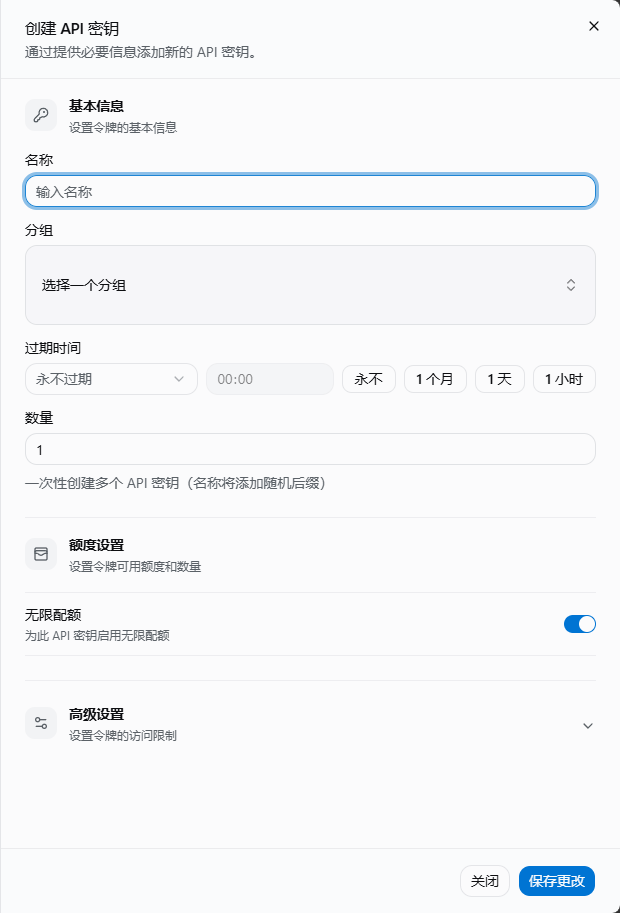

# 快速开始

<!-- Source: https://docs.goswitch.online/docs/register/ -->

Author: goswitch

Updated: 2026-06-13T10:02:01.000Z
<div class="important-notice">
  <div class="notice-glow"></div>
  <div class="notice-header">
    <div class="header-bg-pattern"></div>
    <div class="notice-badge"><span class="badge-icon">⚠️</span></div>
    <div class="header-text">
      <span class="notice-label">IMPORTANT</span>
      <span class="notice-title">给阅读者的忠告！</span>
    </div>
    <div class="header-decoration">
      <span class="deco-dot"></span>
      <span class="deco-dot"></span>
      <span class="deco-dot"></span>
    </div>
  </div>
  <div class="notice-content">
    <div class="notice-item" style="--delay: 0s">
      <div class="item-number">01</div>
      <div class="item-body">
        <div class="item-icon-wrap"><span class="item-icon">📖</span></div>
        <span>请你在部署使用前一定去看看 <strong class="highlight-red">模型分组介绍</strong> 与 <strong class="highlight-red">常见问题</strong> 板块，如果有时间最好阅读全文</span>
      </div>
    </div>
    <div class="notice-item" style="--delay: .1s">
      <div class="item-number">02</div>
      <div class="item-body">
        <div class="item-icon-wrap"><span class="item-icon">💡</span></div>
        <span>我们一直提倡 <strong class="highlight-blue">"授人以鱼，不如授人以渔"</strong></span>
      </div>
    </div>
    <div class="notice-item" style="--delay: .2s">
      <div class="item-number">03</div>
      <div class="item-body">
        <div class="item-icon-wrap"><span class="item-icon">✅</span></div>
        <span>这两个板块不仅能提升你的使用体验，也能解答你今后会在群里提问的 <strong class="highlight-gold">90%</strong> 的问题</span>
      </div>
    </div>
  </div>
  <div class="notice-footer">
    <span class="footer-text">请务必认真阅读以上内容</span>
    <div class="footer-line"></div>
  </div>
</div>

::: info 让我们从这里开始吧！

从 0 开始的 GoSwitch 使用之旅~

一步步来，准没问题！
:::
## 第一步：注册账号

-   注册入口：[https://goswitch.online/sign-up](https://goswitch.online/sign-up)


-   打开注册入口后，点击页面右上角的“注册”。
-   如果你在登录页，也可以点击底部“没有账户？注册”进入注册流程。

**方式一（推荐）：使用 GitHub 账号注册**

1.  点击“使用 GitHub 继续”。
2.  在弹窗中选择要绑定的 GitHub 账号并完成授权。
3.  授权成功后，系统会自动创建账号并登录。

使用 GitHub 注册无需额外设置密码，后续登录时继续选择同一个 GitHub 账号即可。

**方式二：使用邮箱注册**

1.  点击“使用用户名注册”。
2.  填写邮箱、用户名和密码。
3.  按页面提示提交，完成注册。

::: warning 注意

邮箱会用于接收验证与通知；密码建议使用字母、数字和特殊字符组合。请妥善保管登录凭证，避免账号被盗用。
:::
## 第二步：登录账号

-   登录入口：[https://goswitch.online/sign-in](https://goswitch.online/sign-in)


**使用 GitHub 账号登录**

1.  点击“使用 GitHub 继续”。
2.  选择注册时绑定的 GitHub 账号。
3.  授权成功后即可自动登录。

**使用邮箱/用户名登录**

1.  输入邮箱地址或用户名。
2.  输入账号密码。
3.  点击“继续”完成登录。


## 第三步：购买额度

登录控制台后，进入左侧“钱包管理”页面购买额度。

1.  在“选择充值额度”中选择固定额度，或在“自定义额度”中输入要充值的金额。
2.  确认页面下方的“实付金额”后，点击“立即支付”。

::: info 支付说明

目前充值比例为 `1:1`，即 **1 元人民币等同于 1 美元额度**。如果使用支付宝或微信支付时没有弹出支付页面，请先关闭代理后重试。
:::

## 第四步：创建 API 令牌

登录后进入控制台面板，左侧选择“令牌管理”。


### 进入令牌管理

1.  在左侧菜单点击“令牌管理”。
2.  点击页面上方的“添加令牌”。

### 创建新令牌

在弹窗中填写令牌信息：



-   令牌名称：用于区分不同用途，例如 `Claude Code`、`Codex`、`Gemini`。
-   令牌分组：必须选择，分组决定这个令牌可以使用哪些模型。
-   过期时间：默认“永不过期”，也可以按需要设置有效期。
-   新建数量：一般保持 `1` 即可。
-   额度设置：开启“无限额度”时，令牌实际可用额度仍受账户余额限制。
-   访问限制：不熟悉时建议先保持默认，不要开启模型限制或 IP 白名单。

::: warning 令牌分组一定要选对

令牌分组会直接影响可用模型。比如 Claude Code、Codex、Gemini CLI 需要选择对应分组；如果分组选错，后续配置 CLI 时很容易出现“模型不存在”或无法调用的问题。

如果你不确定每个分组适合什么场景，请先阅读 [GoSwitch 各分组介绍](../token/)。

填写完成后，点击右下角“提交”完成创建。
:::
### 查看分组可用模型

你可以在“模型广场”查看每个令牌分组下支持哪些模型。


1.  点击页面右上角“模型广场”。
2.  在左侧“可用令牌分组”中选择分组。


## 第五步：环境检查

在配置 Claude Code、Codex 或 Gemini CLI 之前，请先确认本机已经正确安装 Node.js。

在 Windows、macOS 或 Linux 终端中执行：

```bash
npm list -g --depth-0
```

如果命令可以正常执行，说明 Node.js 与 npm 已经可用。即使输出中没有安装任何全局包，也不影响后续配置。

如果提示“命令未找到”或类似错误，说明当前环境还没有安装 Node.js，或安装后没有正确加入系统环境变量。请先完成 Node.js 安装，再重新执行上面的命令确认。

::: warning 必须先完成环境检查

CLI 工具依赖 Node.js 和 npm。环境没有准备好时，后续安装 Claude Code、Codex、Gemini CLI 都可能失败。
:::
## 第六步：配置 CLI 工具

GoSwitch 支持在命令行中使用 Claude Code、Codex、Gemini CLI

### 基础条件

开始配置 CLI 前，请先完成以下步骤：

1.  完成 [环境检查](./5-env.md)，确保 Node.js 和 npm 可以正常使用。
2.  完成 [安装 CLI](../cli/1-env.md#_2-%E5%AE%89%E8%A3%85cli)，安装 Claude Code、Codex、Gemini CLI。


::: warning 推荐配置

为了让配置过程进行轻便简单，我们**极力推荐**使用Github开源项目 [CC-Switch](https://github.com/farion1231/cc-switch)来对我们的使用环境进行配置。

[CC-Switch配置CC、Codex、Gemini教程](../ccswitch/)

如果你是老鸟，或者不愿意使用此工具，可以参考以下CLI配置教程文档，**但我们还是极力推荐使用此工具，能省很多时间！**
:::
::: info CLI 手动配置教程传送门

注意：不管你是使用哪个 CLI，请一定先完成上方基础条件，确保 Node.js、npm 和对应 CLI 都可以正常使用。

[Claude Code配置教程](../cli/2-claude.md)

[Codex配置教程](../cli/3-codex.md)

[Gemini配置教程](../cli/4-gemini.md)

:::
